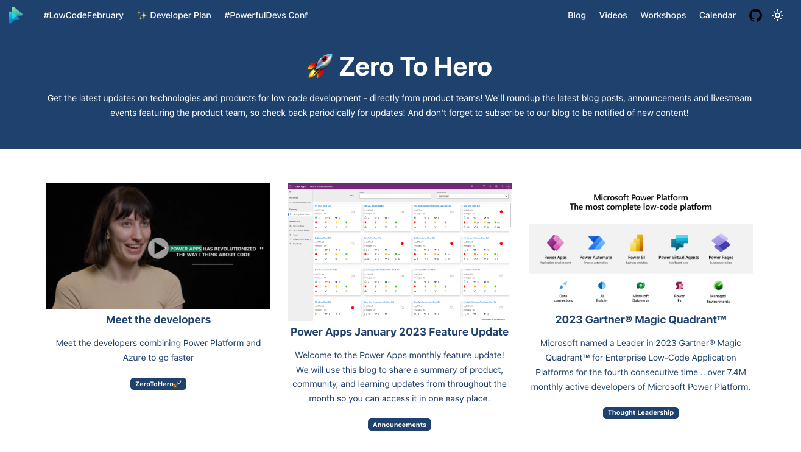

<head>
  <meta name="twitter:url" 
    content="https://microsoft.github.io/Low-Code/blog/2023-day4" />
  <meta name="twitter:title" 
    content="4. Developer Stories" />
  <meta name="twitter:description" 
    content="Software developers around the world are embracing low-code as a powerful part of their toolkit — let's meet some of the developers and organizations and hear their stories.." />
  <meta name="twitter:image" 
    content="https://microsoft.github.io/Low-Code/img/og/30-04.png" />
  <meta name="twitter:card" content="summary_large_image" />
  <meta name="twitter:creator" 
    content="@nitya" />
  <meta name="twitter:site" content="@AzureAdvocates" /> 
  <link rel="canonical" 
    href="https://microsoft.github.io/Low-Code/blog/2023-day4" />
</head>

Welcome to `Day 04` of #30DaysOfLowCode!

Today we celebrate all the developers and organizations who make the low code ecosystem successful.

## What We'll Cover
 * About Zero To Hero
 * Meet The Developers
 * Meet The Organizations
 * Solution Architecture Examples
 * **Activity**: Sign up for your [Developer Plan](https://aka.ms/lowcode-february/devplan)
 * **Resources**: Explore the [Low Code February Collection](https://aka.ms/lowcode-february/collection)

<!-- ************************************* -->
<!--  AUTHORS: ONLY UPDATE BELOW THIS LINE -->
<!-- ************************************* -->

## About Zero To Hero

Did you know we had a [dedicated Zero To Hero page](/lowcode-february/ZeroToHero) on this site? It's our page for amplifying news, articles and updates on technologies and products for low code development - directly from product teams! Here's what that page look like. Click on any article to visit the _original_ content on the Product Group blog. Or click the **tag** under a post (e.g., `Announcements`) to view _all_ posts for that category.

## Meet The Developers

Meet featured developer **Gini Brandon** and watch her as she shares her journey of adopting low-code as a professional developer! In the video, Gini talks about her journey graduating with a computer science degree, how she’s been able to increase efficiency using Power Platform, why she believes low code is the future of development, and how you can get started.

✨ Read It Now: [**Meet developers combining Power Platform and Azure to go faster**](https://powerapps.microsoft.com/blog/meet-the-developers-combining-power-platform-and-azure-to-go-faster/)

## Meet The Organizations

Organizations around the globe have adopted Microsoft Power Platform along with Azure and Dynamics 365 to build flagship applications and establish centers of excellence to scale adoption and impact of low-code solutions.

✨ Read It Now: [**Meet The Organizations**](https://powerapps.microsoft.com/blog/meet-the-developers-combining-power-platform-and-azure-to-go-faster/#meet-organizations)

## Solution Architecture Examples

Explore a few real-world solution architecture examples that show how low-code capabilities in Power Platform are used in conjunction with code-first programming patterns and capabilities in Microsoft Azure. Here are just a subset of those stories:
 * Rabobank – Scaling adoption across the organization 
 * EY – Loan forgiveness portal
 * Blackmores Group – Enabling rapid development of new products
 * IKEA Sweden – Reimagining the customer experience
 * Western States Caterpillar: Mobile apps for the field

✨ Read It Now: [**Solution Architecture Examples**](https://powerapps.microsoft.com/blog/meet-the-developers-combining-power-platform-and-azure-to-go-faster/#architecture-examples)
