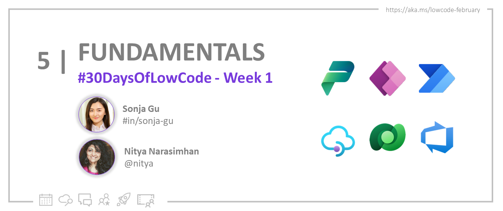

<head>
  <meta name="twitter:url" 
    content="https://microsoft.github.io/Low-Code/blog/slug-FIXME" />
  <meta name="twitter:title" 
    content="FIXME: Title Of Post" />
  <meta name="twitter:description" 
    content="FIXME: Post Description" />
  <meta name="twitter:image" 
    content="FIXME: Post Image" />
  <meta name="twitter:card" content="summary_large_image" />
  <meta name="twitter:creator" 
    content="@nitya" />
  <meta name="twitter:site" content="@AzureAdvocates" /> 
  <link rel="canonical" 
    href="https://microsoft.github.io/Low-Code/blog/slug-FIXME" />
</head>

Welcome to `Day 04` of #30DaysOfLowCode!

The theme for this week is **Low Code Foundamental**. Today we'll take a overview of what we've learnt from the first week and help you prep for [**Week2 Backed Integrations**](https://aka.ms/lowcode-february/30days) .

## What We'll Cover
 * Introduction to Low Code Development
 * Onboarding to Low Code Platform 
 * Developer Stories
 * Outlook for week 2
 * Resources

<!-- FIXME: banner image -->

<!-- ************************************* -->
<!--  AUTHORS: ONLY UPDATE BELOW THIS LINE -->
<!-- ************************************* -->

## Introduction to Low Code Development

**What is low code?** Low code is a method of application development that allows people to create enterprise-grade business apps with a small amount of code or no code.  [*With tools like Power Apps, you only need to write a small amount of code to get results that would normally take several more lines of code in a traditional programming language.*](http://localhost:3000/Low-Code/blog/2023-day2)

**Why low code** With the surging global digial demand it's estimated that 500 million more applications will be built in the next 5 years. Meanwhile, the shortage of developers is estimated to reach 4 milllion in 2025. More and more companies are embracing low code development technology to help bridget the app gap and the shorfall of developers resources. Gartner estimates that 65% of application development will be low code by 2024. With that being said, the low-code platform market has been growing double digit over the last few years. 

**What does low code mean for developers?** Low code technology not only benefits makers to build solutions that requires coding in the past, but also benefits professional developers as it helps developers save effort, time and cost from traditional app development. 

In fact, code-first developers are critical as they bring in the code-first development skills that can truly extend the full potential of low code such as Power Platform. Developers can focus on the creative aspects of app building while still taking advantage of powerful cloud computing technologies such as scalability, security, and reliability. 

[*The combination of low code + full code creates what we call a "no cliffs" experience that allows business technologists to easily build solutions with low code while professional developers can leverage full code to augment and extend the platform capabilities. The process of low code developers, IT pros and full code developers working together like this is often referred to as "fusion development"*](http://localhost:3000/Low-Code/blog/2023-day2).

**Power Platform low code family**

* **Power Apps** for creating custom applications for web and mobile that can be integrated with a variety of systems and services.
* **Power Automate** for automation tasks and orchestrating activities across various services
* **Power BI** for business analytics and interactive data visualization
* **Power Virtual Agents** for creating AI-powered chatbots that can answer questions from your customers and employees
* **Power Pages** for secure, enterprise-grade external-facing business websites
* **Dataverse** which provides a cloud scale data store with robust security that abstracts away data management complexity from the app maker

**Extend Power Platform solutions with code-first approach**

* **UI Components** - Leverage the [Power Apps Component Framework](https://aka.ms/LowCodePCF) to extend the UI of our applications with custom code.
* **Custom Connectors** - Create [custom connectors](https://aka.ms/LowCodeCustomConnectors), which are essentially a wrapper around an API to communicate to our external data sources and services.
* **Custom Visuals in Power BI** - Use the open-source SDK to create [custom visuals](https://aka.ms/LowCodeCustomVisuals) for your reports and dashboards
* **Custom Business Logic** - Extend the [Dataverse API](https://aka.ms/LowCodeDataverseAPI) with your own custom API that implements your business logic
* **Add CI/CD** - Setup continuous integration and continuous deployment ([CI/CD](https://aka.ms/LowCodeALM)) with your Power Platform solutions

Learn more about low code development at [**You say Low, I say Code!**]((http://localhost:3000/Low-Code/blog/2023-day2)) 

## Onboarding to Low Code Platform

**Start your journey with Power Apps Developer Plan** 
* Sign up for your [Developer Plan](https://aka.ms/lowcode-february/devplan)
* Read full onboard guidance at [**DevTools & Onboarding**](http://localhost:3000/Low-Code/blog/2023-day3)

## Developer Stories
There are thousands of developers who have used Microsoft Power Platform in conjunction with code-first development tools and services to build enterprise grade digital solutions. 

Today, let's to hear the story from our feature developer Gini Brandon: 

In this video, Gini talks about her journey graduating with a Computer Science degree, how she’s been able to increase efficiency using Power Platform, why she believes low code is the future of development, and how you can get started.

<iframe width="640" height="360" src="https://www.youtube.com/embed/OrWDTi8GVfM" title="It changed how I think about code - Gini Brandon - Power Platform Developer Stories" frameborder="0" allow="accelerometer; autoplay; clipboard-write; encrypted-media; gyroscope; picture-in-picture; web-share" allowfullscreen></iframe>

Read the full story at [**Developer Stories**](https://aka.ms/PowerForPros)

## Outlook for week 2
In week 2, we will cover how to extend your app's functionality by integration low code platform with backend services across Dataverse, Azure data source, Azure API Management, Functions, etc. to build safe and serverless apps at scale. From build-in connectors, to custom connectors, we will handhold your journey with tutorials, demos, and real world best practices. [**Save**](http://localhost:3000/Low-Code/blog) the page and don't miss one blog!

## Resources

1. [**Sign up**](https://aka.ms/lowcode-february/devplan) for the free Power Apps Developer Plan. 🙌 
2. [**Enroll**](https://aka.ms/lowcode-february/challenge) in the Cloud Skills Challenge and start climbing that leaderboard! ☁️
3. [**Explore**](https://aka.ms/lowcode-february/collection) the [Low Code February Collection]