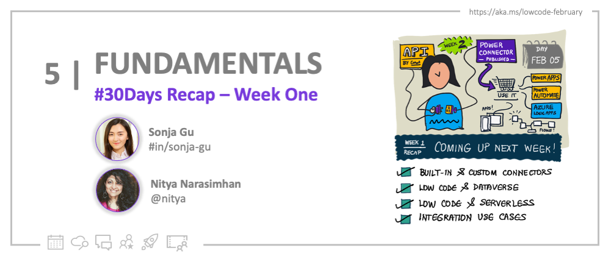
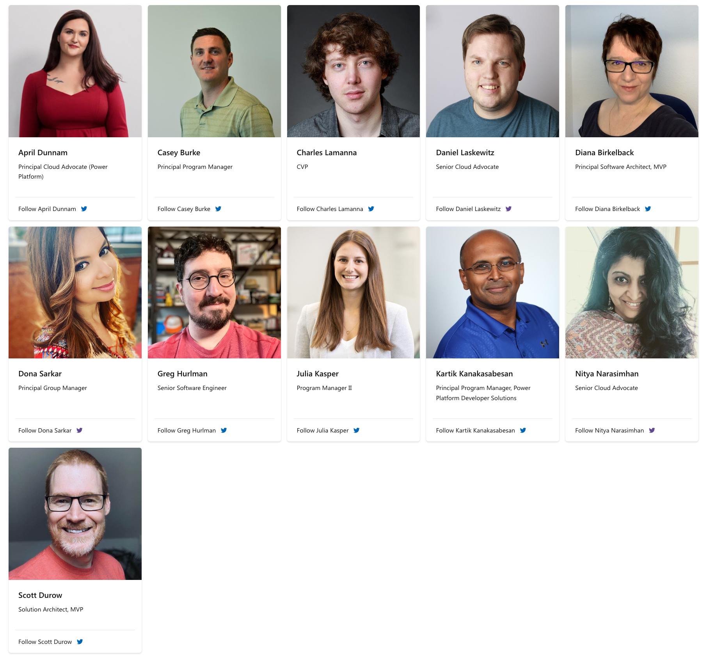
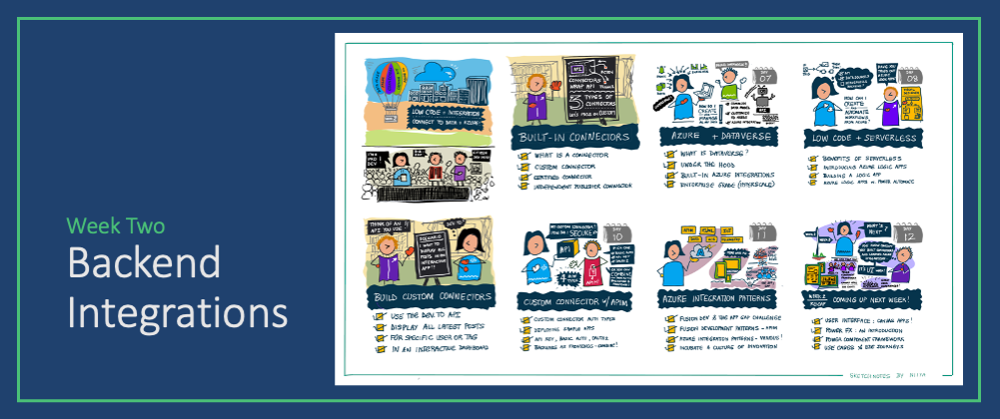

<head>
  <meta name="twitter:url" 
    content="https://microsoft.github.io/Low-Code/blog/2023-day5" />
  <meta name="twitter:title" 
    content="5. Week 1 - Recap" />
  <meta name="twitter:description" 
    content="Let's recap Week 1 of #30DaysOfLowCode focused on #PowerPlatform Fundamentals - join us at #LowCodeFebruary https://aka.ms/lowcode-february" />
  <meta name="twitter:image" 
    content="https://microsoft.github.io/Low-Code/img/og/30-05.png" content="summary_large_image" />
  <meta name="twitter:creator" 
    content="@nitya" />
  <meta name="twitter:site" content="@AzureAdvocates" /> 
  <link rel="canonical" 
    href="https://microsoft.github.io/Low-Code/blog/2023-day5" />
</head>

Welcome to `Day 05` of #30DaysOfLowCode!

## What We'll Cover
 * **Look Back**: Recap Fundamentals Week
 * **Self-Study**: Resources to dive deeper
 * **Look Ahead**: It's Integrations Week!
 * **Activity**: Sign up for your [Developer Plan](https://aka.ms/lowcode-february/devplan)
 * **Resources**: Explore the [Low Code February Collection](https://aka.ms/lowcode-february/collection)

<!-- ************************************* -->
<!--  AUTHORS: ONLY UPDATE BELOW THIS LINE -->
<!-- ************************************* -->

## Look Back: Week 1 Recap
Wow, Low Code February is a hit! We've had **40k+ visits** to our website campaign and **1400+ of you** signed up to take the Cloud Skills Challenge and _skill yourself on all things low code_! This is incredible and we're super honored to have built something that you, the community, have found valuable! We know that we couldn't have gone so far without the support from everyone of you who's reading this blog right now. THANK YOU! ❤️

Here are the highlights for week 1. If you're just joining us, welcome!! It's not too late to get started learning and skilling up, with two core activities:
 
1. [**Cloud skills Challenge**](https://aka.ms/lowcode-february/challenge) - gives you a free curated set of learning modules to jumpstart your learning journey into Low Code and Fusion development. Get building amazing Power Platform solutions using pro-code tools and frameworks. Register now and get on the leaderboard!

2. [**#30DaysOfLowCode**](https://aka.ms/lowcode-february/blog) - gives you daily blog posts from experts. We started this week with a look at **Power Platform fundamentals** (core concepts) and ended it with a look at **Developer Stories** celebrating our low-code and code-first developer communities with real-world case studies.
    * 🥇 First time hearing the term _low-code_ and want to learn how it helps in your day-to-day work? Read [**You say Low, I say Code!**](https://microsoft.github.io/Low-Code/blog/2023-day2) for a quick introduction. 
    * 🆕 Never used _Power Platform before_? Read [**DevTools & Onboarding**](http://localhost:3000/Low-Code/blog/2023-day3) to get full onboarding guidance, and setup your development environment for success!
    * 🚀 Want to hear stories from your peers, and understand why more and more code-first developers have turned to low-code and embrace the technology in their daily work? Read [**Developer Stories**](https://aka.ms/lowcode-february/blog/PowerForPros) posted by our amazing Power Platforms PM team at [**ZeroToHero**🚀](https://aka.ms/lowcode-february/0ToHero).

## Self-Study: Resources
Don't have the time to follow day by day? Here're 3 self-study materials that you should know about to help you learn at your own pace: 
1. [**Resource Collection**](https://aka.ms/lowcode-february/collection): Bookmark the collection for a 1-stop resource containing all relevant links to documentation and training, as covered in the #30DaysOfLowCode blogs. 
2. [**Hands-on Workshops**](https://aka.ms/lowcode-february/workshop): learn by doing! These labs help you gain hands-on experience from intro to advanced, whereever you're in the learning path. 
3. [**Ask The Experts!**](http://localhost:3000/Low-Code/lowcode-february/Video-Live#ask-the-experts): get your questions answered! Pick a time that works best for you and enjoy a face to face discussion with our leaderships:
    1. 🎙 [**Feb 23, 9AM PST**](https://aka.ms/ATE0223/RSVP ) - Join this session for Q&A from the **Powerful Devs Conference** team. The Powerful Devs Conference focuses on showcasing how code first developers can integrate with the Power Platform to innovate faster. We will have experts on hand to answer questions about full code and low code integration.
    2. 🎙 [**Mar 09, 9AM PST**](https://aka.ms/ATE0309/RSVP) - Join this session for Q&A from the **Low Code February** team, including authors of this #30DaysOfLowCode series. We will have experts in code-first integration with the Power Platform live to answer questions related to the content and cloud skills challenge of the Low Code February event.
4. [**Learn Live!**:](https://aka.ms/lowcode-february/LearnLive) Have questions for Microsoft Learn modules or the cloud skills challenge? Join our **Learn Live** sessions to hear tips and commentary from experts:
* 1️⃣ [**Feb 06**](https://aka.ms/lowcode-february/LearnLive) - Low code as a traditional developer
* 2️⃣ [**Feb 13**](https://aka.ms/lowcode-february/LearnLive) - Integrate OpenAPI-enabled Web APIs with Azure API Management
* 3️⃣ [**Feb 27**](https://aka.ms/lowcode-february/LearnLive) - Manage Microsoft Power Platform deployments
 

## Feb 15: PowerfulDevs Conf

Do you know the [**Powerful Dev Conf**](https://learn.microsoft.com/events/learn-events/powerful-devs-2023/?WT.mc_id=javascript-82212-ninarasi) happens in just 10 days, on **Feb 15**? It's a signature 2-hour event where you can hear from many of the experts, including authors from this series, on the features and usage of the Power Platform! Check out the great speaker lineup below and visit [the site](https://learn.microsoft.com/events/learn-events/powerful-devs-2023/?WT.mc_id=javascript-82212-ninarasi) to see the scheduled sessions.

:::info REGISTER NOW - IT'S FREE & ONLINE!
 * [**Sign up**](https://learn.microsoft.com/events/learn-events/powerful-devs-2023/?WT.mc_id=javascript-82212-ninarasi) for a reminder and link to the livestream.
 * Then #SaveTheDate and join us **Feb 15**
:::

## Look Forward: Week 2 Plan

Don't forget to bookmark the [**#30DaysOfLowCode**](https://aka.ms/lowcode-february/blog) page and come back tomorrow, where we will cover everything you need to know about Power Platform Backend Integrations in week 2. 

From utilizing built-in connectors to building custom connectors, integrating with backend data source, and creating serverless apps. We will showcase the latest functionalities we have, help you learn with tutorials, demos, and real world best practices that you can apply to your business immediately. 

