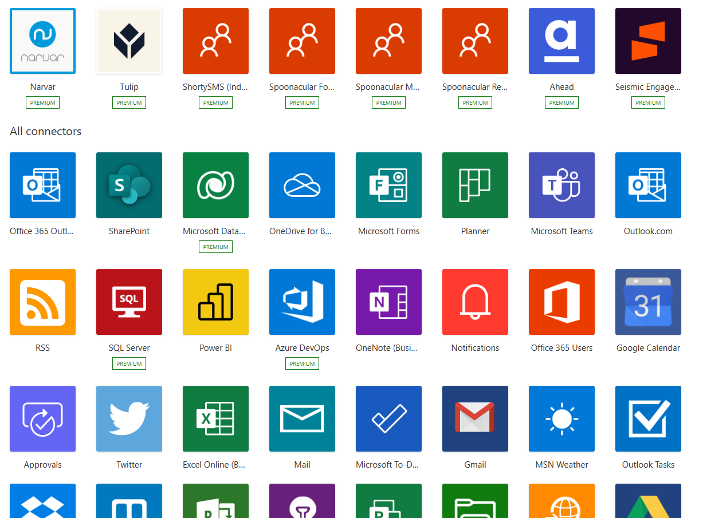

## Let's Make Some Connections

One of the things that makes the Power Platform so powerful (pun intended) is its ability to seamlessly pull in and interact with data from a variety of 1st and 3rd party services. This integration with other services is done through Connectors - the building blocks of the Power Platform.

## What is a Connector?

 A connector is a wrapper around an API that allows the underlying service to talk to the Power Platform. It's essentially a proxy that provides a way for users to connect their accounts and leverage a set of prebuilt actions and trigger to integrate the services with their apps and workflows.

The Power Platform offers a large ecosystem of software as a service connectors that enable you to connect apps, data and devices in the cloud. Some examples of popular connectors are Office 365, Outlook, Dropbox, Salesforce, Google Services and many many more.

There are hundreds of prebuilt connectors available to use in Power Apps, Power Automate and Logic Apps. You can see a list of all of the connectors available here: [https://learn.microsoft.com/en-us/connectors/connector-reference/](https://learn.microsoft.com/en-us/connectors/connector-reference/)

## Connectors Components

Every connector offers action and trigger operations. Let's explore each of those further.

**Actions** are changes that are directed by a user. An action can be used to perform standard CRUD (create, read, update and delete) operations in a data source like a SQL database. Each of these actions directly map to operations defined in the OpenAPI definition for the connector.

**Triggers** allow you to kick off interaction with your connector when specific events occur. For example, the SharePoint connector has a trigger for when a new file is added and the Outlook connector has a trigger for when an email is received. You can build a Logic App or flow in Power Automate that listens to this trigger and performs an action whenever the trigger fires. Triggers are unique to Power Automate and Logic Apps and can't be used inside of Power Apps.

There are two types of triggers:

* **Polling Triggers** which call your service at specified intervals to check for new data. When that new data is available, it causes a new run of your workflow instance with the data as an input.
* **Push Triggers** which wait for an event to occur that then causes a new run of your workflow instance.

## Custom Connectors

The amount of out-of-the-box connectors for the Power Platform is growing every day, but sometimes you might want to call API's, services and systems that aren't available as prebuilt connectors. To support this need, you can build custom connectors that have their own triggers and actions.

A connector is simply a wrapper around an API which means you can take any RESTful API that is defined in OpenAPI (Swagger) and make that accessible to the Power Platform with a custom connector.

You can build custom connectors to connect to both public and private API's.

Connections to private API's are possible with the [on-premises data gateway](https://learn.microsoft.com/en-us/flow/gateway-reference).

For public API's that you want to create and manage, you might considering leveraging Azure products like [Azure Functions](https://azure.microsoft.com/services/functions/), [Azure Web Apps](https://azure.microsoft.com/services/app-service/web/) or [Azure API Apps](https://azure.microsoft.com/services/app-service/api/).

Custom connectors can either be used internally within your organization or you can get your connector certified so that it's publicly accessible for anyone in the world using the Power Platform and Logic Apps.

## Certifying a Connector

If you want to make your custom connector publicly available you have to go through a certification process where Microsoft reviews the connector to see if it meets certification criteria and approves it for publishing.

There are two options when it comes to getting a connector certified:

* **Verified Publisher** - To be eligible to get certified as a verified publisher, you must own the underlying service behind the connector.
* **Independent Publisher** - This gives you a chance to get your connector certified if you do not own the underlying service behind it.

The processes for certification vary depending on which option you qualify for. You can learn more about the process for getting your connector certified here:

* [Independent publisher certification process](https://learn.microsoft.com/en-us/connectors/custom-connectors/certification-submission-ip)
* [Verified publisher certification process](https://learn.microsoft.com/en-us/connectors/custom-connectors/certification-submission)

## What's next?

Stay tuned for the rest of this week's blog posts to dive deeper into the world of connectors and backend integrations.  

* 1️⃣ [**Sign up**](https://aka.ms/lowcode-february/devplan) for the free Power Apps Developer Plan.
* 2️⃣ [**Enroll**](https://aka.ms/lowcode-february/challenge) in the Cloud Skills Challenge to learn more about low code and fusion team fundamentals and start climbing that leaderboard!
* 3️⃣ Connectors will also be highlighted at the Powerful Devs Conference so be sure to [**Sign up**](https://aka.ms/lowcode-february/PowerfulDevsConf2023) for the free virtual event!

## Resources
* [Introduction to the Power Platform](https://aka.ms/LowCodePowerPlatformIntro)
* [Fusion Development with Power Platform EBook](https://aka.ms/FusionDevEbook)
* [Fusion Development with Power Platform Learning Path](https://aka.ms/learn-fusiondev)
