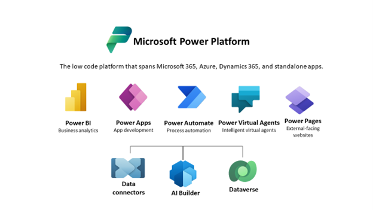
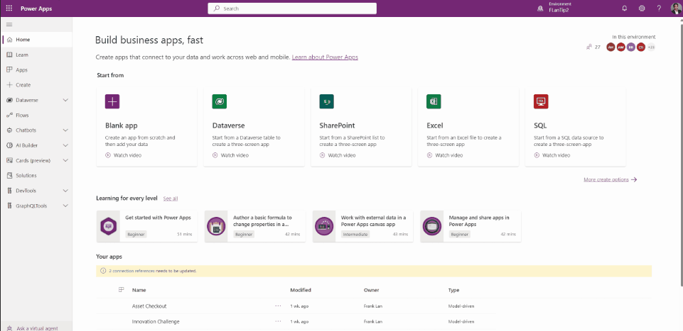

<head>
  <meta name="twitter:url" 
    content="https://microsoft.github.io/Low-Code/blog/slug-FIXME" />
  <meta name="twitter:title" 
    content="FIXME: Title Of Post" />
  <meta name="twitter:description" 
    content="FIXME: Post Description" />
  <meta name="twitter:image" 
    content="FIXME: Post Image" />
  <meta name="twitter:card" content="summary_large_image" />
  <meta name="twitter:creator" 
    content="@nitya" />
  <meta name="twitter:site" content="@AzureAdvocates" /> 
  <link rel="canonical" 
    href="https://microsoft.github.io/Low-Code/blog/slug-FIXME" />
</head>

Welcome to `Day #FIXME` of #28DaysOfLowCode!

The theme for this week is #FIXME. Yesterday we talked about #FIXME. Today we'll explore the topic of #FIXME.

## What We'll Cover
 * Section 1
 * Section 2
 * Section 3
 * Section 4
 * Exercise: Try this yourself!
 * Resources: For self-study!

<!-- FIXME: banner image -->

<!-- ************************************* -->
<!--  AUTHORS: ONLY UPDATE BELOW THIS LINE -->
<!-- ************************************* -->

# Do more with your Data for less - Microsoft Dataverse 
Microsoft Dataverse is a SaaS data platform that helps you ***easily create and manage your data, events, logic, and generate analytics, and insights to support interconnected apps and processes in a secure and compliant manner***. Dataverse, being a hyperscale polyglot storage, can store any type of data (relational, file, observational etc.) for all your transactional or analytical applications. Dataverse is the data platform for all Power Platform products and Dynamics 365 applications, supporting both low-code and pro-code development. It is a critical element of Microsoft Power Platform, supporting all the data, events, analytics, and related processing, besides generating insights for citizen app makers and professional developers to build, store and manage data for their applications. 
 
*Figure 1: Microsoft Dataverse and Power Platform* 

All these diverse types of data, in Dataverse, are represented externally as tables, which not only makes it easy for citizen developers to use it as excel but also accelerates design and development time and cost, for professional developers .Dataverse includes a base set of standard tables that cover typical scenarios, also known as [Common Data Model (CDM)](https://learn.microsoft.com/en-us/common-data-model/), but you can also customize or create new custom tables specific to your needs.
## Dataverse -Under the hood 
Dataverse enables integrated, intelligent systems of action of the data that is stored. Dataverse achieves this by leveraging Azure services, so it is built on Azure and extends with Azure. 
  
*Figure 2: Microsoft Dataverse Runs on Azure & Extends with Azure* 

All the building blocks of Dataverse i.e., storage, compute and insights are built on Azure. Similarly, if you need to extend the functionality, you can leverage your existing investments in Azure to augment your customer requirements. 
## Why Dataverse? ##
Microsoft Dataverse is much more than a database because it provides a managed SaaS data platform experience for citizen developers and professional developers to build, store, and manage data for their applications. It also provides a rich and intelligent computing layer to integrate and act on these diverse types of data through [a rich API layer](https://learn.microsoft.com/en-us/power-apps/developer/data-platform/webapi/overview), besides providing analytics and generating insights. 

Let’s look at some of these salient features of Dataverse. 

### Enables low-code and pro-code integration of external data
Dataverse provides an ability to use out of the box power of Power Query via [Power Platform Data Flows](https://learn.microsoft.com/en-us/power-query/dataflows/create-use), [Azure Data Factory](https://learn.microsoft.com/en-us/azure/data-factory/connector-dynamics-crm-office-365?tabs=data-factory)(ADF) and [Web API](https://learn.microsoft.com/en-us/power-apps/developer/data-platform/webapi/perform-operations-web-api) to enable low-code and pro-code developers to integrate external data with Dataverse. With few clicks, users can have a quick start experience to get the data from multitude of data sources specifically from Azure resources into Dataverse with rich, intuitive user experience. Pro dev deeply familiar with data transformations can extend queries and author complex transformations for both ADF and Power Query. A splendid example of using Dataverse data to create reports can be found [here](https://learn.microsoft.com/en-us/power-apps/maker/data-platform/data-platform-powerbi-connector?tabs=Dataverse). Another powerful feature about data integration with Dataverse is the introduction of Virtual Tables in Dataverse which allows you to integrate external data without moving it physically into Dataverse. With this new experience, you can create virtual tables from SharePoint and SQL without any code, and without leaving the maker portal. In minutes, you can set up your connection, pick your SharePoint Site or SQL Database, select your SharePoint List or SQL Table, and your virtual table will appear in table hub within [Maker experience](https://make.powerapps.com) ready to use.
   
*Figure 3 : Creating a Virtual Table in Microsoft Dataverse* 

You can try it out for yourself using this detailed [information](https://powerapps.microsoft.com/en-us/blog/virtual-tables-creation-wizard-now-in-public-preview/) 
Additional Info: [Virtual tables in Dataverse](https://www.youtube.com/watch?v=viRTtGEZXNE&list=PL8b8RgcLYAyqDb3hgrVOs-xICPtorzSiK&index=2&ab_channel=MicrosoftPowerPlatform)

### Advanced business logic, eventing, analytics, and insights at no additional cost 
Besides Web API, Dataverse also provides several advanced business logic and eventing features like [calculated fields and rollups](https://learn.microsoft.com/en-us/power-apps/developer/data-platform/calculated-rollup-attributes), and automatic [duplicate detection](https://learn.microsoft.com/en-us/power-platform/admin/detect-duplicate-records) along with powerful built-in AI, Analytics through Power BI, Azure Cognitive Services and [AI Builder](https://learn.microsoft.com/en-us/power-apps/use-ai-builder). Dataverse allows pro-code extensibility via [plug-ins](https://learn.microsoft.com/en-us/power-apps/developer/data-platform/plug-ins) and low code extensibility using Power FX, like [formula columns](https://learn.microsoft.com/en-us/power-apps/maker/data-platform/formula-columns).

Additionally, there is built-in integration with Azure - With a few clicks, you can use [Azure Synapse Link for Dataverse](https://learn.microsoft.com/en-us/power-apps/maker/data-platform/export-to-data-lake) to bring your Dataverse data to Azure Synapse, visualize data in your Azure Synapse workspace, and rapidly start processing the data to discover insights using advanced analytics capabilities for serverless data lake exploration, code-free data integration, data flows for extract, transform, load (ETL) pipelines, and optimized Apache Spark for big data analytics. [Here](https://cloudblogs.microsoft.com/powerplatform/2021/05/26/accelerate-time-to-insight-with-azure-synapse-link-for-dataverse/) is how you can accelerate time to insight with Azure Synapse Link for Dataverse. 

Here is another glimpse into doing more with [analytics using Dataverse](https://www.youtube.com/watch?v=UNMYSEN3VeI&list=PL8b8RgcLYAyqDb3hgrVOs-xICPtorzSiK&index=50&ab_channel=MicrosoftPowerPlatform)

All these features are built-in into Dataverse and hence you do not have to spend any additional time or money managing additional compute services outside Dataverse platform which helps in bringing down the total cost of ownership for an end-to-end business solution.

### Providing data residency and compliance while scaling globally.
Dataverse serves customers in 18 distinct geographic locations like Asia Pacific, Canada, Switzerland, France, Germany, UK, India, Japan, China, Korea, Norway, Australia, South America, Singapore, UAE, South Africa, North America, Europe and expanding to more regions. To help your organization comply with national, regional, and industry-specific requirements governing the collection and use of individuals’ data, Dataverse provides a comprehensive set of compliance offerings which you can find [here](https://learn.microsoft.com/en-us/power-platform/admin/wp-compliance-data-privacy).The latest availability information can be found in [Product Availability by Geography](https://powerplatform.microsoft.com/en-us/availability-reports/georeport/) under Power Apps product, since Dataverse is the data platform for Power Platform products.

### Availability and Reliability that you can depend on
Dataverse also provides high availability (99.9+ %), reliability features like disaster recovery and business continuity capabilities for your production instance, by leveraging [Azure availability zones](https://learn.microsoft.com/en-us/azure/reliability/availability-zones-overview) and asynchronous cross-region replications using [Azure paired regions](https://learn.microsoft.com/en-us/azure/reliability/cross-region-replication-azure). You can read more about these scenarios and solutions in [this article](https://learn.microsoft.com/en-us/power-platform/admin/business-continuity-disaster-recovery) which explains *Business Continuity(BC)* and *Disaster Recovery (DR)*. You can watch [Planet-scale Dataverse](https://www.youtube.com/watch?v=QlQmBPYAK8I&list=PL8b8RgcLYAyqDb3hgrVOs-xICPtorzSiK&index=39&t=100s&ab_channel=MicrosoftPowerPlatform) to learn more about how Dataverse operates at planet-scale.

With Dataverse you can store terabytes of data – all types of data like relational, non-relational, image, file etc. and process millions of transactions in a day. You can take a look at the different types of data supported by Dataverse [here](https://learn.microsoft.com/en-us/power-apps/maker/data-platform/types-of-fields).You can also learn more about [Polyglot and Hyperscale Dataverse](https://www.youtube.com/watch?v=bSscrGddctI&list=PL8b8RgcLYAyqDb3hgrVOs-xICPtorzSiK&index=35&ab_channel=MicrosoftPowerPlatform). Dataverse also delivers fast and [comprehensive search results experience](https://learn.microsoft.com/en-us/power-platform/admin/configure-relevance-search-organization#what-is-dataverse-search) in a single list, sorted by relevance, powered by Microsoft Azure Cognitive Search. Besides all Dataverse instances are backed up automatically every few minutes and these backups can be retained for 7 to 28 days, in case of production environments running Power Platform and Dynamics applications respectively. 

### Enterprise grade Security, along with advanced risk and compliance features
Dataverse provides built-in enterprise-grade security that is based on [Zero Trust](https://www.microsoft.com/en-us/security/business/zero-trust) principles. The security layer spans across data and compute layer with robust authentication mechanisms and authorization mechanisms like role-based access model. Dataverse also supports advanced risk and compliance features like [Customer Lockbox](https://learn.microsoft.com/en-us/power-platform/admin/about-lockbox) and [Customer Managed Key](https://learn.microsoft.com/en-us/power-platform/admin/manage-encryption-key). Learn more about Dataverse Security features and capabilities covered in the [Microsoft Dataverse Security white paper](https://download.microsoft.com/download/9/e/d/9edefa88-50a0-4900-97f4-815bca5a7cb8/Dataverse-security-and-scenarios.pdf).

You can see by using Microsoft Dataverse with Azure, there is so much you can do with your data for so less - effort, cost and time! 

### More Resources
[Microsoft Dataverse documentation](https://learn.microsoft.com/en-us/power-apps/maker/data-platform/)

[Why to choose Dataverse](https://www.youtube.com/watch?v=fbKZlF1WMBk&list=PL8b8RgcLYAyqDb3hgrVOs-xICPtorzSiK&index=5&ab_channel=MicrosoftPowerPlatform)

