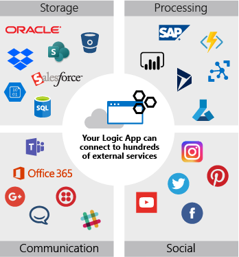
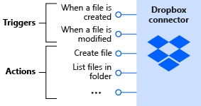

<head>
  <meta name="twitter:url" 
    content="https://microsoft.github.io/Low-Code/blog/slug-FIXME" />
  <meta name="twitter:title" 
    content="FIXME: Title Of Post" />
  <meta name="twitter:description" 
    content="FIXME: Post Description" />
  <meta name="twitter:image" 
    content="FIXME: Post Image" />
  <meta name="twitter:card" content="summary_large_image" />
  <meta name="twitter:creator" 
    content="@codemillmatt" />
  <meta name="twitter:site" content="@AzureAdvocates" /> 
  <link rel="canonical" 
    href="https://microsoft.github.io/Low-Code/blog/slug-FIXME" />
</head>

Welcome to `Day 8` of #28DaysOfLowCode!

The theme for this week is Integrations. Yesterday we talked about Low Code + Dataverse. Today we'll explore the topic of serverless low code with Azure Logic Apps.

## What We'll Cover

* Serverless and Low Code?
* Azure Logic Apps overview
* Let's build a Logic App
* Logic Apps compared to Power Automate
* Resources

<!-- FIXME: banner image -->

<!-- ************************************* -->
<!--  AUTHORS: ONLY UPDATE BELOW THIS LINE -->
<!-- ************************************* -->

## Serverless and Low Code?

Are you sitting down? Because I'm about to tell you that there's something out there that combines the best of serverless computing with low code development. And that's ... Azure Logic Apps.

Before diving in and talking about what Logic Apps are, how they're used, and how they compare to Power Automate, let's start with a quick definition of serverless.

Generally, when people talk about serverless computing, they mean a computing paradigm where a small unit of functionality is exposed as a service. This "function" is meant to complete a single cohesive unit of work, and when finished the cloud resource that provided the processing power for the "function" is deallocated. And that's where the serverless comes in, the server, or cloud resources, are scaled to zero when the "function" is not running.

Now I've been putting quotation marks around the word function for a reason, and that's because Azure's serverless offering is called Azure Functions. And the unit of work that runs is called a Function.

Writing an Azure Function is a high-code activity. You use Visual Studio or VS Code and an SDK, such as the .NET SDK, to create a Function that does ... something. That something is going to be defined by your business needs of course, but there will always be a _trigger_ or an event that kicks the Function off. And there may be _bindings_, or connections to other services that are managed by the Azure Functions runtime. These connections are established and maintained for you amongst other things.

Now what does this all have to do with low code? Well, Azure Logic Apps allows you to create serverless workflows through a visual designer in the Azure portal, Visual Studio, or VS Code. You can specify what type of events that will kick off the workflow. And you can connect to other services via _connectors_. And I want to drive home the point, you do this through a visual designer!

In other words, Azure Logic Apps allows you to take the benefits of serverless computing and combine that with low code.

## Azure Logic Apps overview

Azure Logic Apps automates the execution of business processes. Using the visual designer, you arrange pre-made components into a sequence - or a workflow. The Logic Apps runtime launches your app when conditions are right and manages the compute resources needed to run it. The following illustration shows a high-level view of the steps.

Azure Logic Apps components let you connect to hundreds of external services. The logic apps runtime takes care of managing and calling the services for you. The following illustration shows a few of the services you can use in your logic app workflow.

A Logic App is built by combining the capabilities of various services together. You can even add decision making processes to your app.

## Building a Logic App

We're not going to create a Logic App from front to back, step-by-step, in this article. That's really worth it's own article and we have some [documentation](https://learn.microsoft.com/azure/logic-apps/quickstart-create-first-logic-app-workflow) that will take you through that process.

Rather I want to concentrate on the major pieces and decision points that you'll make when creating a Logic App.

### Kicking off the logic

The very first decision you'll need to make when creating a Logic App is to decide what type of event, or _trigger_ will start the workflow running. The trigger specifies the condition to meet before any actions defined in the Logic App execute. Each time the trigger fires, the Logic Apps runtime creates and runs the workflow instance. If the trigger does not fire, no instance is created nor run. Serverless.

There are a ton of different triggers you can choose from. A workflow can be started with events as varied as a new email arriving to a new message arriving in an Azure Storage queue. The point is there are many different events you can choose from that will start your workflow.

### Connecting to other services

Now let's pause for a second to talk about all of these services that you can connect your Logic Apps workflow to. A _connector_ is a component that provides an interface to an external service. For example, the Twitter connector allows you to send and retrieve tweets, while the Office 365 Outlook connector lets you manage your email, calendar, and contacts.

There are literally hundreds of connectors from Microsoft and 3rd party vendors that you can use to build your workflows with.

A connector uses the external service's REST API to do its work. When you use the connector in your Logic App workflow, the connector calls the service's underlying API for you.

### Performing actions

If a trigger kicks off a workflow, then an action performs a specific task while the workflow is running.

A connector can be composed of many actions and triggers. For example, the Dropbox connector has triggers to monitor for when a file is created or modified. And it has actions to create a file, list files in a folder, and so on.

### Controlling actions

A control action routes the execution within a workflow based on conditions. Consider the Azure DevOps connector's Build Complete trigger kicking off a workflow. If the build status is _failed_, then a text message could be sent using the Azure Communication Service's connector. Otherwise if the build status is successful, a message could be posted to a chat in Microsoft Teams using its connector.

The _if_ statement is a conditional action. There are others such as _switch_ statements, _for each_ and _until_ loops.

## Logic Apps compared to Power Automate

Now, you may be thinking to yourself - Logic Apps sound a lot like Power Automate. And you're not wrong, they're both workflow-based services that work with connectors to other services.

In fact, Power Automate is built upon Azure Logic Apps!

They both have a user-friendly design surface to create your workflow on quickly. The difference is that Logic Apps allows you to build a bit more complex integration soutions and utilize advanced development tooling like Visual Studio or VS Code.

The licensing model is also different. Power Automate is licensed on a per-user basis. Logic Apps is done on a consumption (serverless) or a fixed-pricing model.

## Resources

* Take a [self-paced training course](https://learn.microsoft.com/training/modules/intro-to-logic-apps/) on Azure Logic Apps!
* [Azure Logic Apps documentation](https://learn.microsoft.com/azure/logic-apps/)
* [Power Automate documentation](https://learn.microsoft.com/power-automate/getting-started)
