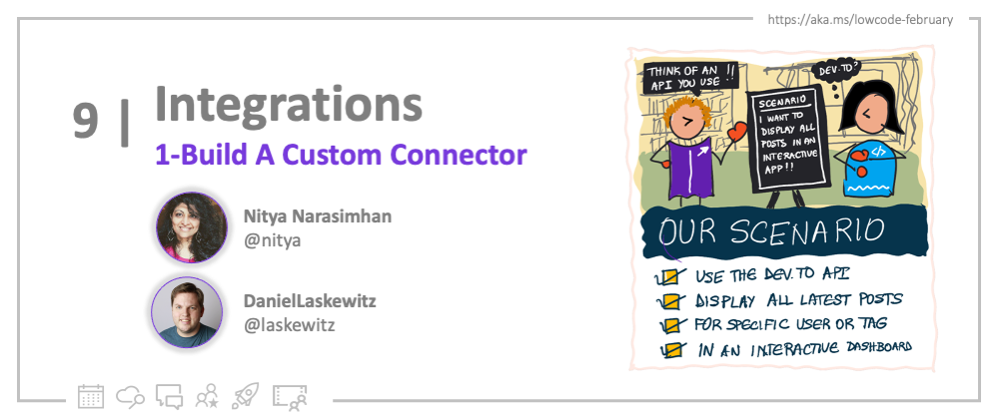
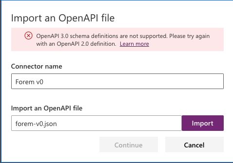
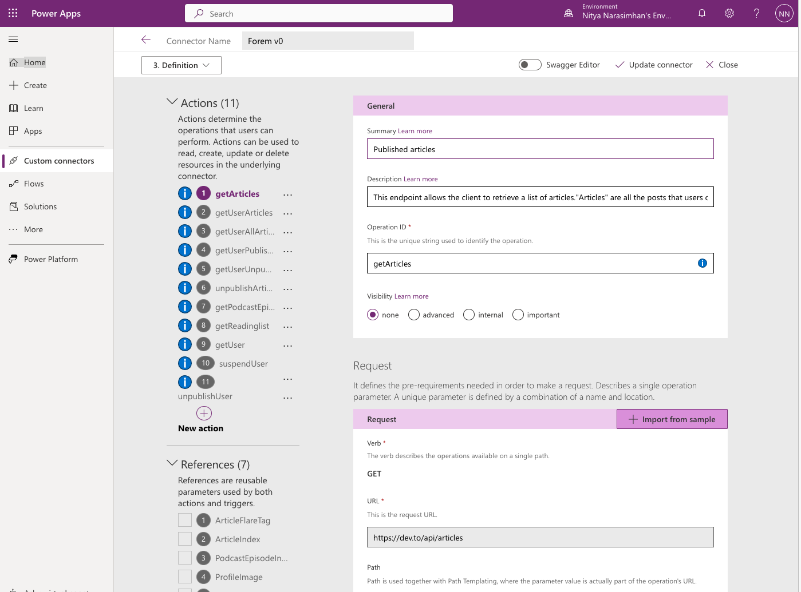
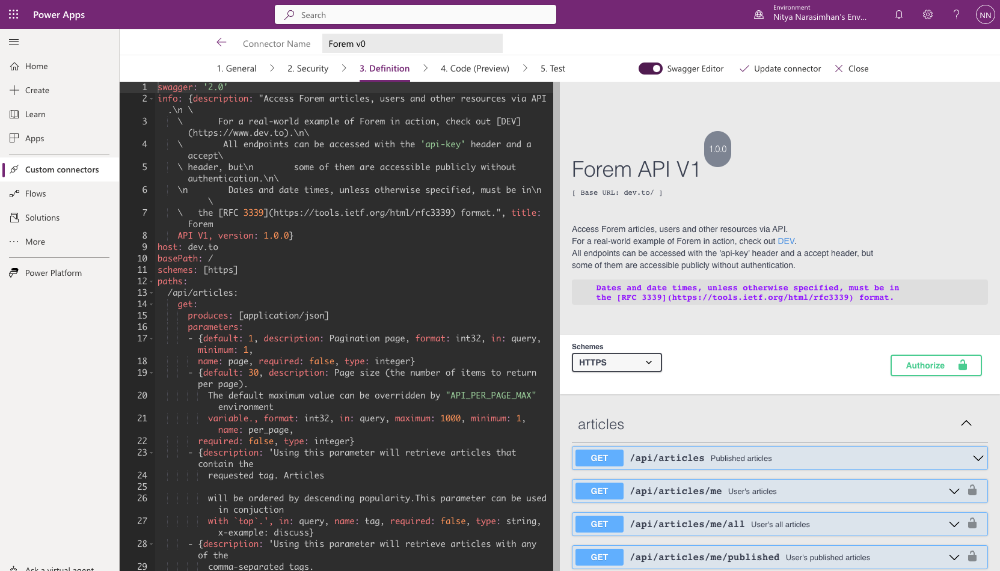

<head>
  <meta name="twitter:url" 
    content="https://microsoft.github.io/Low-Code/blog/2023-day9-build" />
  <meta name="twitter:title" 
    content="9. Build a Custom Connector" />
  <meta name="twitter:description" 
    content="Want to build a Power Platform connector for an API? Or extend an existing one to support new capabilities? Join us on #30DaysOfLowCode to learn how - https://aka.ms/lowcode-february" />
  <meta name="twitter:image" 
    content="https://microsoft.github.io/Low-Code/img/og/30-09-01.png" />
  <meta name="twitter:card" content="summary_large_image" />
  <meta name="twitter:creator" 
    content="@nitya" />
  <meta name="twitter:site" content="@AzureAdvocates" /> 
  <link rel="canonical" 
    href="https://microsoft.github.io/Low-Code/blog/2023-day9-build" />
</head>

Welcome to `Day 09` of #30DaysOfLowCode!

It's **Integrations Week**! So far, we've talked about Power Platform Connectors - from [built-in options](/blog/2023-day6) to [serverless computing solutions](/blog/2023-day8) with automated workflows triggered by connectors. But what if prebuilt connectors don't support _your_ requirements? That's where **custom connectors** come in. Join us today for a 2-part tutorial as we take you step-by-step through the process of _building, testing, and using_ a custom connector! 

## What We'll Cover
 * Motivation - Why are custom connectors needed?
 * Scenario - Let's build a dev.to Connector!
 * Process - Building from an OpenAPI specification
 * Testing - Validate it works!
 * **Exercise**: [Training: Build custom connectors for Power Automate](https://learn.microsoft.com/training/paths/build-custom-connectors/?WT.mc_id=javascript-82212-ninarasi&ns-enrollment-type=Collection&ns-enrollment-id=xz6ehr2mx031y0)
 * **Resources**: Explore the [Low Code February Collection](https://aka.ms/lowcode-february/collection)

<!-- ************************************* -->
<!--  AUTHORS: ONLY UPDATE BELOW THIS LINE -->
<!-- ************************************* -->

## Why Custom Connectors?

From [the earlier post](/blog/2023-day6) we know Connectors are wrappers around APIs that make it easier for low-code developers to take actions and trigger workflows based on API-supported operations. And we know there are [900+ pre-built connectors](https://learn.microsoft.com/connectors/connector-reference/?WT.mc_id=javascript-82212-ninarasi)  for Power Platform.

_So why would I want to build a custom connector?_ We can think of three reasons:
 1. **The API exists, but connector does not** - and you need to work with the API!
 2. **The connector exists, but it's not perfect** - you need a more customized or complete version.
 3. **The API is being built by you** - and you want to build a connector in parallel, to drive usage.

As a JavaScript Cloud Advocate, this was exactly the situation I faced when I wanted to explore the low-code ecosystem from a pro-developer perspective. I had a specific scenario I wanted to implement and the API existed **but the connector did not**! 

So I reached out to my colleague Daniel (Power Platform Cloud Advocate) and his response was immediate: _Let's build a custom connector!!_. Alright then!

## Our Target Scenario

You might know that there is an [Azure publication on dev.to](https://dev.to/azure), a community-driven content portal where cloud advocates publish tutorials, tips and best practices for developers. We have 100+ contributors on that publication, and each post can have up to 4 tags. We wanted to view the content in different ways, but the default dev.to dashboard only shows us a chronological view. So here's our scenario:

:::info USER SCENARIO
As a user, I want to see a list of articles from dev.to
 - for the Azure organization
 - for a specific user
 - for a specific tag

where each item should provide {publication date, author, tags, description, link}.
:::

The good news? The dev.to site is built on a platform called Forem - [which has an API](https://developers.forem.com/) that provides _exactly_ the kinds of operations (e.g., `/articles`) that can help us build this dashboard scenario. But there is no _prebuilt connector_ for this API, so it was time to build one!

## The Build Lifecycle

The Power Platform [documentation](https://learn.microsoft.com/en-us/connectors/custom-connectors/#lifecycle?WT.mc_id=javascript-82212-ninarasi) describes this 5-step process for building a custom connector:

 1. **Build & Secure it** - applicable only if you are building the API itself. We are not, so we can skip it.
 2. **Define it** - this is where you describe the methods and metadata in the API. You can hand-craft this _or_ use standardized options (OpenAPI file or Postman collection) to build from.
 3. **Use it** - create a connection to your Connector from a client, and validate it works!
 4. **Share it** - make the connector available to people within your organization to use.
 5. **Certify it** - submit it for Microsoft certification if you want this available to all users.

## Let's Build the Connector!

We'll follow the guidelines in [this tutorial](https://learn.microsoft.com/en-us/connectors/custom-connectors/#tutorial?WT.mc_id=javascript-82212-ninarasi). 

### 1. Pre-Requisites

To get started, you will need the following:
 * **Subscription** - to Azure (if using Azure Logic Apps), Power Automate, or Power Apps.
 * **Familiarity** - with core concepts of Logic Apps, Power Automate flows, or Power Apps.
 * **API Key** - to the Forem API, if using authenticated endpoints

Note that currently Power Plaform supports only [OpenAPI v2.0](https://learn.microsoft.com/connectors/custom-connectors/define-openapi-definition#prerequisites?WT.mc_id=javascript-82212-ninarasi) - and the dev.to API uses OpenAPI 3.x.  We can work around this in two ways:
 1. Use a converter that downgrades API to v2.0 (knowing you may lose some functionality)
 2. Manually re-create API in Custom Connector wizard (using OpenAPI spec as reference)

We'll talk briefly about the first option in this post, and encourage you to join us for our [**PowerfulDevs Session**](https://learn.microsoft.com/events/learn-events/powerful-devs-2023/?WT.mc_id=javascript-82212-ninarasi) where Daniel will walk through the steps for the second option!

### 2. Get The DevPlan

Don't have a Power Apps or Power Automate subscription (see pre-requisites)? Just sign up for the [Power Apps Developer Plan](https://aka.ms/lowcode-february/devplan) and get a free development environment that will work for this purpose. Anyone with a work or school email address (backed by Azure AD) can sign up. Read our earlier post on [**DevTools and Onboarding**](/blog/2023-day3) options to get yourself set up with a sandbox subscription and test tenant.

### 3. Connector Wizard

Visit the [Power Apps](https://make.powerapps.com/) portal and sign in. You should see something like this:

Select `Data > Custom Connectors` to enter the Custom Connector Wizard. Click the `New custom connector` drop-down to see the different starting options as shown below. Use the **Create from blank** option to build the custom connector manually. We walk through this approach in our [**PowerfulDevs Session**](https://learn.microsoft.com/events/learn-events/powerful-devs-2023/?WT.mc_id=javascript-82212-ninarasi) on Feb 15 so don't miss it!

### 4. OpenAPI Converter

For completeness, let's also see what happens if we were to try using the _Import an OpenAPI file_ option. First **[download the dev.to OpenAPI file](https://developers.forem.com/api/v1)** to your local drive. Then use the _Import_ option in the wizard to upload this file to the portal. (Note: in my case I used a converter tool to convert the OpenAPI YAML to a JSON file before this step).

Not surprisingly, we get this error message indicating that the dev.to OpenAPI file uses the v3 specification which is not _yet_ supported. What do we do now?

If you're a JavaScript developer, you'll likely check npm for a handy converter. And guess what? [**You'd find one!**](https://www.npmjs.com/package/api-spec-converter) that does exactly what you need. You can even use this directly on the YAML file downloaded from the dev.to API site!

Now use the _Import_ option again but with the converted file and - SUCCESS! 🎉 You should be taken into the first step of the Custom Connector creation workflow.

### 5. Creation Workflow

The wizard walks you through the 5 key steps of the workflow (see tabs):
 1. **General** - defines the metadata for the Connector. Pay attention to the `Host` and `Base URL` fields. These will need to be corrected to align with the API definition. However, importing the file should have filled in details like the `Description`. Customize this by adding your own icon and background color preferences. _Then move to next tab_.
 2. **Security** - is the panel where you enter credentials (e.g., API key) required to access the API
 3. **Definition** - is the main tab defining the API. We'll look at this in the next section.
 4. **Code** - The connector can act as a proxy between API and low-code clients. This section allows you to define code that _transforms_ requests or responses in custom ways.
 5. **Test** - This pane helps validate your definition with simple in-wizard tests as we see later.

For our current purpose, let's dive into the _Definition_ tab for more detail.

### 6. Edit Definition

The good news is that importing an OpenAPI file will fill in most of the definition details for you. Here, **Actions** are the requests you can make on API (endpoints) - we can see that the default dev.to API endpoints are already defined. Because we downgraded to OpenAPI v2, you may find certain actions throwing _error_ flags.

You can use your judgement to delete or edit them manually, till the complete definition is error-free. As a pro-developer, I was particularly happy to see the option to switch to a _Swagger editor_ as shown below. Changes in this editor are kept in sync with the definition, so you can easily move between the wizard UI or this editor, without losing context. The editor view lets you see the raw details of the OpenAPI spec, and the _swagger-ui_ rendered version (at right) for easy debugging.

Once you've completed the definition to your satisfaction, take a minute to click _Update connector_ to make sure the changes are saved to the environment. We aren't doing any code transformations, so let's skip that step and go directly to testing!

## Let's Test the Connector!

At this point, we've come to the [Step 5: Test the connector](https://learn.microsoft.com/en-us/connectors/custom-connectors/define-blank#step-5-test-the-connector?WT.mc_id=javascript-82212-ninarasi) step of the tutorial. **Testing is currently available only in Power Automate and Power Apps**.

### 1. Create Connection

The connector is just the wrapper around the API. Before we can use it, we need to associate this with a _Connection_ that provides the required **credentials** (e.g., API key) required to actually use the deployed API endpoint.

You can create a new connection either from the _Connections_ page (see sidebar) or from the Test tab of the wizard itself. Once the Connection is created, you should be taken to the Connections page to verify that it was created correctly. Now we're ready to test!

### 2. Test Connector

Switch back to the Custom Connectors page, select the connector you were working on, and move to the _Test_ tab. You should see something like this - where you can now select the newly created connector as the default Connection for the test.

Screenshot of Testing UI](./build/7-test.png)

At this point, you can simply select the _Action_ (request), provide any necessary parameters, and click `Test operation` to see if you get the correct response. For example, in the screenshot below, you can see the default response for `getUserArticles` returns the last article I published on dev.to! 

This test tab also provides helpful feedback - for instance _schema validation_ - that can help you further debug and fix any issues in the definition, before you share the connector with others.

:::success CONGRATULATIONS 🥳
You just built and tested your first custom connector using the dev.to API!
:::

Note that testing within the wizard helps with improving the _definition_ but it can be laborious to test everything that your intended application will use. Instead, you might be able to test the connector _from an application_ by **using the connector in a Power Apps or Power Automate** implementation.

## Next: Use The Connector!

Wow - we covered a lot today! Here's a helpful visual recap for your convenience. We defined our scenario, built our connector, tested it within the Custom Connector wizard, and learned about options for sharing it widely. What's next? **Using the connector** in a real-world context, to deliver the rich interactive experience we described in our scenario. **Read Part-2 to see how we used the connector within Power Apps!**.

## Exercise

Try building a custom connector yourself, either for the same dev.to API, or for any other OpenAPI-compliant API that you might want to use. And don't forget to [**join us Feb 15 for the PowerfulDevs Conference**](https://learn.microsoft.com/events/learn-events/powerful-devs-2023/?WT.mc_id=javascript-82212-ninarasi) where we walk through the process and demo in under 30 mins!

## Resources

 - [**Training: Build custom connectors for Power Automate**](https://learn.microsoft.com/training/paths/build-custom-connectors/?WT.mc_id=javascript-82212-ninarasi&ns-enrollment-type=Collection&ns-enrollment-id=xz6ehr2mx031y0) - also in our [Cloud Skills Challenge](https://aka.ms/lowcode-february/challenge)
 - [**Documentation: Custom Connectors**](https://learn.microsoft.com/connectors/custom-connectors/?WT.mc_id=javascript-82212-ninarasi) - on Microsoft Learn
 - [**Examples: Custom Connectors**](https://github.com/Microsoft/PowerPlatformConnectors/tree/master/custom-connectors) - GitHub Repository
 - [**PowerfulDevs Session**](https://learn.microsoft.com/events/learn-events/powerful-devs-2023/?WT.mc_id=javascript-82212-ninarasi): Enable millions of low code devs by building custom connectors
 - [**Learn Collection** ](https://aka.ms/lowcode-february/collection) LowCode February

