<head>
  <meta name="twitter:url" content="https://microsoft.github.io/Low-Code/blog/2023-day10" />
  <meta name="twitter:title" content="Providing Power Platform custom connector with additional security via Azure API Management" />
  <meta name="twitter:description" content="Throughout this post, let's discuss how Azure API Management can offer extra security to Power Platform custom connectors" />
  <meta name="twitter:image" content="https://microsoft.github.io/Low-Code/img/og/30-10.png" />
  <meta name="twitter:card" content="summary_large_image" />
  <meta name="twitter:creator" content="@justinchronicle" />
  <meta name="twitter:site" content="@AzureAdvocates" /> 
  <link rel="canonical" href="https://microsoft.github.io/Low-Code/blog/2023-day10" />
</head>

Welcome to `Day 10` of #30DaysOfLowCode!

The theme for this week is **backend**. Yesterday we talked about building custom connectors. Today we'll explore the topic of _providing Power Platform custom connectors with additional security via [Azure API Management][az apim]_. Ready? Let's go!

## What We'll Cover

- [**Authentication Types**](#power-platform-custom-connector-authentication-types) for Custom Connectors
- [**Prerequisites**](#prerequisites)
- [**Deploying**](#deploying-sample-apps) Sample Apps
  1. [API Key Auth](#1-api-key-auth)
  2. [Basic Auth](#2-basic-auth)
  3. [OAuth2 – Authorisation Code Auth](#3-oauth2--authorisation-code-auth)
  4. [BFF (Backends-for-Frontends) – Combine API Key Auth & Basic Auth](#4-bff-backends-for-frontends--combination-of-api-key-auth-and-basic-auth)
- [**Exercise**](#exercise--try-it-yourself) – Try it yourself!
- [**Resources**](#resources--for-self-study) – For self-study!


## Custom Connector Authentication Types

Power Platform custom connectors currently support [four authentication flow options &ndash; No Auth flow, API Key Auth flow, Basic Auth flow and OAuth2 Authorisation Code Auth flow][az pp cuscon authn]. "No Auth flow" is definitely not an option this time, but let's focus on the other three options throughout this post. You also need to be aware that those authentication types are mutually exclusive. In other words, you CANNOT combine two or more authentication scenarios on one custom connector. Also, if you want to use the API Key auth flow, you CANNOT use the other two authentication types within the custom connector. I'll discuss that later in this post.


## Prerequisites

For this post, you need to have the following signed up:

- [Microsoft 365 Developer Program][m365 dev]
- [Power Platform Developer Program][pp dev]
- [Free Microsoft Azure subscription][az free]
- [Free GitHub account][gh free]


## Deploying Sample Apps

Let's deploy the sample apps for this post. Fork [this repository][gh sample] and follow the detailed instruction on its README to provision and deploy the sample apps. Once everything is done, you will have one [API Management][az apim] instance and three [Azure Functions][az fncapp] app instances representing authentication scenarios like API Key Auth, Basic Auth and OAuth2 Auth, respectively.


Each function app has already been integrated with API Management. Let's take a look at each authentication type.


### 1. API Key Auth

The first option is using an API key to provide extra security. Using Azure API Management, you can choose between:

- A concept called [subscription][az apim subscription], where you use the subscription key through a HTTP request header of `Ocp-Apim-Subscription-Key`
- Or you can use a HTTP request query string of `subscription-key`.

Both options add another security layer to your API, in addition to your Azure Function app's `x-functions-key` in the request header or `code` in the request querystring.

1. Let's take a look at the [API policy configurations][az apim policies] in API Management.

    

   Through this policy, the function app's API key is integrated. Therefore, you don't need to worry about the function app's API key.

1. Now, you want to add the API Management's API key. First, make sure your API settings have enabled the subscription. Also, ensure that no user authorization is enabled by selecting "None" against the "User authorization" option.

    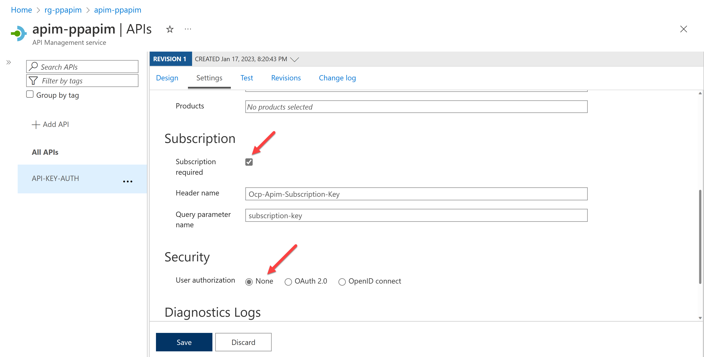

1. Export the OpenAPI document by selecting the "Export" menu and choosing the "OpenAPI v2 (JSON)" option. Then you will be able to download an OpenAPI document.

    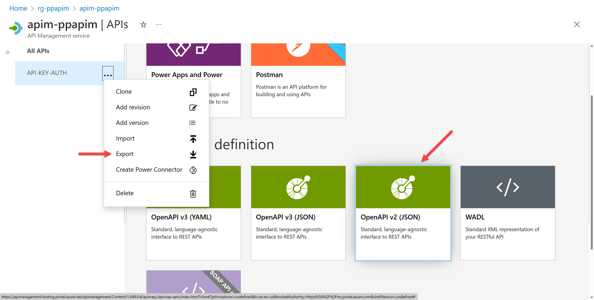

   You might have a question here.

   > What does the "Create Power Connector" menu do? Isn't that for this API key auth?

   That's actually a valid question. The only difference between exporting the OpenAPI document and creating the connector directly through the menu is that which tenant you want to export the connector to. If you want to only use within your tenant, the "Create Power Connector" is a simple and easy way to generate a custom connector. However, if your connector is not only for your tenant, but also other tenant, you should export the OpenAPI document and use it in the other tenants.

   Therefore, throughout this post, you're assuming to use this custom connector in general purpose, rather than tied with your tenant.

1. Let's take a look at the document. It might look like the following JSON document, saying that you MUST use the API key through `Ocp-Apim-Subscription-Key` in the request header or `subscription-key` in the request querystring.

    ```jsonc
    {
      "swagger": "2.0",
      ...
      "securityDefinitions": {
        "apiKeyHeader": {
          "type": "apiKey",
          "name": "Ocp-Apim-Subscription-Key",
          "in": "header"
        },
        "apiKeyQuery": {
          "type": "apiKey",
          "name": "subscription-key",
          "in": "query"
        }
      },
      "security": [
        {
          "apiKeyHeader": []
        },
        {
          "apiKeyQuery": []
        }
      ],
      "paths": {
        ...
      }
      ...
    }
    ```

1. Alright. Let's import this OpenAPI document for a custom connector. Go to either `https://make.powerapps.com` for Power Apps or `https://make.powerautomate.com` for Power Automate, and create a custom connector by importing an OpenAPI file.

    

1. It automatically identifies the authentication type to "API Key", the API key parameter name of `Ocp-Apim-Subscription-Key` and the parameter location of "Header".

    

1. After creating the connector, let's create a connection for the connector. Then, it requires the API key. Enter the API key generated from the API Management.

    

1. Test the connector to see whether it works OK or not.

    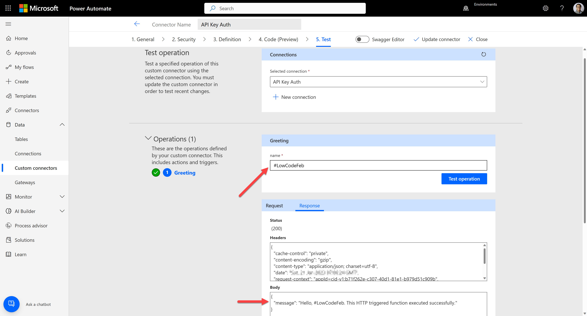

We've added extra security to the custom connector with API Management's API key.


### 2. Basic Auth

The second option is to use the basic auth flow. It's important to know that **API Management doesn't support this basic auth flow out-of-the-box**. Although it's a limitation, you can still apply this flow for the Power Platform custom connectors by slightly modifying the OpenAPI document.

1. Let's take a look at the API policy, which is basically the same as the one in the previous section &ndash; integrate the function app's API key with API Management.

    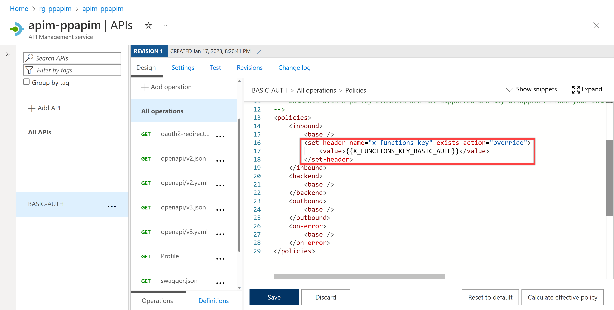

1. Make sure that you're not going to use the subscription key at this time. Therefore, disable the subscription key. By doing so, you no longer need the API key for this API.

    

   > **WARNING**: If you disable the subscription key for this exercise, your API endpoint works as like a public API &ndash; not secure at all. Therefore, you MUST implement the logic in your function app that validates the basic authentication header sent through API Management. As mentioned above, it's required to disable the subscription key because API Management doesn't natively support the basic auth feature. Therefore, if you want to use this approach, please use it with extra care.

1. Once you're ready, export the OpenAPI document by selecting the "Export" menu and choosing the "OpenAPI v2 (JSON)" option.

    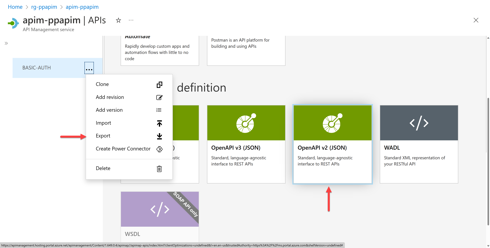

1. Then, you will be able to download an OpenAPI document. Let's take a look at the document. It might look like the following JSON document, saying that you MUST use either `Ocp-Apim-Subscription-Key` in the request header or `subscription-key` in the request querystring.

   However, you MUST replace both with the basic auth because you will not use the API key auth this time.

    ```jsonc
    {
      "swagger": "2.0",
      ...
      "securityDefinitions": {
        // ⬇️⬇️⬇️ Remove both 'apiKeyHeader' and 'apiKeyQuery' ⬇️⬇️⬇️
        "apiKeyHeader": {
          "type": "apiKey",
          "name": "Ocp-Apim-Subscription-Key",
          "in": "header"
        },
        "apiKeyQuery": {
          "type": "apiKey",
          "name": "subscription-key",
          "in": "query"
        },
        // ⬆️⬆️⬆️ Remove both 'apiKeyHeader' and 'apiKeyQuery' ⬆️⬆️⬆️
    
        // ⬇️⬇️⬇️ Add 'basicAuth' ⬇️⬇️⬇️
        "basicAuth": {
          "type": "basic"
        }
        // ⬆️⬆️⬆️ Add 'basicAuth' ⬆️⬆️⬆️
      },
      "security": [
        // ⬇️⬇️⬇️ Remove both 'apiKeyHeader' and 'apiKeyQuery' ⬇️⬇️⬇️
        {
          "apiKeyHeader": []
        },
        {
          "apiKeyQuery": []
        },
        // ⬆️⬆️⬆️ Remove both 'apiKeyHeader' and 'apiKeyQuery' ⬆️⬆️⬆️
    
        // ⬇️⬇️⬇️ Add 'basicAuth' ⬇️⬇️⬇️
        {
          "basicAuth": []
        }
        // ⬆️⬆️⬆️ Add 'basicAuth' ⬆️⬆️⬆️
      ],
      "paths": {
        ...
      }
      ...
    }
    ```

1. Once you update the OpenAPI document, let's import this OpenAPI document for a custom connector. Go to either `https://make.powerapps.com` for Power Apps or `https://make.powerautomate.com` for Power Automate, and create a custom connector by importing an OpenAPI file.

    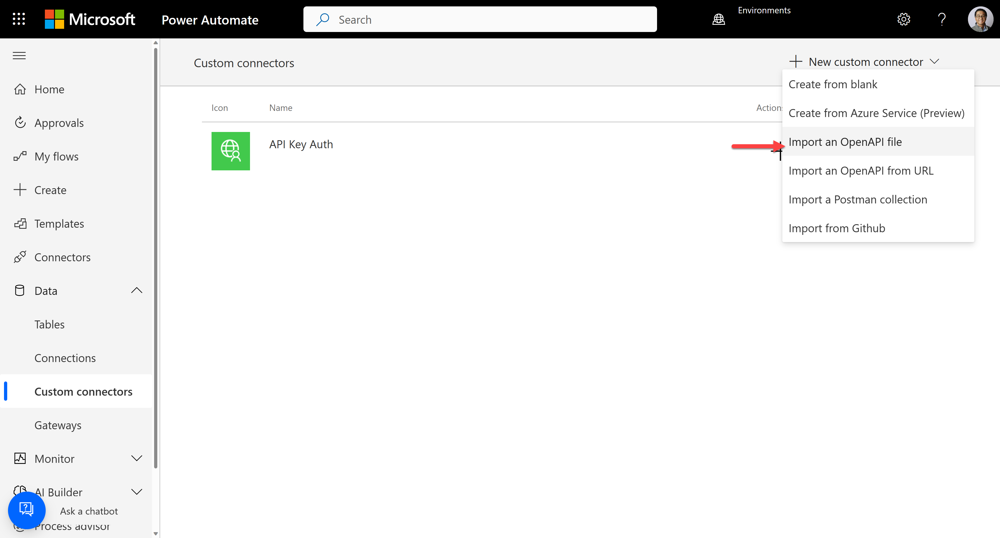

1. It automatically identifies the authentication type as "Basic authentication", "username", and "password".

    

1. After creating the connector, let's create a connection for the connector. Then, it requires the username and password. The username and password in this sample app are for [Atlassian Jira][atlassian jira]. Therefore, get your email address as the username and API token as the password from there.

    

1. Test the connector to see whether it works OK or not.

    

We've added extra security to the custom connector with basic auth.


### 3. OAuth2 - Auth Code

The third option is to use [OAuth2][oauth2]. There are many authentication flows in OAuth2, but Power Platform custom connector only supports the [Authorisation code auth flow][az ad authn authcodeauth] at this time of writing. Therefore, let's focus on that. The basic idea of using any OAuth2 auth flow is to get the access token and the resources you want. It's safe to assume that the function app is able to understand the access token and process it.

1. To use OAuth2 auth flow, you need to first [register an app][az ad register app] in [Azure Active Directory][az ad]. After registering a new app, it will give the ability to get the access codes. I'm not going into too many details here, but it's worth taking a look at [this document][gh sample authcodeauth readme]. Once you create the app, you will have the following information:

    - Tenant ID
    - Client ID
    - Client secret
    - Endpoint URL for authorization
    - Endpoint URL for the access token
    - Endpoint URL for the refresh token

1. With this information, you need to integrate it with API Management. Go to Azure Portal, open the API Management instance, and navigate to the "OAuth 2.0 + OpenID Connect" blade. Add a new OAuth2 service under the "OAuth 2.0" tab.

    

1. Enter the following details in the fields and create the service.

    - Display name: `AuthCode Auth`
    - Client registration page URL: `http://localhost`
    - Authorization grant types: tick only on "Authorization code"
    - Authorization endpoint URL: endpoint URL for authorization noted from the above
    - Token endpoint URL: endpoint URL for access token noted from the above
    - Default scope: `https://graph.microsoft.com/.default`
    - Client ID: client ID noted from the above
    - Client secret: client secret noted from the above

    After that, you will have both redirect URLs:

    - `null/signin-oauth/code/callback/authcode-auth`
    - `null/signin-oauth/implicit/callback`

    Replace `null` with your API Management instance URL like `https://{{APIM_NAME}}.azure-api.net`, where `{{APIM_NAME}}` is your API Management instance name.

1. Add both redirect URLs to your registered app on Azure AD as redirect URLs.

1. Check out the API policy, which is basically the same as in the previous sections &ndash; integrate the function app's API key with API Management.

    

1. Make sure you will not use the subscription key this time. Therefore, disable the subscription key. By doing so, you no longer need the API key for this API. In addition to this, because you're using OAuth2 authorization, choose the "OAuth 2.0" option and select the OAuth 2.0 server of "AuthCode Auth" that you just created right before.

    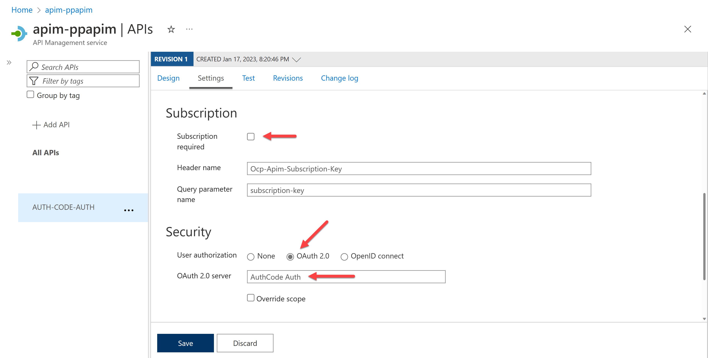

    It's also worth noting that because the custom connector sends the OAuth2 access token to the function app through API Management, it's safe to assume that the function app is able to understand the token and process it.

1. Once you're ready, export the OpenAPI document by selecting the "Export" menu and choosing the "OpenAPI v2 (JSON)" option.

    

1. Then, you will be able to download an OpenAPI document. Let's take a look at the document. It might look like the following JSON document, saying that you MUST use either `Ocp-Apim-Subscription-Key` in the request header or `subscription-key` in the request querystring.

   However, you MUST remove both because you will not use the API key auth this time. Make sure you MUST replace `{{TENANT_ID}}` with your tenant ID.

    ```jsonc
    {
      "swagger": "2.0",
      ...
      "securityDefinitions": {
        // ⬇️⬇️⬇️ Remove both 'apiKeyHeader' and 'apiKeyQuery' ⬇️⬇️⬇️
        "apiKeyHeader": {
          "type": "apiKey",
          "name": "Ocp-Apim-Subscription-Key",
          "in": "header"
        },
        "apiKeyQuery": {
          "type": "apiKey",
          "name": "subscription-key",
          "in": "query"
        },
        // ⬆️⬆️⬆️ Remove both 'apiKeyHeader' and 'apiKeyQuery' ⬆️⬆️⬆️
    
        // ⬇️⬇️⬇️ Keep 'oauth2AuthCode Auth' ⬇️⬇️⬇️
        "oauth2AuthCode Auth": {
          "type": "oauth2",
          "scopes": {
            "https://graph.microsoft.com/.default": ""
          },
          "flow": "accessCode",
          "authorizationUrl": "https://login.microsoftonline.com/{{TENANT_ID}}/oauth2/v2.0/authorize",
          "tokenUrl": "https://login.microsoftonline.com/{{TENANT_ID}}/oauth2/v2.0/token"
        }
        // ⬆️⬆️⬆️ Keep 'oauth2AuthCode Auth' ⬆️⬆️⬆️
      },
      "security": [
        // ⬇️⬇️⬇️ Remove both 'apiKeyHeader' and 'apiKeyQuery' ⬇️⬇️⬇️
        {
          "apiKeyHeader": [],
          "oauth2AuthCode Auth": [
            "https://graph.microsoft.com/.default"
          ]
        },
        {
          "apiKeyQuery": [],
          "oauth2AuthCode Auth": [
            "https://graph.microsoft.com/.default"
          ]
        }
        // ⬆️⬆️⬆️ Remove both 'apiKeyHeader' and 'apiKeyQuery' ⬆️⬆️⬆️
    
        // ⬇️⬇️⬇️ Add 'oauth2AuthCode Auth' ⬇️⬇️⬇️
        {
          "oauth2AuthCode Auth": [
            "https://graph.microsoft.com/.default"
          ]
        }
        // ⬆️⬆️⬆️ Add 'oauth2AuthCode Auth' ⬆️⬆️⬆️
      ],
      "paths": {
        ...
      }
      ...
    }
    ```

1. Once you update the OpenAPI document, let's import this OpenAPI document for a custom connector. Go to either `https://make.powerapps.com` for Power Apps or `https://make.powerautomate.com` for Power Automate, and create a custom connector by importing an OpenAPI file.

    

1. It automatically identifies the authentication type to "OAuth 2.0" and the Identity Provider of "Generic OAuth 2". Then, enter the Client ID, Client secret, and the Refresh URL noted above. Using a different registered app here is OK if it's under the same tenant.

    

1. After creating the connector, let's create a connection for the connector. As you've already provided the client ID and secret, you will immediately create the connection.

1. Test the connector to see whether it works OK or not.

    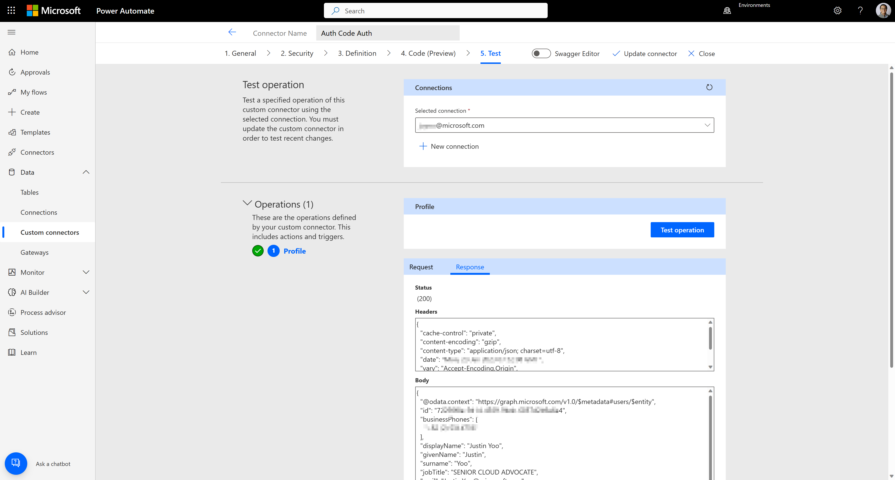

We've added extra security to the custom connector with OAuth2 - authorization code auth.


### 4. BFF - Combine Auth

Many organisations nowadays have requirements using the [BFF (Backends-for-frontends) pattern][az patterns architecture bff] through API Management, mainly if your organisation adopts microservice architecture. It's not uncommon that APIs use different authentication approaches for different APIs &ndash; one uses the API key auth, another uses the basic key auth, and the other uses the OAuth2 auth.

If you are about to build a BFF with those APIs using different authentication methods, what would you do? What could you do if you're even about to create the BFF for the Power Platform custom connector? There are many different combinations of authentication methods, but let's focus on following two &ndash; API key auth and basic auth:

1. First of all, you MUST choose which authentication type you will use for the main one for the Power Platform custom connector. If you want to use basic auth as the main one, the custom connector doesn't have to know the API key and vice versa. In other words, the other authentication method MUST be handled by the API Management policy of the BFF API.

1. Let's take a look at [this OpenAPI document][gh sample openapi bff] for BFF. It combines both apps using the API key auth and basic auth, respectively.

    ```yaml
    openapi: 3.0.1
    ...
    paths:
      /greeting:
        get:
          tags:
            - greeting
          summary: Greeting
          operationId: Greeting
          ...
          security:
            - apiKeyHeader: [ ]
            - apiKeyQuery: [ ]
      /profile:
        get:
          tags:
            - profile
          summary: Profile
          operationId: Profile
          ...
          security:
            - apiKeyHeader: [ ]
            - apiKeyQuery: [ ]
            - basicAuth: [ ]
    ...
    components:
      ...
      securitySchemes:
        apiKeyHeader:
          type: apiKey
          name: Ocp-Apim-Subscription-Key
          in: header
        apiKeyQuery:
          type: apiKey
          name: subscription-key
          in: query
        basicAuth:
          type: http
          scheme: basic
    ```

   It defines API key auth and basic auth in the document and applies them to each endpoint.

1. Import this OpenAPI to API Management. Then check out the settings. Make sure you MUST activate the subscription.

    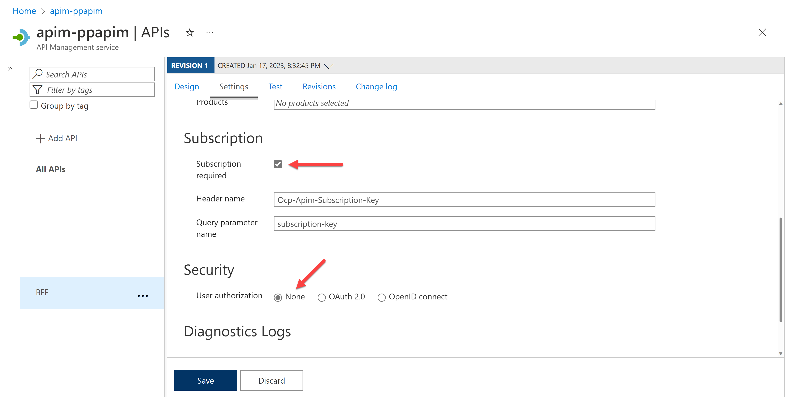

1. Add the [`authentication-basic` as an inbound policy][az apim policies basicauth] that sets the basic auth token to the request header. After this, API Management automatically injects this basic auth token into every request header.

    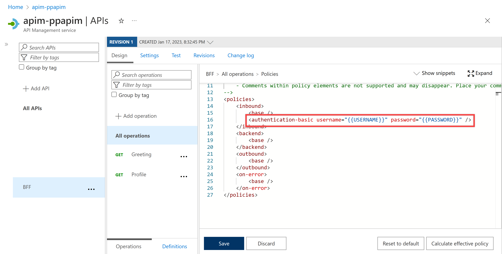

1. Export the OpenAPI document. As you use the API key auth, follow the [1. API Key Auth](#1-api-key-auth) pattern.

1. In the Power Platform custom connector, you only need the API key provided by API Management to create the connection because API Management has already encapsulated the basic auth token.

1. Test the connector to see whether it works OK or not. As you can see, both endpoints work perfectly fine.

    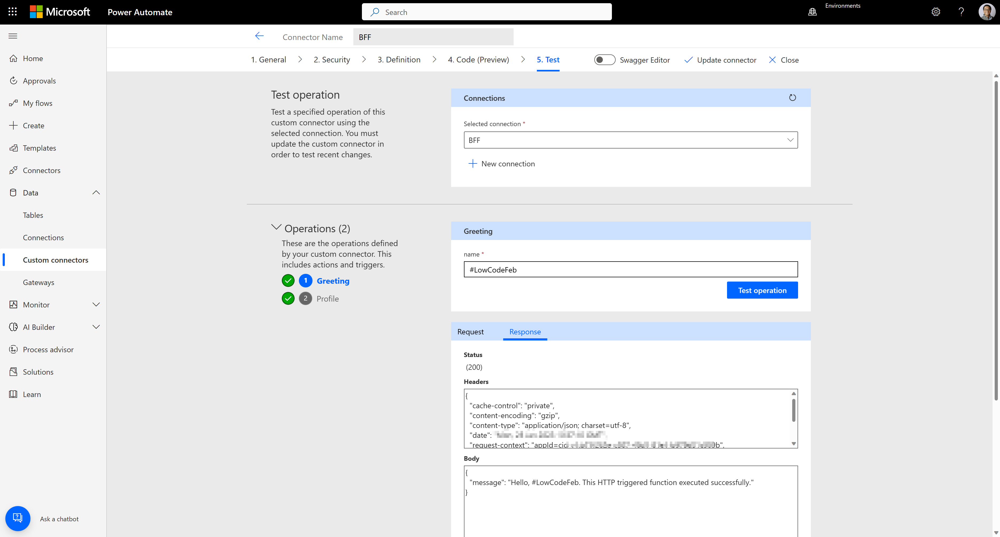

We've created a BFF by combining APIs that use API key auth and basic auth, and the BFF has been used for the Power Platform custom connector. However, as mentioned earlier in this post, we have to choose only one authentication type due to the restriction of authentication types in the Power Platform custom connector. Therefore, if you need more than one authentication type for your connector, you MUST choose one, and API Management MUST encapsulate all the others.

Theoretically, there are three possible combinations for BFF:

- API key auth and basic auth
- API key auth and OAuth2 auth code auth
- Basic auth and OAuth2 auth code auth

Throughout this post, we've walked through the first combination. After that, you can try the other two combinations on your end!


## Exercise &ndash; Try it yourself!

If you haven't joined the following programs, it's time to do so for further learning!

- [Microsoft 365 Developer Program][m365 dev]
- [Power Platform Developer Program][pp dev]
- [Free Microsoft Azure subscription][az free]
- [Free GitHub account][gh free]

Then, follow the steps below. After that, you will be the one who knows better security on Power Platform custom connectors!

- Fork this [GitHub repository][gh sample] to provision and deploy the sample apps.
- Read and follow the instructions for each scenario:
  - [API Key Auth][gh sample apikeyauth readme]
  - [Basic Auth][gh sample basicauth readme]
  - [Authorisation Code Auth][gh sample authcodeauth readme]
  - [BFF][gh sample bff readme]


## Resources &ndash; Self-Study

- [Cloud architecture pattern &ndash; BFF (Backends-for-frontends)][az patterns architecture bff]
- [Azure AD application model][az ad register app]
- [Azure API Management authentication and authorisation][az apim security authn]
- [Power Platform custom connector parameters][az pp cuscon authn]
- [Creating Microsoft 365 Developer Environment][m365 dev create]


[gh sample]: https://github.com/devkimchi/power-platform-connector-via-apim
[gh sample apikeyauth readme]: https://github.com/devkimchi/power-platform-connector-via-apim/blob/main/src/ApiKeyAuthApp/README.md
[gh sample basicauth readme]: https://github.com/devkimchi/power-platform-connector-via-apim/blob/main/src/BasicAuthApp/README.md
[gh sample authcodeauth readme]: https://github.com/devkimchi/power-platform-connector-via-apim/blob/main/src/AuthCodeAuthApp/README.md
[gh sample bff readme]: https://github.com/devkimchi/power-platform-connector-via-apim/blob/main/src/BffApp/README.md
[gh sample openapi bff]: https://github.com/devkimchi/power-platform-connector-via-apim/blob/main/infra/apim-openapi-bff.yaml

[az patterns architecture bff]: https://learn.microsoft.com/azure/architecture/patterns/backends-for-frontends?WT.mc_id=dotnet-82212-juyoo

[az ad]: https://learn.microsoft.com/azure/active-directory/fundamentals/active-directory-whatis?WT.mc_id=dotnet-82212-juyoo
[az ad authn authcodeauth]: https://learn.microsoft.com/azure/active-directory/develop/v2-oauth2-auth-code-flow?WT.mc_id=dotnet-82212-juyoo
[az ad register app]: https://learn.microsoft.com/azure/active-directory/develop/quickstart-register-app?WT.mc_id=dotnet-82212-juyoo

[az apim]: https://learn.microsoft.com/azure/api-management/api-management-key-concepts?WT.mc_id=dotnet-82212-juyoo
[az apim policies]: https://learn.microsoft.com/azure/api-management/api-management-howto-policies?WT.mc_id=dotnet-82212-juyoo
[az apim policies setheader]: https://learn.microsoft.com/azure/api-management/set-header-policy?WT.mc_id=dotnet-82212-juyoo
[az apim policies basicauth]: https://learn.microsoft.com/azure/api-management/authentication-basic-policy?WT.mc_id=dotnet-82212-juyoo
[az apim subscription]: https://learn.microsoft.com/azure/api-management/api-management-subscriptions?WT.mc_id=dotnet-82212-juyoo
[az apim security authn]: https://learn.microsoft.com/azure/api-management/authentication-authorization-overview?WT.mc_id=dotnet-82212-juyoo

[az fncapp]: https://learn.microsoft.com/azure/azure-functions/functions-overview?WT.mc_id=dotnet-82212-juyoo

[az pp cuscon authn]: https://learn.microsoft.com/connectors/custom-connectors/connection-parameters?WT.mc_id=dotnet-82212-juyoo

[atlassian jira]: https://www.atlassian.com/software/jira
[oauth2]: https://oauth.net/2/

[m365 dev]: https://learn.microsoft.com/office/developer-program/microsoft-365-developer-program?WT.mc_id=dotnet-82212-juyoo
[m365 dev create]: https://learn.microsoft.com/power-platform/developer/create-developer-environment
[pp dev]: https://learn.microsoft.com/power-apps/maker/developer-plan?WT.mc_id=dotnet-82212-juyoo?WT.mc_id=dotnet-82212-juyoo
[az free]: https://azure.microsoft.com/free/?WT.mc_id=dotnet-82212-juyoo
[gh free]: https://github.com/signup
