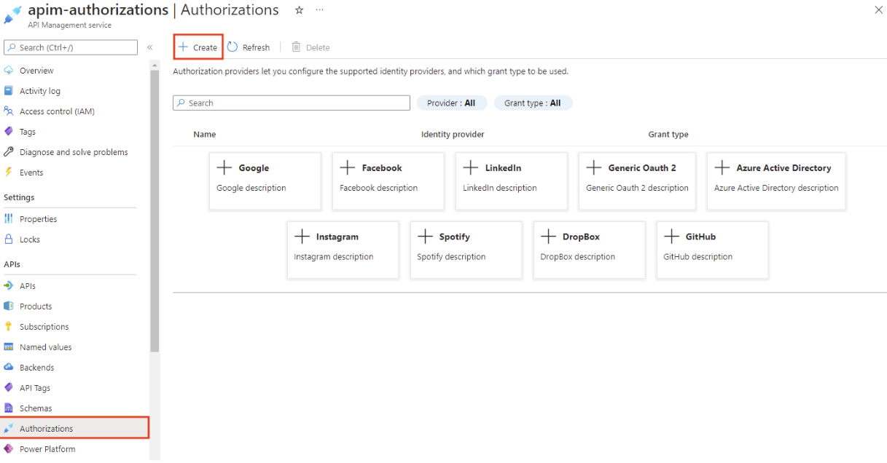
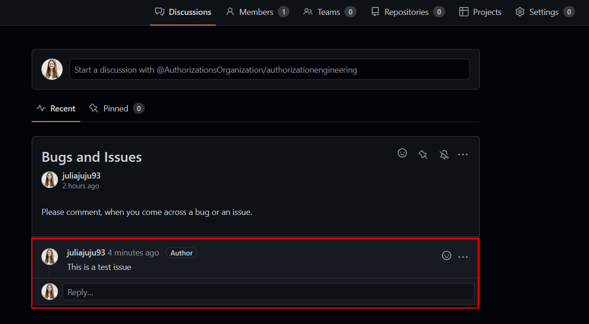
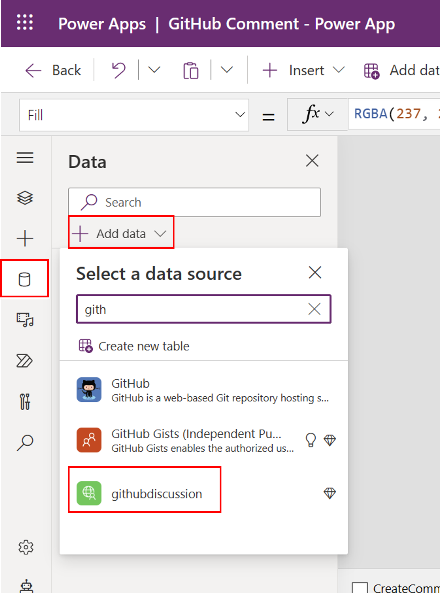

<head>
  <meta name="twitter:url" content="https://microsoft.github.io/Low-Code/blog/2023-day10" />
  <meta name="twitter:title" content="Create Power Platform custom connectors using Azure API Management and Authorizations" />
  <meta name="twitter:description" content="Throughout this post, let's discuss how users can create custom connectors using Azure API Management and authorizations" />
  <meta name="twitter:image" content="FIXME: Post Image" />
  <meta name="twitter:card" content="summary_large_image" />
  <meta name="twitter:creator" content="@Jujujuliakasper" />
  <meta name="twitter:site" content="@AzureAdvocates" /> 
  <link rel="canonical" href="https://microsoft.github.io/Low-Code/blog/2023-day10" />
</head>

Welcome to `Day 10` of #28DaysOfLowCode!

The theme for this week is **backend**. We talked about how we can provide extra security to our web APIs using Azure API Management. In this section, we will talk about our new feature in Azure API Management called [Authorizations](https://learn.microsoft.com/en-us/azure/api-management/authorizations-overview) and how this can elevate your low-code journey with web APIs.

## What We'll Cover

 * [What is API Management Authorizations](#what-is-api-management-authorizations)
 * [Scenario - Power Apps integration with GitHub and API Management Authorizations](#scenario---power-apps-integration-with-github-via-authorizations)
 * [Scenario Overview](#scenario-overview)
 * [Prerequisites](#prerequisites)
 * [Step 1: Register an application in GitHub for your organization](#step-1-register-an-application-in-github-for-your-organization)
 * [Step 2: Configure an authorization in API Management](#step-2-configure-an-authorization-in-api-management)
 * [Step 3: Create an API in API Management and configure a policy](#step-3-create-an-api-in-api-management-and-configure-a-policy)
 * [Step 4: Create a custom connector for the Microsoft Power Platform using API Management](#step-4-create-a-custom-connector-for-the-microsoft-power-platform-using-api-management)
 * [Step 5: Call your web API via your Power App](#step-5-call-your-web-api-via-your-power-app)

<!-- FIXME: banner image -->


<!-- ************************************* -->
<!--  AUTHORS: ONLY UPDATE BELOW THIS LINE -->
<!-- ************************************* -->

## What is API Management Authorizations

[API Management authorizations](https://learn.microsoft.com/en-us/azure/api-management/authorizations-overview) allows you to delegate authentication to API Management to let it authenticate against a given backend service or a given SaaS platform. It greatly simplifies the process for authenticating and authorizing users across these services and reduces development costs in ramping up, implementing and maintaining security features with service integrations. It lets you configure OAuth, Consent, Acquire Tokens, Cache Tokens and refreshes tokens for multiple services without writing a single line of code. API Management does all the heavy lifting for you, while you can focus on the application/domain logic.

> *Note: It differs from managed identity in that it spans multiple identity providers (IDP), as it is not tight to Azure Active Directory. It also leverages OAuth flows, such as the Authorization code flow, while managed identities stick to the Client Credentials Grant.*

## Scenario - Power Apps integration with GitHub and API Management Authorizations

### Scenario Overview

Imagine having a GitHub organization with multiple [team discussions](https://docs.github.com/en/organizations/collaborating-with-your-team/about-team-discussions). In one of your team discussions, you want to collect issues from users via comments. Now, to post a GitHub comment, every user requires a GitHub account and needs to understand where to find the relevant team discussion.

> Let's create a Power App that uses a custom connector to call the right GitHub API to post a comment about an issues to a team's discussion.

Note: Microsoft Power Platform offers wide varity of pre-installed connectors, one of them for [GitHub](https://learn.microsoft.com/en-us/connectors/github/). For our scenarios however, this connector doesn't provide us with the right capability. Creating a custom connector using Azure API Management is an easy and secure way to expose your microservices/APIs directly. This way, you can expand the possibilities with the Microsoft Power Platform and adapt it according to your organization's use cases.

### Prerequisites
- A GitHub account is required.
- A team discussion in your GitHub organization. Follow [Creating a team discussion](https://docs.github.com/en/organizations/collaborating-with-your-team/creating-a-team-discussion) for more information.
- A running API Management instance. Complete the following [Quickstart: Create a new Azure API Management service instance by using the Azure portal](https://learn.microsoft.com/en-us/azure/api-management/get-started-create-service-instance).
- Enable [managed service identiy](https://learn.microsoft.com/en-us/azure/api-management/api-management-howto-use-managed-service-identity) for API Management in the API Management instance.
- Make sure you have a Power Apps or Power Automate [environment](https://learn.microsoft.com/en-us/power-apps/powerapps-overview#power-apps-for-developers).

### Step 1: Register an application in GitHub for your organization

1. Sign in to GitHub.
2. In your account profile, go to **Your organizations** and select the organization that the scenario is for.


3. In your organization's profile, go to **Settings > Developer Settings > OAuth Apps > New OAuth App**
 - Enter *teamdiscussion* as your **Application name**
 - *https://portal.azure.com* as your **Homepage URL**
 - Optionally, add an Application description.
 - In **Authorization callback URL** (the redirect URL), enter {https://authorization-manager.consent.azure-apim.net/redirect/apim/<YOUR-APIM-SERVICENAME>} (substituting the API Management service name that is used).

4. Select **Register application**.
5. In the General page, copy the **Client ID**, which you'll use in a later step.
6. Select **Generate a new client secret**. Copy the secret, which won't be displayed again, and which you'll use in a later step.


### Step 2: Configure an authorization in API Management

1. Sign into Azure portal and go to your API Management instance.
2. In the left menu, select **Authorizations > + Create**.

3. In the **Create authorization window**, enter the following settings, and select **Create**:

  | Settings  | Value |
  | ------------- | ------------- |
  | Provider name  | *github-discussion*  |
  | Identity provider  | Select *GitHub*  |
  | Grant type  | Select *Authorization code*  |
  | Client id  | Paste the value you copied earlier from the app registration  |
  | Client secret  | Paste the value you copied earlier from the app registration  |
  | Scope  | *write:discussion*  |
  | Authorization name  | *auth-discussion*  |

4. After the authorization provider and authorization are created, select **Next**.
5. On the **Login tab**, select **Login with GitHub**. Before the authorization will work, it needs to be authorized at GitHub.
6. Sign in to your GitHub account if you're prompted to do so. If prompted during redirection, select **Allow access**. 
7. After authorization, the browser is redirected to API Management and the window is closed. In API Management, select **Next**.
8. On the Access policy page, create an access policy so that API Management has access to use the authorization. *Note: Ensure that a [managed identity](https://learn.microsoft.com/en-us/azure/api-management/api-management-howto-use-managed-service-identity#create-a-system-assigned-managed-identity) is configured for API Management.*
9. Select **Managed identity + Add members** and then select your subscription.
10. In **Select managed identity**, select **API Management service**, and then select the API Management instance that is used. Click **Select** and then **Complete**.


### Step 3: Create an API in API Management and configure a policy

1. Sign into Azure portal and go to your API Management instance.
2. In the left menu, select **APIs > + Add API** and select **HTTP**.


3. Enter the following settings. Then select **Create**.

  | Settings  | Value |
  | ------------- | ------------- |
  | Display name  | githubdiscussion  |
  | Name  | githubdiscussion  |
  | Web service URL  | https://api.github.com  |
  | API URL suffix  | githubdiscussion  |

4. Navigate to the newly created API and select **Add Operation**. Enter the following settings and select **Save**.

  | Settings  | Value |
  | ------------- | ------------- |
  | Display name  | POSTdiscussioncomment  |
  | URL for **POST**  | /orgs/{org}/teams/{team_slug}/discussions/{discussion_number}/comments  |

Please find here an example of a POST URL: 
```
/orgs/AuthorizationsOrganization/teams/AuthorizationEngineering/discussions/1/comments
```


5. Next, we need to add a **Request Body** to your API. For this, within your Frontend section scroll down and select **Request**.


6. Now **Add representation** and insert the following information:

  | Representations  |  |
  | ------------- | ------------- |
  | CONTENT TYPE  | application/json  |
  | DEFINITION  | {"body":"This is a test issue"}  |


7. Select **All operations** and in the **Inbound processing** section, select the **(</>)** (code editor) icon.
8. Copy the following, and paste in the policy editor. Make sure the provider-id and authorization-id correspond to the names in our previous step. Select **Save**.

Inbound policy:
```
<policies>
    <inbound>
        <base />
        <get-authorization-context provider-id="github-discussion" authorization-id="auth-discussion" context-variable-name="auth-context" identity-type="managed" ignore-error="false" />
        <set-header name="Authorization" exists-action="override">
            <value>@("Bearer " + ((Authorization)context.Variables.GetValueOrDefault("auth-context"))?.AccessToken)</value>
        </set-header>
        <set-header name="Accept" exists-action="override">
            <value>application/vnd.github+json</value>
        </set-header>
        <set-header name="X-GitHub-Api-Version" exists-action="override">
            <value>2022-11-28</value>
        </set-header>
        <set-header name="User-Agent" exists-action="override">
            <value>API Management</value>
        </set-header>
    </inbound>
    <backend>
        <base />
    </backend>
    <outbound>
        <base />
    </outbound>
    <on-error>
        <base />
    </on-error>
</policies>
```
> Note: The policy to be used consists of five parts.
    1. Fetch an authorization token.
    2. Create an HTTP header with the fetched authorization token.
    3. Create an HTTP header with an accept header [(API requirement)](https://docs.github.com/en/rest/teams/discussion-comments?apiVersion=2022-11-28#create-a-discussion-comment).
    4. Create an HTTP header with a X-GitHub-Api-Version header [(API requirement)](https://docs.github.com/en/rest/teams/discussion-comments?apiVersion=2022-11-28#create-a-discussion-comment).
    5. Create an HTTP header with a User-Agent header [(GitHub requirement)](https://docs.github.com/rest/overview/resources-in-the-rest-api#user-agent-required).


9. Test the API in Azure API Management:
  - Select your operation.
  - Go to the Test tab.
  - Select Send.

You should get a **HTTP/1.1 201 Created** response and a comment should have been posted in your team's discussion.



### Step 4: Create a custom connector for the Microsoft Power Platform using API Management

As soon as your API was tested successfully, you are now able to export your web API to the Microsoft Power Platform. Please find a detailed guide here: [Export APIs from Azure API Management to the Power Platform](https://learn.microsoft.com/en-us/azure/api-management/export-api-power-platform).
If you want to add additional security to your API, check out our blog post on [10. Providing Power Platform custom connector with additional security via Azure API Management]()


### Step 5: Call your web API via your Power App

Next, we want to make an API call within your Power. You can import our [GitHub Comment - Power App](powerapp) sample app, please follow instructions on [Importing a canvas app package](https://learn.microsoft.com/en-us/power-apps/maker/canvas-apps/export-import-app#importing-a-canvas-app-package).

1. In your Power App, add your custom connector to your Power App via the tab **data > + Add data**.



2. Next, we modify our **Send** Button with the following PowerFX formular:

> githubdiscussion.postdiscussioncomment({body:TextInputFeedback.Text}); Reset(TextInputFeedback); Notify("Success: 201 Created",NotificationType.Success)


3. Now, you are able to test your Power App and create a new comment in your GitHub team's discussion.


>Enjoy this fun little tutorial and let us know what you think!