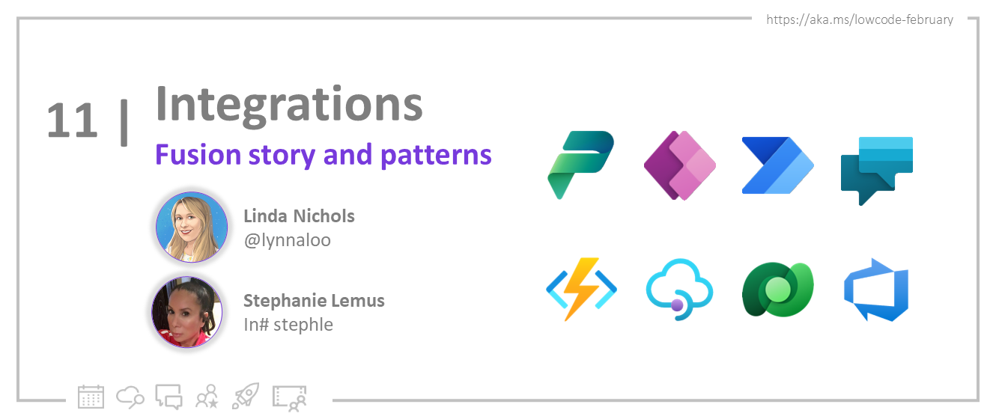
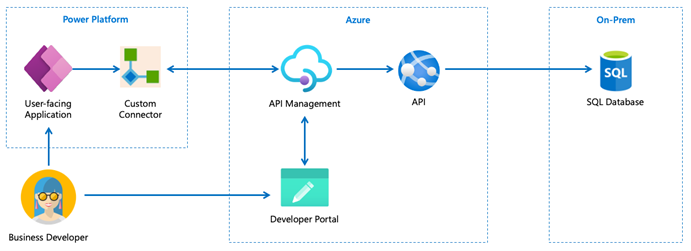
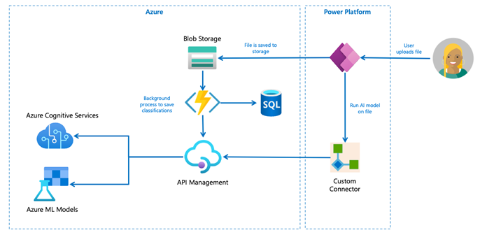
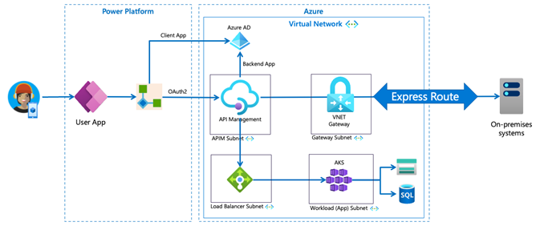

<head>
  <meta name="twitter:url" 
    content="https://microsoft.github.io/Low-Code/blog/slug-FIXME" />
  <meta name="twitter:title" 
    content="FIXME: Title Of Post" />
  <meta name="twitter:description" 
    content="FIXME: Post Description" />
  <meta name="twitter:image" 
    content="FIXME: Post Image" />
  <meta name="twitter:card" content="summary_large_image" />
  <meta name="twitter:creator" 
    content="@nitya" />
  <meta name="twitter:site" content="@AzureAdvocates" /> 
  <link rel="canonical" 
    href="https://microsoft.github.io/Low-Code/blog/slug-FIXME" />
</head>

Welcome to `Day 11` of #30DaysOfLowCode!

The theme for this week is **backend integration**. Yesterday we talked about building secure connectors with Azure API Management. Today we'll explore some real world use cases that integrate Azure with Power Platform to help you resolve busienss challenges more efficiently.

## What We'll Cover
 * Why Power Platform and Azure together?
 * Access data beyond a low code platform
 * Use Azure API Management use low code development
 * Low Code + Azure Integration Patterns

<!-- FIXME: banner image -->

<!-- ************************************* -->
<!--  AUTHORS: ONLY UPDATE BELOW THIS LINE -->
<!-- ************************************* -->

## Why Power Platform and Azure together?

By using Microsoft Azure to extend the capabilities of Power Platform, you can help solve the App Gap challenge. 

Simply put, the app gap is a condition where there is an increasing need for custom applications, but you don't have enough developers to build the applications in the business units’ backlog. 

For many businesses today, the *app gap* is already very real and getting worse.  Current estimates are that the world is currently short some 4m developers … with an estimated 500 million new apps needing to be built by 2025. This challenge emphasizes the need to find creative and efficient ways to deliver more custom applications to meet the needs of the business with fewer developers.

**So how do we build more apps, faster?**

We can accelerate app development by letting pro developers do what they do best: traditional development and increasing the availability of organizational services & data.

We then simultaneously empower low code developers to solve some of their business problems themselves by giving them a low code development platform and controlled access to the right data, APIs & service endpoints.

This is at the heart of the fusion team development concept – joining professional & low code developers together to:

-	Close the app gap
-	Build applications faster to reduce the organizational app backlog
-	Create new developers from untraditional places
-	Incubate a culture of innovation

**Resources:**
* [Expedite application delivery with low-code and fusion teams](https://learn.microsoft.com/events/build-2022/odbrk45-expedite-application-delivery-with-low-code-fusion-teams/?WT.mc_id=javascript-82212-ninarasi)
* [Fusion Development Ebook](https://learn.microsoft.com/power-apps/guidance/fusion-dev-ebook/?WT.mc_id=javascript-82212-ninarasi)

## How do I access data from Microsoft Azure & beyond from a low code platform?

Power Platform uses the concept of connectors - wrappers around the OpenAPI specifications - the industry standard for documenting REST APIS. 

Connectors abstract away the details of the underlying API while still offering a low code interface within Power Platform. Using connectors, low code developers can interact with APIs without having to have coding ability or extensive knowledge of the underlying API or backend systems. Connectors also give a consistent experience when authenticating to APIs without added custom code.

Power Platform provides >1000 built-in connectors which enables easy integration with a wide variety of systems & services.  Pre-built connectors include Dynamics 365, Salesforce, SAP and  Microsoft Teams among many others – in addition to seamless connection to Microsoft Azure services.  

To connect to internal organizational APIs or solutions where there isn’t an existing connector, Power Platform includes the ability to create custom connectors, which can be used as wrappers to APIs exposed through an API Gateway. 

**Resources:**
* [Connectors overview](https://learn.microsoft.com/connectors/connectors/?WT.mc_id=javascript-82212-ninarasi)
* [Custom Connectors overview](https://learn.microsoft.com/connectors/custom-connectors/?WT.mc_id=javascript-82212-ninarasi)

## Why use Azure API Management (APIM) with low code development?

Azure API Management is a cloud-based platform for creating, managing & publishing APIs.  It supports fusion development patterns through:

-	Decoupling: Abstracting APIs from their backend implementation and hosting them under a single domain/IP address.  The API layer is decoupled from a specific user interface so the same API can be used in both traditional & low code applications.
-	Governance: APIM adds an additional control plane for low code development by allowing access only to specified apps & users and not exposing APIs directly.
-	Monitoring and debugging: Use Azure Application Insights to debug, monitor traffic & configure analytics.
-	Change Management: Versioning & revision control to manage breaking changes for traditional & low code developers.
-	Internal Documentation: Creates a catalog of available APIs with downloadable Open API specifications via the Developer Portal.
-	Integration with Power Platform: Pushing custom connectors directly to Power Platform environments makes them available at once for use in apps & automation flows.

**Resources:**
* [What is API Management?](https://learn.microsoft.com/azure/api-management/api-management-key-concepts/?WT.mc_id=javascript-82212-ninarasi)
* [Export custom connectors from API Management](https://learn.microsoft.com/azure/api-management/export-api-power-platform/?WT.mc_id=javascript-82212-ninarasi)
* [APIM Hands-on Lab](https://azure.github.io/apim-lab/?WT.mc_id=javascript-82212-ninarasi)

## Low Code + Azure Integration Patterns

The following technology patterns are generalized with regards to specific use cases but are drawn from real-world customer scenarios using Azure with Power Platform, aka “fusion development.” 

A common part of many of these fusion architecture patterns is the use of custom connectors that are exported & controlled from Azure API Management.

 
**IT Democratization**

This is the most basic pattern for fusion development.  This pattern allows for low code developers, without a coding background, to build applications using their organization’s data. This architecture uses APIs written by pro developers to amplify existing data and expose it to low code developers using an API gateway. 

The Azure API Management Developer Portal provides an enterprise catalog which aggregates the data & APIs available to low code & professional developers alike.
 

 

**Resources:**
* [Fusion Development Ebook](https://learn.microsoft.com/power-apps/guidance/fusion-dev-ebook/?WT.mc_id=javascript-82212-ninarasi)

**AI/ML integrations**

Azure includes a rich suite of managed AI and machine learning services, including Azure Cognitive Services and Azure Machine Learning, to more easily build & deploy AI models. 

By combining Azure’s AI/ML capabilities with Power Platform, you can build intelligent solutions that bring together the best of both worlds.  For example:

*	Building custom machine learning models in Azure AI services front-ended by a low code app that consumes the resulting models to deliver insights about images & videos uploaded by end users.
*	After using AI/ML on the backend to process large amounts of data, Power Automate workflows can watch the resulting output, triggering custom actions & notifications based on the content.
*	Creating a low code user interface for data labeling, making it easier for your business subject matter experts to label their datasets for use in training new custom Azure machine learning experiments.

 

**Resources:**
* [Azure Cognitive Services overview](https://azure.microsoft.com/products/cognitive-services/#overview/?WT.mc_id=javascript-82212-ninarasi)
* [Azure Machine Learning](https://azure.microsoft.com/products/machine-learning/#product-overview/?WT.mc_id=javascript-82212-ninarasi)
* [Azure Open AI](https://azure.microsoft.com/products/cognitive-services/openai-service/?WT.mc_id=javascript-82212-ninarasi)
* [Custom Vision + Power Apps Demo](https://github.com/appdevgbb/power-apps-custom-vision/?WT.mc_id=javascript-82212-ninarasi)
* [Power Apps and Azure Cognitive Services Demo](https://www.youtube.com/watch?v=ka_yY77b-0M/?WT.mc_id=javascript-82212-ninarasi)

**IoT/Event-driven Systems** 

IoT systems can generate large amounts of data from connected devices. By integrating Power Platform with Azure IoT, you can build custom low code apps & workflows that act on the IoT device data. 

For example:

*	Azure IoT Hub can collect & process data from IoT Devices, while Power Apps + Power BI can be used to build custom dashboards to supply insights & visualizations of the data.
*	Designing Power Automate workflows that are only triggered based on specific events or conditions which then send notifications to other systems, like Microsoft Teams.
*	Building fast, low-code interfaces for remote command & control of IoT edge devices.

 

**Resources:**
* [Azure IoT Hub overview](https://azure.microsoft.com/products/iot-hub/#overview/?WT.mc_id=javascript-82212-ninarasi)
* [Messaging Services on Azure Overview](https://azure.microsoft.com/solutions/messaging-services/#overview/?WT.mc_id=javascript-82212-ninarasi)
* [Tornado Warning System Demo](https://github.com/appdevgbb/tornado-watchdog/?WT.mc_id=javascript-82212-ninarasi)

**On-prem data with Azure and Power Platform**

Sometimes organizations have security requirements that require isolated communication between resources in the cloud and on-premises. By using Azure with on-premises systems, you can create a dedicated and private connection and bypass the public internet. 

By using API Management in an Azure VNET (Virtual Network), you can also create secure connections between APIs and their backend services. Access to these APIs can be restricted to only allowing access to designated, trusted interfaces, such as Power Platform. This pattern has some of the same accessibility benefits of IT Democratization, but while respecting the security & isolation requirements of the business.

**Resources:**
* [Connect to a VNET using APIM](https://learn.microsoft.com/azure/api-management/api-management-using-with-vnet?tabs=stv2/?WT.mc_id=javascript-82212-ninarasi)
* [Export a Custom connector from APIM](https://learn.microsoft.com/azure/api-management/export-api-power-platform/?WT.mc_id=javascript-82212-ninarasi)
* [Custom connector for Azure AD-protected Apps](https://learn.microsoft.com/connectors/custom-connectors/create-custom-connector-aad-protected-azure-functions/?WT.mc_id=javascript-82212-ninarasi)
* [Protect APIM with Azure AD](https://learn.microsoft.com/azure/api-management/api-management-howto-protect-backend-with-aad/?WT.mc_id=javascript-82212-ninarasi)

**Azure Communication Services + Power Platform**

Azure Communication Services allows you to add voice, video, and messaging capabilities to your applications. By integrating Power Platform with Azure Communication Services, you can build custom low code applications that easily incorporate these communication capabilities.

Common communication & low code scenarios include:

*	Create a flow using Power Automate to send out omnichannel notifications via email, SMS, and chat.
*	Using Power Automate to create Event Grid triggered flows to process inbound communication events such as incoming calls or SMS messages.
*	Using Azure Cognitive services, Azure Communication Services, and Power Automate together to do sentiment analysis that empowers support personnel to create contextual, personalized responses for end users.
*	Create a Power App low code UI to trigger communication workflows and manage communication related metadata, like chat/SMS history.
 
 

**Resources:**
*	[Azure Communication Services overview](https://learn.microsoft.com/azure/communication-services/overview/?WT.mc_id=javascript-82212-ninarasi)
*	[SMS Connector](https://powerautomate.microsoft.com/connectors/details/shared_azurecommunicationservicessms/azure-communication-services-sms/?WT.mc_id=javascript-82212-ninarasi)
*	[Email Connector](https://powerautomate.microsoft.com/connectors/details/shared_acsemail/azure-communication-services-email/?WT.mc_id=javascript-82212-ninarasi)
*	[Chat Connector](https://powerautomate.microsoft.com/connectors/details/shared_acschat/azure-communication-services-chat/?WT.mc_id=javascript-82212-ninarasi)
*	[Identity Connector](https://powerautomate.microsoft.com/connectors/details/shared_acsidentity/azure-communication-services-identity/?WT.mc_id=javascript-82212-ninarasi)
*	[Integrate sentiment analysis with SMS](https://aka.ms/lowCode/sentimentanalysis)

**Mainframe Modernization and Extension**

Azure integration services unlocks the ability to access & use Mainframe data.  Old green screen mainframe apps can be modernized to use modern technologies such as advanced data analytics & AI/ML services. 

By combining Power Platform with mainframe application data, you can unlock data and democratize development that was previously limited to only professional developers. You can build low code user-friendly interfaces for accessing and working with Mainframe data, making it easier for non-technical users to interact with data. For example:

•	Ingesting real-time data, like telemetry & system alerts, that trigger Power Automate flows and send notifications to Microsoft Teams. 
•	Using Power Apps to create user interfaces that allow users to view, manage, and create visualizations for Mainframe application data.

 

**Resources:**
* [Low-Code Meets Mainframe: Kyndryl data pipeline](https://ignite.microsoft.com/sessions/691884e3-273a-46eb-99ee-a0c761c86a1e?source=sessions/?WT.mc_id=javascript-82212-ninarasi)

## Conclusion

These Azure low code patterns are just a few of the many integration patterns that bring together the best of both worlds. 

The combination of Azure & Power Platform supplies a comprehensive set of tools for building internal APIs to access your organization's data, designing AI experiments, and programming IoT devices.  

Our low code platform’s capabilities help you quickly solve complex business problems & address the app gap problem with the fusion development process. 

** Get Started Today?** 

 - [**Cloud Skills Challenge**](https://aka.ms/lowcode-february/challenge): Sign up for a month-long challenge and clime up the leaderboard
 - [**PowerfulDevs Session**](https://learn.microsoft.com/events/learn-events/powerful-devs-2023/?WT.mc_id=javascript-82212-ninarasi): Enable millions of low code devs by building custom connectors
 - [**Learn Collection** ](https://aka.ms/lowcode-february/collection): #30DaysOfLowCode resources center