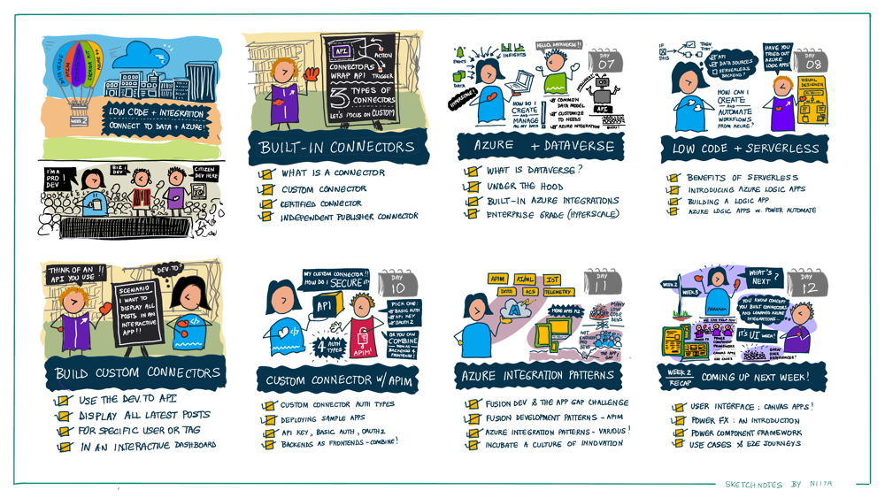
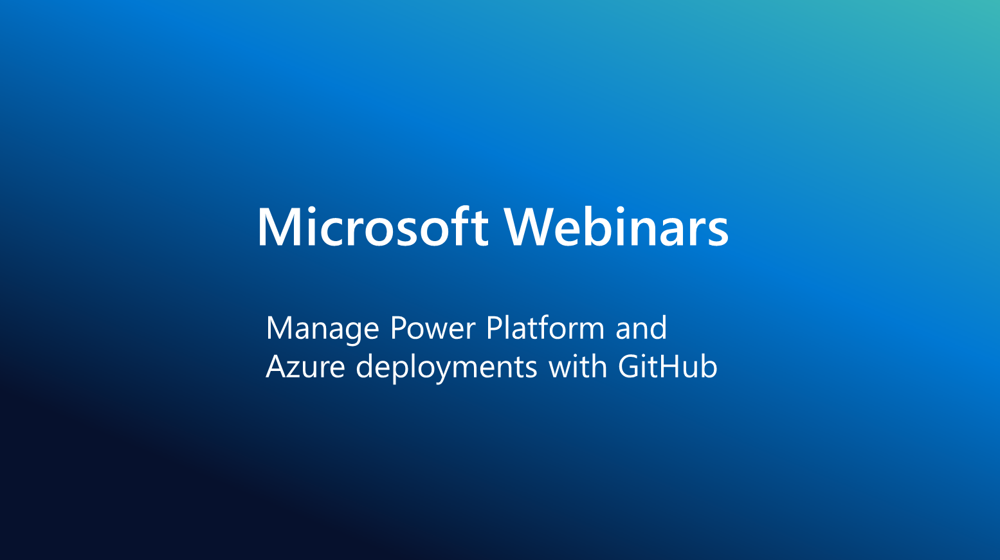

<head>
  <meta name="twitter:url" 
    content="https://microsoft.github.io/Low-Code/blog/2023-day12" />
  <meta name="twitter:title" 
    content="12. Recap - Integrations Week ✨" />
  <meta name="twitter:description" 
    content="Let's recap Week 2 of #30DaysOfLowCode focused on Backend Integrations with emphasis on data, security, serverless, connectors and usage patterns - join us at #LowCodeFebruary https://aka.ms/lowcode-february" />
  <meta name="twitter:image" 
    content="https://microsoft.github.io/Low-Code/img/og/30-12.png" />
  <meta name="twitter:card" content="summary_large_image" />
  <meta name="twitter:creator" 
    content="@nitya" />
  <meta name="twitter:site" content="@AzureAdvocates" /> 
  <link rel="canonical" 
    href="https://microsoft.github.io/Low-Code/blog/2023-day12" />
</head>

Welcome to `Day 12` of #30DaysOfLowCode!

## What We'll Cover
 * **Look Back**: Recap Backend Integrations Week
 * **Save the Date**: Powerful Dev Conference, Learn Live and Webinar for Power Platform and GitHub
 * **Skill Up**: Self-Study Resources & Cloud-Skills Challenge
 * **Look Ahead**: Are you ready for the Interface Week?!
 * **Activity** Sign up for the [**Powerful Dev Conference**](https://learn.microsoft.com/events/learn-events/powerful-devs-2023/?WT.mc_id=javascript-82212-ninarasi) on Feb 15!
 * **Resources**: Explore the [**Low Code February Collection**](https://aka.ms/lowcode-february/collection)

## **Look Back**: Week 2 Recap

Wow, how quickly time flies! We can hardly believe that we're almost halfway through our journey. How have you been enjoying the experience so far? We truly hope that you have found value in the carefully selected blogs, videos, workshops, and events that have been put together just for you. Our goal is for you to feel empowered to apply the knowledge you've gained in various aspects of your life.

From the bottom of our hearts, we want to say THANK YOU for supporting us on this journey. If you have any thoughts or feedback, please don't hesitate to reach out to us through [**GitHub Discussions**](https://github.com/microsoft/Low-Code/discussions). We value your input and look forward to hearing from you! ❤️

Here are the highlights for week 2! If you're new to us, welcome to the party! You won't want to miss the amazing content we have in store for you in this week's [**#30DaysOfLowCode**](https://aka.ms/lowcode-february/blog): 

Welcome to our series of blogs on low code development! This series is designed to help you understand the full potential of Power Platform and how it can transform the way you work. This week, our discussions spanned from introducing connectors, dataverse and serverelss apps to testing and constructing your own connector, as well as exploring various integration patterns. So, hang tight and get ready to dive into the exciting world of low-code and integration!

* [**Connectors 101: Let's Make Some Connections!**](https://microsoft.github.io/Low-Code/blog/2023-day6)

Are you new to connectors and curious about how they can enhance the functionalities of Power Platform? This blog provides a comprehensive overview of connectors and how they interact with data from various services. You'll get a 360 degree view of connectors and understand how they can be leveraged to streamline your work.

* [**Do more with your Data for less - Dataverse!**](https://microsoft.github.io/Low-Code/blog/2023-day7)

Do you want to create and manage your data and insights with ease to support your applications and more? Our second blog this week provides a walkthrough of Dataverse, from introduction to managing low-code to pro-code integration as well as controlling advanced business logic in a compliant manner.

* [**Serverless Low Code**]((https://microsoft.github.io/Low-Code/blog/2023-day8))

Did you know that you can create serverless applications with low-code technology? Our third blog walks you through how Azure Logic Apps bring low-code technology to serverless computing. You'll learn how to build and deploy serverless applications with ease, leveraging the power of low-code.

* [**Build and Use Custom Connectors**](https://microsoft.github.io/Low-Code/blog/2023-day9-build)

We also provide hands-on tutorials to help you put your knowledge into practice. Our fourth and fifth blogs [**Build a Custom Connector**](https://microsoft.github.io/Low-Code/blog/2023-day9-build) and [**Use the Custom Connector**](https://microsoft.github.io/Low-Code/blog/2023-day9-use) show you step-by-step how to build and consume custom connectors in the Power Platform environment - using a real-world OpenAPI specification and application scenario!

* [**Secure Connectors with Azure API Management**](https://microsoft.github.io/Low-Code/blog/2023-day10)

Azure API Management is one of the most commonly used tools for custom connectors in the Power Platform. Our sixth blog covers how to add additional security and control to your custom connectors with Azure API Management. You'll learn about different authentication types for custom connectors and how to deploy different authentication scenarios with various sample applications.

* [**Low-Code + Azure Integration Patterns**](https://microsoft.github.io/Low-Code/blog/2023-day11)

Last but not least, we end the week with a hands-on approach by showcasing key integration patterns that can elevate your work to the next level. It explores how low-code technology can be combined with Azure to tackle real-world challenges and provide practical solutions. We understand that people learn best from real-life examples, and this blog is designed to do just that.

## **#SaveTheDate**: Events

* [**Powerful Devs Conference: Feb 15**](https://learn.microsoft.com/events/learn-events/powerful-devs-2023/?WT.mc_id=javascript-82212-ninarasi) Get ready to be amazed! In 3 days, the highly-anticipated Powerful Dev Conf is happening on February 15th. This signature event is packed with exciting content, where you'll hear from some of the top experts, including authors from this series, about the amazing features and practical usage of the Power Platform. With a fantastic speaker lineup, you won't want to miss this opportunity to take your knowledge and skills to the next level. So, check out the [scheduled sessions](https://learn.microsoft.com/events/learn-events/powerful-devs-2023/?WT.mc_id=javascript-82212-ninarasi) and visit the site to reserve your spot today!

  

* [**Learn Live!**](https://aka.ms/lowcode-february/LearnLive) Do you have questions about the Microsoft Learn modules or the Cloud Skills Challenge? Then don't miss out on our "Learn Live" sessions! These sessions are the perfect opportunity to hear tips and insights from experts in the field, so join in and ask your questions: 
  1. 🎙 [**Feb 13**](https://aka.ms/lowcode-february/LearnLive) - Integrate OpenAPI-enabled Web APIs with Azure API Management
  2. 🎙 [**Feb 27**](https://aka.ms/lowcode-february/LearnLive) - Manage Microsoft Power Platform deployments

  

* [**Webinar: Power Platform & Azure Deploys with GitHub: Feb 14**](https://mktoevents.com/Microsoft+Event/383091/157-GQE-382) In this webinar, you'll learn about the capabilities that Power Platform opens up for GitHub, and discover the inner and outer loop functions that are available with Power Platform and GitHub. You'll also see how to author CI/CD pipelines and hear customer success stories from the retail and manufacturing industries. 

  

* [**Ask The Experts!**](http://localhost:3000/Low-Code/lowcode-february/Video-Live#ask-the-experts) Have questions about Power Platform, low code development, or recent events and conferences? Then don't miss out on our "Ask the Experts" sessions! These are your chance to have a face-to-face discussion with our leaders and get all your questions answered.
    1. 🎙 [**Feb 23, 9AM PST**](https://aka.ms/ATE0223/RSVP ) - Join this session for Q&A from the **Powerful Devs Conference** team. The Powerful Devs Conference is all about showing how code-first developers can integrate with the Power Platform to innovate faster. Our experts will be available to answer questions about full code and low code integration.

    

    2. 🎙 [**Mar 09, 9AM PST**](https://aka.ms/ATE0309/RSVP) - Join this session for Q&A from the **Low Code February** team, including authors of this #30DaysOfLowCode series. We will have experts in code-first integration with the Power Platform live to answer questions related to the content of the Low Code February events.

    

## **Resources:** For Self-Study

Unable to keep up with the daily pace? No problem! Check out these our self-study materials designed to help you learn at your own convenience:
1. [**Resource Collection**](https://aka.ms/lowcode-february/collection): Bookmark the collection for a 1-stop resource containing all relevant links to documentation and training, as covered in the #30DaysOfLowCode blogs. 
2. [**Hands-on Workshops**](https://aka.ms/lowcode-february/workshop): learn by doing! These labs help you gain hands-on experience from intro to advanced, whereever you're in the learning path. 
3. [**Cloud skills Challenge**](https://aka.ms/lowcode-february/challenge): gives you a free curated set of learning modules to jumpstart your learning journey into Low Code and Fusion development. 

## **Look Forward**: Week 3

During week 3 of the learning journey, you'll get the chance to delve deep into the user interface and explore everything from building a canvas app, to understanding the basics of PowerFx, using the Power Component Framework controls, and even creating your own PCF control. And as a special treat, you'll be taken on a journey from #ZeroToHero with a blog that showcases the integration of the **Power Platform and ChatGPT**✨. This is an opportunity not to be missed!

Don't forget to bookmark the [**#30DaysOfLowCode**](https://aka.ms/lowcode-february/blog) page, then follow along to read the daily blog post, ask questions, and connect with other learners. _Get empowered_ with low code development!

