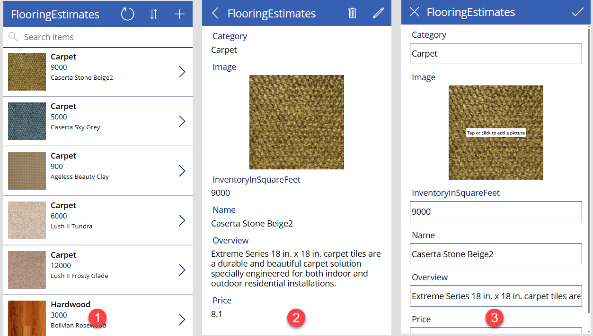
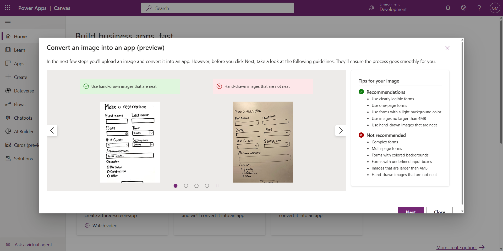
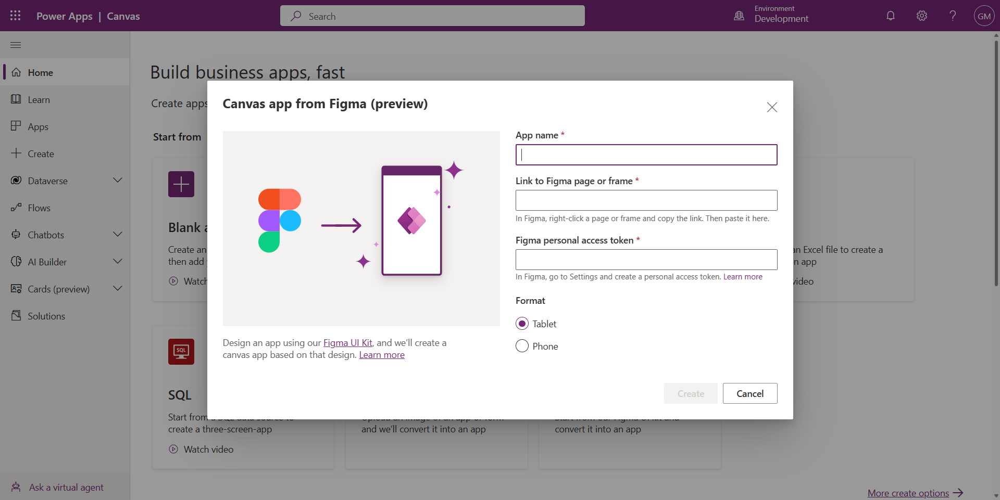

<head>
  <meta name="twitter:url" 
    content="https://microsoft.github.io/Low-Code/blog/slug-FIXME" />
  <meta name="twitter:title" 
    content="FIXME: Title Of Post" />
  <meta name="twitter:description" 
    content="FIXME: Post Description" />
  <meta name="twitter:image" 
    content="FIXME: Post Image" />
  <meta name="twitter:card" content="summary_large_image" />
  <meta name="twitter:creator" 
    content="@nitya" />
  <meta name="twitter:site" content="@AzureAdvocates" /> 
  <link rel="canonical" 
    href="https://microsoft.github.io/Low-Code/blog/slug-FIXME" />
</head>

Welcome to `Day 13` of #30DaysOfLowCode!

More often than not, a well thought out, consistent, eye-catching but functional user experience can define the success of your app. This is why we’ve decided to dedicate this week to the **User Interface (UI)**. Today’s blog will begin that journey with actionable insights and resources that will get you started building amazing UI with Canvas Apps.

## What We'll Cover
 * What are Canvas Apps?
 * Ways to build Canvas Apps
 * Working with Express Design
 * 	**Activity**: Sign up for your [Power Apps Developer Plan](https://aka.ms/lowcode-february/devplan)
 * 	**Exercises**: Try it Yourself! 
 * 	**Resources**: Explore the [Low Code February Collection](https://aka.ms/lowcode-february/collection)

<!-- FIXME: banner image -->

<!-- ************************************* -->
<!--  AUTHORS: ONLY UPDATE BELOW THIS LINE -->
<!-- ************************************* -->

## What are Canvas Apps?

As mentioned in an [earlier blog post](https://microsoft.github.io/Low-Code/blog/2023-day2/#what-does-the-power-platform-provide), Power Apps is a tool for “creating custom applications for web and mobile that can be integrated with a variety of systems and services”. There are two types of Power Apps, namely Model-Driven Apps and Canvas Apps.

Model-Driven apps require a Microsoft Dataverse database. They're built on top of the data that's modelled in that database environment. As a result of this, the views and screens are based on a specific data structure and offer a more consistent appearance and behaviour from one screen to the next.

But with Canvas Apps, you start with a blank screen – like an artist’s canvas. You have complete control over the placement of each image, textbox, form, icon, and other elements on that canvas. Power Apps offers you a graphical, intuitive interface with a pixel perfect visual app designer which enables you to build and deploy professional looking Canvas Apps faster with tailor-made UI.

## Ways to build Canvas Apps

Now there are many starting points when building Canvas Apps. We’ve already established that you can start from a _blank canvas_ and build out your app from there however we have other methods for getting you to where you want to be faster.

Whether it’s your first time and you want to start from a template just to get familiar with the building experience, or you already have data and you want to build your Canvas App on top of that data or even if you have an initial design and you want to start from that design and add data later on – we’ve got you covered. 

Whatever method you choose, you’ll always end up in the Power Apps Studio. This is the space where you’ll design, build, and manage your Canvas App. If you want to understand the various parts of the Power Apps Studio before you get your hands dirty; I highly recommend reading [this article](https://aka.ms/LCF/PowerAppsStudio) which gives a really good insight into the various parts of it.

### Start from a template

If it’s your first time, you might want to start from a template just so you can get familiar with Canvas Apps. Power Apps provides multiple templates for all types of scenarios. 

You can simply select a template from our vast gallery and then run the app to understand its default behaviour. Feel free to add some additional functionality and make it your own. For a full breakdown of how to create an app from a template, check out [this article](https://aka.ms/LCF/CanvasFromTemplate) to learn more. 

### Start from data

Maybe you already have some business data to work with and you’d like to build an app that connects to this data directly.  It doesn’t matter where your data lives – you can create a working 3-screen app in just a few clicks and choose to customise it however you want. 

The generated 3-screen app includes:

1. **Browse Screen**: Lets the user browse through data. It also includes search, sort, and data refresh all out of the box.
2. **Details Screen**: This screen just shows the extended details of a single record. It also has the option of deleting that record as well. 
3. **Edit Screen**: This allows users to edit a single record to change any of its values. 

This process takes care of the data connection for you so that you can focus on the functionality and UI straight away. Whether your data lives in [SharePoint](https://aka.ms/LCF/CanvasFromSharepoint), [Excel](https://aka.ms/LCF/CanvasFromExcel), [Azure SQL](https://aka.ms/LCF/CanvasFromSQL) or even [Dataverse](https://aka.ms/LCF/CanvasFromDataverse), you can get started building Canvas Apps, from data, today. 

## Working with Express Design

Express design is a new way to quickly get started with Canvas Apps by instantly transforming any visual design artifact into an app. Every app starts with a design phase where some form of initial sketch would have been made. You may have sketched some basic UI on a piece of paper or on a whiteboard or if you’re a professional – you may have designed some assets in Figma.

Whatever your method is, Power Apps is now applying advanced cognitive AI models to generate app UI using two methods.

### Image to App

All you have to do is take a picture or screenshot of whatever wireframe, sketch, or visual design that you have, upload it into Power Apps and then follow the steps in the guided interface to tag the relevant UI components and set up your data. This will then auto-magically generate an app for you to jumpstart your app development process. See [this article](https://aka.ms/LCF/AppFromImage) for more information and step-by-step guidance on how to generate Canvas Apps from an image!

Also, check out this [AMAZING TikTok](https://aka.ms/LCF/ExpressDesignTikTok) that shows you the whole Image to App process in under 60 seconds! Don’t forget to follow us while you’re there 😉 

### Figma to App

Now the Image to App process will do it’s best to match your drawing or image however if you are looking for an exact, pixel-perfect match then you should consider creating your design in Figma using the [Create Apps from Figma UI Kit](https://aka.ms/LCF/FigmaKit). Afterwards, you will then convert your design file into a Canvas App and then add more functionality using the Power Apps Studio. More details on this process can be [found here](https://aka.ms/LCF/Figma) so be sure to try it out for yourself and let us know how it went!

## Exercises

So now that you've taken the time to delve into this blog post, you're essentially a pro at finding whatever your starting point is! Go ahead, give yourself a pat on the back AND why don’t you try and build some Canvas Apps UI yourself? It’s easier than you think, and we’ve got some training materials to help you get started as well. 

* **Training**: [Use the UI and controls in a canvas app in Power Apps](https://aka.ms/LCF/CanvasUIPath) is a Learning Path up on Microsoft Learn which takes you through the process of building a functional UI for your Canvas App. It highlights app navigation, themes, icons, images, personalization, different form factors, and so many more controls that you can take advantage of. 

## What's next?

Be sure to keep yourself posted with this week’s blog posts and discover all that there is to know about working with User Interface in the Power Platform. From Power Fx to the Power Component Framework, we have so much planned for you. 

Also consider -

 1. Signing up for the free **[Power Apps Developer Plan](https://aka.ms/lowcode-february/devplan)** so you have access to the Power Platform.
 2. Enrolling in the **[Cloud Skills Challenge](https://aka.ms/lowcode-february/challenge)** to skill up on key cloud technologies with free, self-guided learning courses, and start climbing the leaderboard!
 3. Registering for the **[Powerful Devs Conference](https://aka.ms/lowcode-february/PowerfulDevsConf2023)** to learn from experts how you, as a developer, can leverage the Power Platform to build applications faster and with far less effort.

## Resources

* Low Code February **[Learn Collection](https://learn.microsoft.com/en-us/users/nityan/collections/xz6ehr2mx031y0?WT.mc_id=javascript-82212-ninarasi)**: Collection of resources to go from learning Power Platform Fundamentals, to understanding the Dataverse and working in Fusion Development teams.
* Power Apps **[Canvas Apps Documentation](https://aka.ms/LCF/CanvasDocs)**
* On-Demand Viewing: **[Building the UI in Power Apps](https://aka.ms/LCF/UILearnLive)**
