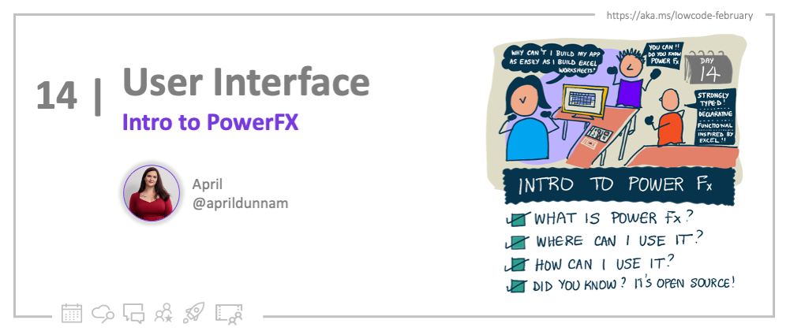

<head>
  <meta name="twitter:url" 
    content="https://microsoft.github.io/Low-Code/blog/2023-day14-build" />
  <meta name="twitter:title" 
    content="14. Intro to Power Fx" />
  <meta name="twitter:description" 
    content="Want to add logic to your low code apps in Power Apps? Join us on #30DaysOfLowCode to learn how - https://aka.ms/lowcode-february"  />
  <meta name="twitter:image" 
    content="https://microsoft.github.io/Low-Code/img/og/30-09-14.png" />
  <meta name="twitter:card" content="summary_large_image" />
  <meta name="twitter:creator" 
    content="@aprildunnam" />
  <meta name="twitter:site" content="@AzureAdvocates" /> 
  <link rel="canonical" 
    href="https://microsoft.github.io/Low-Code/blog/2023-day14-build" />
</head>

Welcome to `Day 14` of #30DaysOfLowCode!

It's **Valentine's Day**, a celebration of love in many regions of the world! Hopefully you're developing a love for the Power Platform as you make your way through Low Code February!

Yesterday, we explored how to get started building apps with Power Apps Canvas apps. Today, we're going to look at how we add logic to our Power Apps by exploring the low code programming language that it uses, Power Fx.

## What We'll Cover
 * **What** - What is Power Fx?
 * **Where** - Where can we use it?
 * **How** - How do we use it?
 * **Exercise**: [Training: Understand Power Fx](https://aka.ms/lowcode-february/PowerFxExercise)
 * **Resources**: Explore the [Low Code February Collection](https://aka.ms/lowcode-february/collection)

## What is Power Fx?

What if you could build an app as easily as you build out a worksheet in Excel?

Power Apps and Power Fx makes this a reality.

While there's a lot we can do without having to write any code in the Power Platform, we need a programming language to enable the full spectrum of development and that's where Power Fx comes in.

Power Fx is the low-code language for the Power Platform. It's a strongly-typed, declarative and functional programming language that is based off of the Microsoft Excel formula language that is designed to be easy to use for everyone; from those who have never programmed before to seasoned professionals.

## Where can we use Power Fx?

Power Fx started as the low code language that we use to add logic to our Power Apps canvas applications, however, it is expanding to be used across the Power Platform.

Currently, we can use Power Fx with the following:

- Power Apps Canvas Apps
- [Dataverse Calculated Columns](https://aka.ms/lowcode-february/PowerFxDataverse)
- Model Driven App Modern Commanding
- Power Apps Ideas (AI assisted formulas)

And more to come!

## How does Power Fx work?

All programming languages, including Power Fx have expressions which are a way to represent a calculation over numbers, string or other data types.

Power Fx, however, is inspired by Excel and in Excel we don't just write expressions, we write formulas or "recipes" for how to calculate a specific cell's value. 

B1 = C2 * 5 is an example of a formula that defines the value of B1 and is recalculated automatically as C2 changes. Power Fx follows this same formula pattern except "cells" are replaced with properties of controls and objects.

Here's an example of a Power Fx formula in action:

Because Power Fx is a declarative formula language, it offers many things including:

- **Excel syntax translation** : Because it's based on excel, most of the Excel syntax is used and available in Power Fx.
- **Asynchronous**: All data operations in Power Fx are asynchronous!
- **Relational Data**: With Power Fx we can use simple dot notation to access the entire graph of relationships from a record.
- **Local and Remote**: Power Fx automatically delegates what it can to the server to process filters and sorts more efficiently.
- **Always Live**: Power Fx formulas are always live and changes are reflected instantaneously.

## Pro Code Integration

If you're a professional developer, you can work with Power Fx in your professional developer tooling like Visual Studio and Visual Studio code. Power Fx formulas can be stored in YAML source files which are easy to edit in any text editor.

Power Fx has recently been made open source. You can see more and contribute here: [Power Fx Github](https://github.com/microsoft/power-fx)

## Exercise

Try the exercise in [this Learn Module](https://aka.ms/lowcode-february/PowerFxExercise) on creating your first Power App as a traditional developer. It has some hands on Power Fx examples.

## Resources

 - [**Exercise**: Training: Understand Power Fx](https://aka.ms/lowcode-february/PowerFxExercise)
 - [**Documentation: Power Fx Operations**](https://aka.ms/lowcode-february/PowerFxOperators) - on Microsoft Learn
 - [**PowerfulDevs Conference**](https://learn.microsoft.com/events/learn-events/powerful-devs-2023/?WT.mc_id=javascript-82212-ninarasi): Learn More about Power Platform integration
 - [**Learn Collection** ](https://aka.ms/lowcode-february/collection) LowCode February

