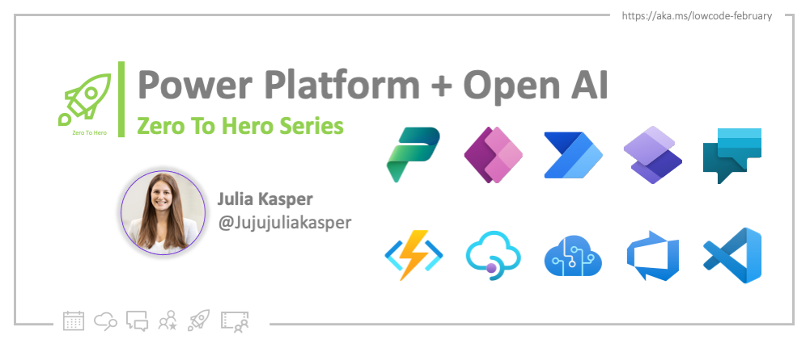
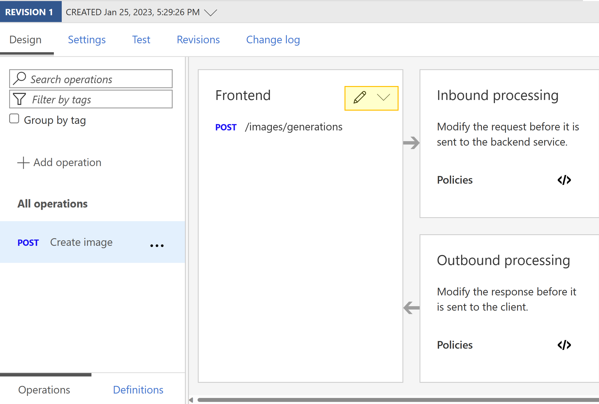
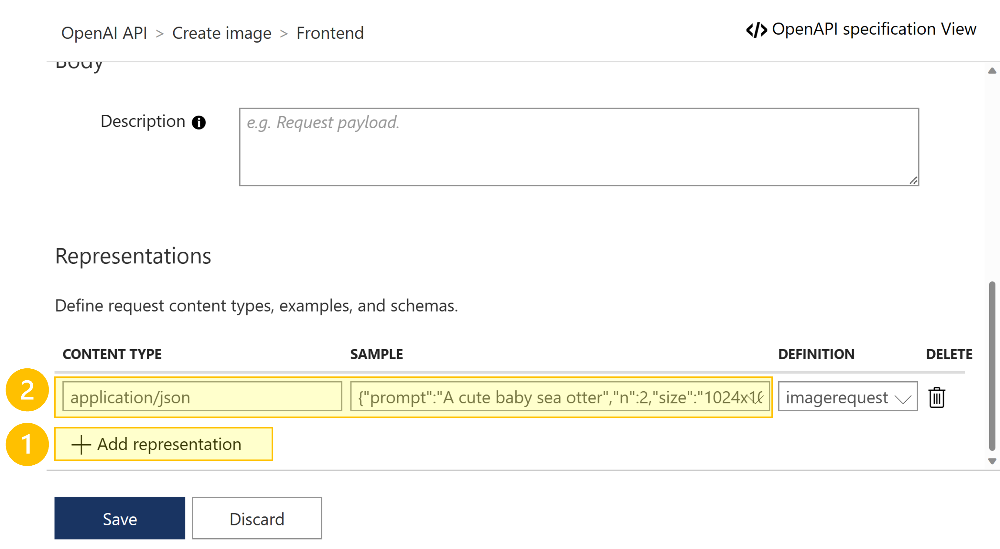
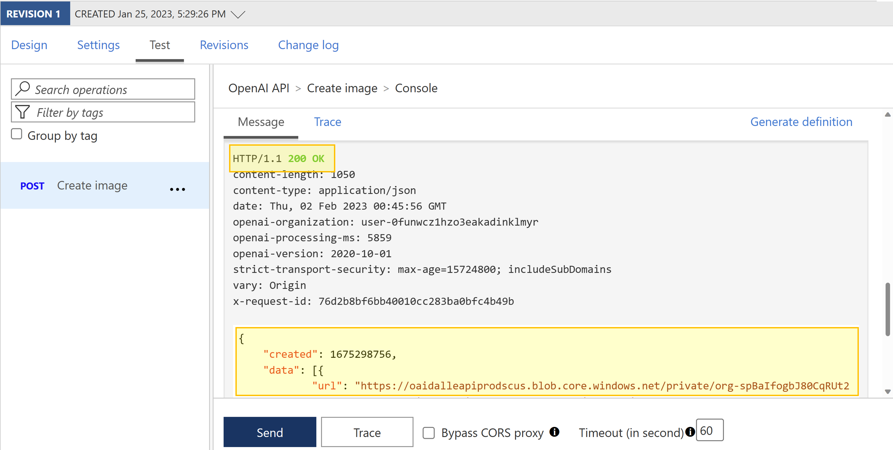
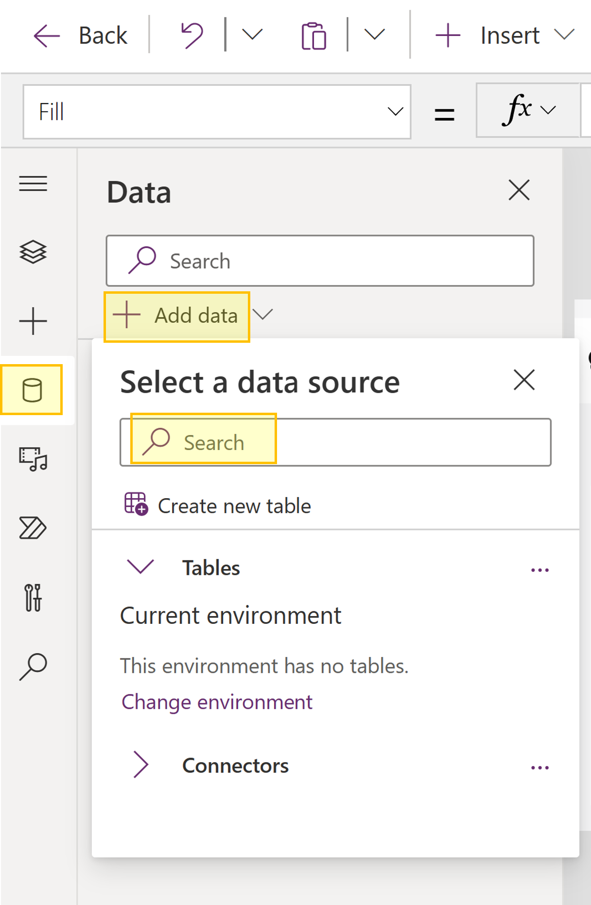
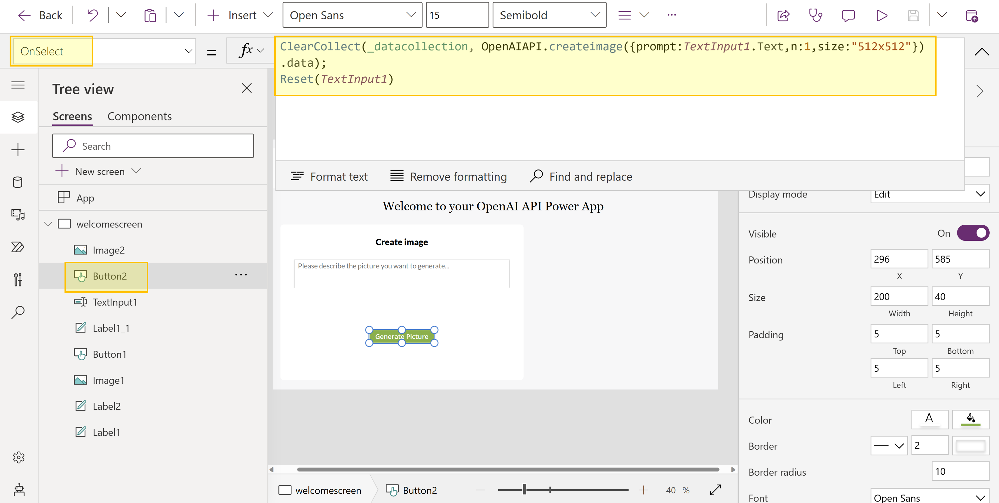

<head>
  <meta name="twitter:url" 
    content="https://microsoft.github.io/Low-Code/blog2023-day15" />
  <meta name="twitter:title" 
    content="Build next-gen apps with OpenAI and Microsoft Power Platform" />
  <meta name="twitter:description" 
    content="Throughout this post, let's discuss how developers can leverage OpenAI's APIs to build next-gen application using Microsoft Power Apps. We will use DALL·E 2 (a new AI system model) to create realistic images and art from a description in natural language." />
  <meta name="twitter:image" 
    content="https://microsoft.github.io/Low-Code/img/og/30-15.png" />
  <meta name="twitter:card" content="summary_large_image" />
  <meta name="twitter:creator" 
    content="@jujujuliakasper" />
  <meta name="twitter:site" content="@AzureAdvocates" /> 
  <link rel="canonical" 
    href="https://techcommunity.microsoft.com/t5/apps-on-azure-blog/build-next-gen-apps-with-openai-and-microsoft-power-platform/ba-p/3742289" />
</head>

Welcome to `Day 15` of #28DaysOfLowCode!

The theme for this week is **OpenAI and Microsoft Power Platform**. Over the past few weeks, social-media feeds and newsletters have been filled with stories and conversations about artificial intelligence (AI). ChatGPT and OpenAI were often center of these conversations and today we will take a look at an exciting OpenAI and Power Platform scenario. We will discuss how developers can leverage OpenAI's APIs to build next-gen application using Microsoft Power Apps. For our scenario, we will use DALL·E 2 (a new AI system model) to create realistic images and art from a text description in natural language.


## What We'll Cover

 * [What is OpenAI](#what-is-openai)
 * [Scenario - Power Apps integration with GitHub and API Management Authorizations](#scenario---power-apps-integration-with-openai-and-azure-api-management)
 * [Scenario Overview](#scenario---power-apps-integration-with-openai-and-azure-api-management)
 * [Prerequisites](#prerequisites)
 * [Step 1: Add OpenAI's API into your Azure API Management instance](#step-1-add-openais-api-into-your-azure-api-management-instance)
 * [Step 2: Configure a policy in Azure API Management](#step-2-configure-a-policy-in-azure-api-management)
 * [Step 3: Create a custom connector via Azure API Management](#step-3-create-a-custom-connector-via-azure-api-management)
 * [Step 4: Call your web API via your Power App](#step-4-call-your-web-api-via-your-power-app)
 * [Resources](#resources)




## What is OpenAI

OpenAI is an AI research and deployment company. Developers can use OpenAI's APIs and build applications using their different trained [models](https://platform.openai.com/docs/models/models). OpenAI offers a spectrum of models with different levels of understanding or generating natural language or code. These models can be used for everything from content generation to semantic search and classification. Their current most popular model is [GPT-3](https://platform.openai.com/docs/models/gpt-3) that can understand and generate natural language. For today's scenario, we will use [DALL·E 2](https://openai.com/blog/dall-e/) (a new AI system model) to create realistic images and art from a text description in natural language.

> *Note: Like GPT-3, DALL·E is a transformer language model. DALL·E is a 12-billion parameter version of GPT-3 trained to generate images from text descriptions, using a dataset of text–image pairs.*

## Scenario - Power Apps integration with OpenAI and Azure API Management

### Scenario Overview

We want to build a Power App and leverage OpenAI's trained model DALL·E 2 to create a realistic image from only a text description. All of this can be done by just a simple API call for OpenAI's [image creation](https://platform.openai.com/docs/api-reference/images/create). We will use [Azure API Management](https://learn.microsoft.com/en-us/azure/api-management/api-management-key-concepts) to help us securely expose OpenAI's API to the Microsoft Power Platform.

### Azure API Management

Web APIs have experienced an exponential increase in popularity and usage in the past few years. APIs exist at the intersection of business, products, and technologies and have transformed the way businesses interact with each other and the way they provide value to their customers. The need for organizations to securely manage, deploy, monitor and share APIs has increased as well. Azure API Management helps to create consistent and modern API gateways for existing back-end services hosted anywhere, secure and protect them from abuse and overuse, and get insights into usage and health.

### Prerequisites
- A running API Management instance. Complete the following [Quickstart: Create a new Azure API Management service instance by using the Azure portal](https://learn.microsoft.com/en-us/azure/api-management/get-started-create-service-instance).
- Make sure you have a Power Apps or Power Automate [environment](https://learn.microsoft.com/en-us/power-apps/powerapps-overview#power-apps-for-developers).

### Step 1: Add OpenAI's API into your Azure API Management instance

1. Sign into Azure portal and go to your API Management instance.
2. In the left menu, select **APIs > + Add API** and select **HTTP**.


3. Enter the following settings. Then select **Create**.

  | Settings  | Value |
  | ------------- | ------------- |
  | Display name  | *openAIAPI*  |
  | Name  | *openaiapi*  |
  | Web service URL  | *https://api.openai.com/v1*  |
  | API URL suffix  | *openaiapi*  |

4. Navigate to the newly created API and select **Add Operation**. Enter the following settings and select **Save**.

  | Settings  | Value |
  | ------------- | ------------- |
  | Display name  | *createimage*  |
  | URL for **POST**  | */images/generations*  |

5. Select your newly created operation and edit **Frontend**.



6. Next, we need to add a **Request Body** to our API. For this, within our Frontend section scroll down and select **Request**. Now **Add representation** and insert the following information:

  | Representations  |  |
  | ------------- | ------------- |
  | CONTENT TYPE  | application/json  |
  | DEFINITION  | {"prompt":"A cute baby sea otter","n":1,"size":"512x512"}  |



7. Next, we will add a Response to our API. Select **Responses** and insert the following information via **+ Add response** for **200 OK**:

  | Representations  |  |
  | ------------- | ------------- |
  | CONTENT TYPE  | application/json  |
  | DEFINITION  | {"created": 1589478378,"data": [{"url": "https://..."},{"url": "https://..."}]} |


8. Select **Save**.

### Step 2: Configure a policy in Azure API Management

1. Next, we need to assign a policy to our API to make sure we are passing along an API key for authentication. 

> *Note: OpenAI API uses API keys for authentication. Visit your [API Keys](https://platform.openai.com/account/api-keys) page to retrieve the API key you'll use in your requests.*

2. Select your operation and in the **Inbound processing** section, select the (`</>`) (code editor) icon.

Inbound policy:

```html
<policies>
    <inbound>
        <base />
        <set-header name="Authorization" exists-action="override">
            <value>Bearer YOUR_API_KEY</value>
        </set-header>
    </inbound>
    <backend>
        <base />
    </backend>
    <outbound>
        <base />
    </outbound>
    <on-error>
        <base />
    </on-error>
</policies>
```

3. Select **Save** and we can now test our API in Azure API Management:
 - Select your operation.
 - Go to the **Test** tab.
 - Select **Send**.



### Step 3: Create a custom connector via Azure API Management

As soon as your API was tested successfully, you are now able to export your web API to the Microsoft Power Platform. Please find a detailed guide here: [Export APIs from Azure API Management to the Power Platform](https://learn.microsoft.com/en-us/azure/api-management/export-api-power-platform).
If you want to add additional security to your API, check out our blog post on [10. Secure Connectors with APIM](https://microsoft.github.io/Low-Code/blog/2023-day10).


### Step 4: Call your web API via your Power App

Next, we want to integrate our newly create custom connector in our Power App and make an API call.

1. In your Power App, add your custom connector to your Power App via the tab **data > + Add data**.



2. Next, we modify a **Generate Picture** Button with the following PowerFX formula:

```
ClearCollect(_datacollection, OpenAIAPI.createimage({prompt:TextInput1.Text,n:1,size:"512x512"}).data); 
Reset(TextInput1)
```




3. Next, we modify an **Image** with the following PowerFX formula:

```
$"{First(_datacollection).url}"
```


4. Now, you are able to test your Power App and create a picture via your text input parameters. This picture will be generated using OpenAI's DALL·E model. Enjoy generating some fun pictures like me:


> Let us know what you think! [@Julia Kasper](https://www.linkedin.com/in/jukasper/)

> Don't forget to [Sign up for the Powerful Dev 2023](https://aka.ms/PowerfulDevsConf2023)!

## Resources

[Sign up for Powerful Dev 2023](https://aka.ms/PowerfulDevsConf2023)

Microsoft Power Platform:
- [Overview of creating apps in Power Apps](https://learn.microsoft.com/en-us/power-apps/maker/)
- [Microsoft Power Platform developer documentation](https://learn.microsoft.com/en-us/power-platform/developer/)
- [Custom connectors](https://learn.microsoft.com/en-us/connectors/custom-connectors/)

Azure API Management:
- [What is Azure API Management?](https://learn.microsoft.com/en-us/azure/api-management/api-management-key-concepts)
- [Azure API Management connector on the Power Platform](https://powerapps.microsoft.com/en-us/blog/azure-api-management-connector-on-the-power-platform/)


