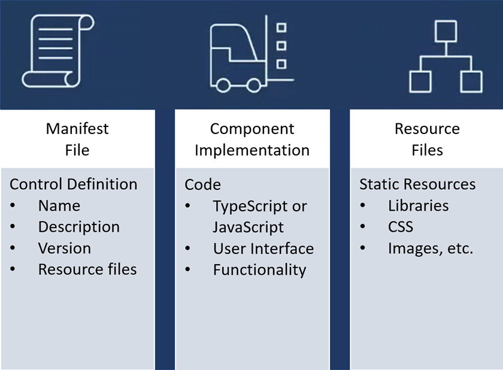

<head>
  <meta name="twitter:url" 
    content="https://microsoft.github.io/Low-Code/blog/slug-FIXME" />
  <meta name="twitter:title" 
    content="FIXME: Title Of Post" />
  <meta name="twitter:description" 
    content="FIXME: Post Description" />
  <meta name="twitter:image" 
    content="FIXME: Post Image" />
  <meta name="twitter:card" content="summary_large_image" />
  <meta name="twitter:creator" 
    content="@nitya" />
  <meta name="twitter:site" content="@AzureAdvocates" /> 
  <link rel="canonical" 
    href="https://microsoft.github.io/Low-Code/blog/slug-FIXME" />
</head>

Welcome to `Day 16` of #30DaysOfLowCode!

The theme for this week is **User Interface**! Yesterday, [Julia](https://github.com/juliajuju93) spoiled us with a blog that highlighted [OpenAI and the Power Platform](https://microsoft.github.io/Low-Code/blog/2023-day15). Today we'll explore the topic of the *Power Apps Component Framework*! 

## What We'll Cover
 * What is the *Power Apps Component Framework (PCF)*?
 * Why would you want to *use* PCF?
 * What are the *advantages*?
 * The *composition* of a PCF component
 * **Exercise**: Training - [Build a Power Apps component](https://aka.ms/LCF/BuildPCF)
 * **Resources**: Explore the [Low Code February Collection](https://aka.ms/lowcode-february/collection)

<!-- FIXME: banner image -->

<!-- ************************************* -->
<!--  AUTHORS: ONLY UPDATE BELOW THIS LINE -->
<!-- ************************************* -->

## What is the Power Apps Component Framework?

Power Apps Component Framework (PCF) empowers professional or traditional developers and app makers to create reusable code components for Power Apps. What's great about these code components is that they work for both [Canvas Apps](https://aka.ms/LCF/Components4Canvas) and [Model-Driven Apps](https://aka.ms/LCF/Components4ModelDriven) and they can be used to enhance the user experience for users working with data on forms, views, dashboards, and even canvas app screens. 

## Why would you want to use PCF?

Sometimes, as app makers, we might reach certain limitations when it comes to building consistent, eye-catching but functional user experiences. The out-of-the-box controls within Power Apps might not fit all of our needs or maybe, we just want to stretch Power Apps' capabilities a little further. With PCF, you can build code components which are essentially visual controls that help you create a more customised user interface.

### Types of PCF Components

These code components also allow for the integration of business logic which complements the visualisation for unique scenarios. There are two main types of components that you can create:

 * **Field**: A custom control for a field on a form. If you have a numeric value, instead of a simple text box with a number, you can represent it as a slider code component.
 * **Dataset**: A custom control to display rows of data. If you would like to go the more advanced route, you could take a boring dataset and represent that as a specialised interactive graph instead of a normal table. 

## What are the advantages of using PCF?
With the PCF's ability to tailor-make your apps to fit your specific needs and requirements, there must be other advantages to take note of, right? Of course! These include;

 * When it comes to **integration**, you have access to a rich set of framework APIs, 3rd-party libraries, and services that lets you incorporate external functionality and exposes capabilities like component lifecycle management, contextual data, and metadata.
 * Drastically improve and enhance the **user experience** with seamless server access via Web API, utility and data formatting methods; device features like camera, location, and microphone; and easy-to-invoke user experience elements like dialogs, lookups, and full-page rendering.
 * The **reusability** aspect because PCF components can be easily reused across multiple Power Apps reducing the development time and cost associated with creating custom functionality for each individual app.
 * Components built with PCF are optimised for **performance** due to the fact that they are designed to be lightweight ensuring that they do not slow down the overall application.
 * Use of **responsive** web design principles to provide an optimal viewing and interaction experience for any screen size, device, or orientation.

### Web Resources vs PCF

Before the PCF existed, HTML web resources were used to provide any type of custom presentation to a Power Apps' form. However, with the introduction of PCF, code components can now be bundled into a single solution file and rendered as part of the same context at the same time as any other components, providing a seamless experience for the user.

## The composition of a PCF component

A [solution](https://aka.ms/LCF/SolutionConcepts) can have code components, which can then be imported into a Dataverse environment. Professional / Traditional developers and app makers can then specify columns, subgrids, views, and dashboard subgrids to use in place of default components after importing the solution containing the code components. These coding elements can be added to Canvas Apps as well as Model-Driven Apps.

## Excercise

Try the exercise in this [learn module](https://aka.ms/LCF/BuildPCF) where you will learn how to build your very first custom PCF component, create a code component solution package, and then test and debug the code component.

Also be sure to look out for tomorrow's blog where we will be building another PCF code component in a detailed step-by-step fashion. 

## Resources

* **Exercise**: Training - [Build a Power Apps component](https://aka.ms/LCF/BuildPCF)
* **Documentation**: [Power Apps Component Framework Overview](https://aka.ms/LCF/PCFDocs)
* **Watch**: [The Low Code Revolution Show](https://learn.microsoft.com/en-us/shows/the-low-code-revolution/?wt.mc_id=82054_collection_webpage_ece&ns-enrollment-type=Collection&ns-enrollment-id=8q5jhr1y0jeqj6)
* Low Code February [Learn Collection](https://learn.microsoft.com/users/nityan/collections/xz6ehr2mx031y0?WT.mc_id=javascript-82212-ninarasi): Collection of resources to go from learning Power Platform Fundamentals, to understanding the Dataverse and working in Fusion Development teams.

Also consider -

* Signing up for the free [Power Apps Developer Plan](https://aka.ms/lowcode-february/devplan) so you have access to the Power Platform.
* Enrolling in the [Cloud Skills Challenge](https://aka.ms/lowcode-february/challenge) to skill up on key cloud technologies with free, self-guided learning courses, and start climbing the leaderboard!

