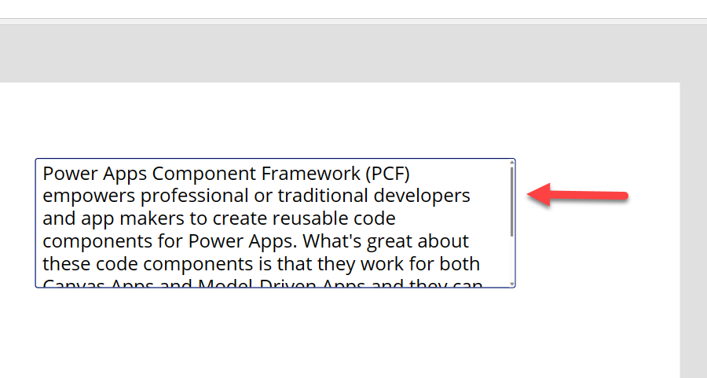
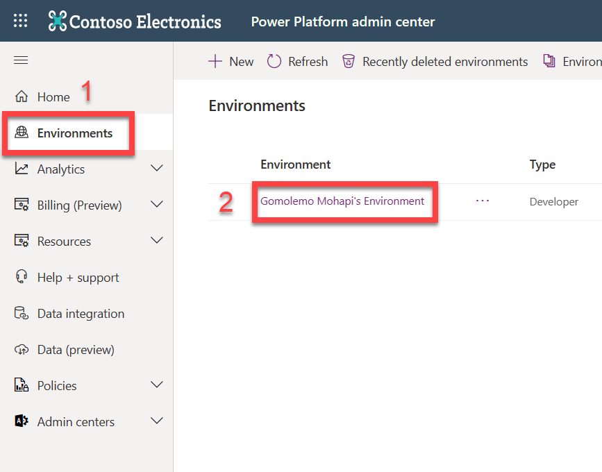
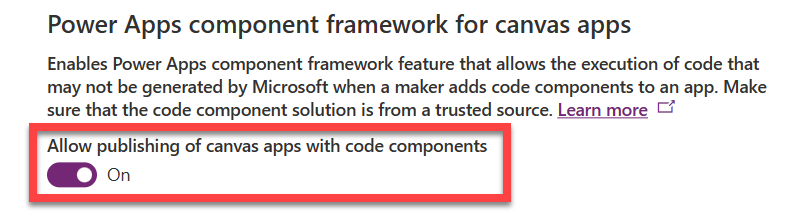
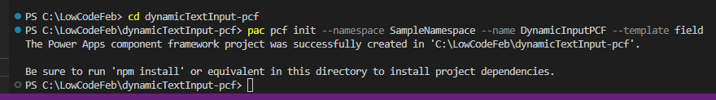
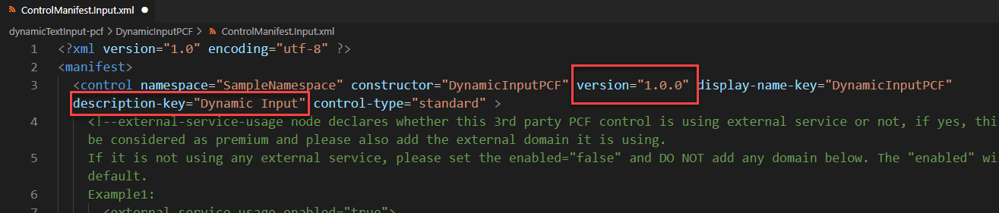
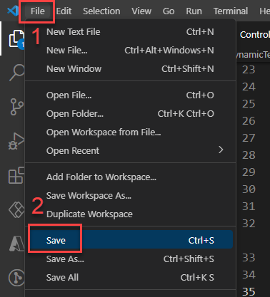
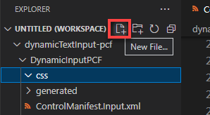
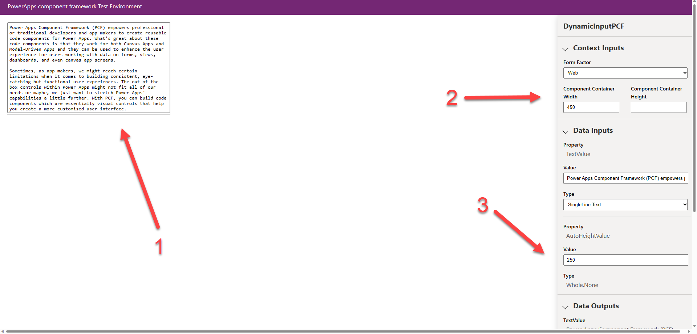

<head>
  <meta name="twitter:url" 
    content="https://microsoft.github.io/Low-Code/blog/slug-FIXME" />
  <meta name="twitter:title" 
    content="FIXME: Title Of Post" />
  <meta name="twitter:description" 
    content="FIXME: Post Description" />
  <meta name="twitter:image" 
    content="FIXME: Post Image" />
  <meta name="twitter:card" content="summary_large_image" />
  <meta name="twitter:creator" 
    content="@nitya" />
  <meta name="twitter:site" content="@AzureAdvocates" /> 
  <link rel="canonical" 
    href="https://microsoft.github.io/Low-Code/blog/slug-FIXME" />
</head>

Welcome to `Day 17` of #30DaysOfLowCode!

The theme for this week is **User Interface** and we're ending it off with a quick tutorial on PCF Components! Yesterday, I wrote about the [Power Apps Component Framework](https://microsoft.github.io/Low-Code/blog/2023-day16) and highlighted why you would want to use it, what the advantages are, as well as the composition of a PCF Component. Today, as promised, we'll be building a simple code component step-by-step.

## What We'll Cover
 * Power Apps Component Framework Recap
 * What are we building today?
 * Let's make a Code Component!
 * Test and Run your component 
 * Where to from here?
 * **Exercise**: Training - [Use advanced features with Power Apps component framework](https://aka.ms/LCF/BuildMorePCF)
 * **Resources**: Explore the [Low Code February Collection](https://aka.ms/lowcode-february/collection)

<!-- FIXME: banner image -->


<!-- ************************************* -->
<!--  AUTHORS: ONLY UPDATE BELOW THIS LINE -->
<!-- ************************************* -->

## Power Apps Component Framework Recap
As mentioned in yesterday's blog, Power Apps Component Framework (PCF) empowers professional or traditional developers and app makers to create reusable code components for Canvas Apps and Model-Driven Apps. Sometimes, as app makers, we might reach certain limitations when it comes to building consistent, eye-catching but functional user experiences. The out-of-the-box controls within Power Apps might not fit all of our needs or maybe, we just want to stretch Power Apps' capabilities a little further. With PCF, you can build code components which are essentially visual controls that help you create a more customised user interface.


## What are we building today? 
So, with Power Apps, there is generally a large amount of data that end users input into the app via a Text Input control. However, as we can see in this [reference page](https://aka.ms/LCF/TextInputControl), there is no "auto height" property. What I mean is whenever you use a Text Input, and you have a lot of text, the text input does not inherently have the ability to increase its own height based on the amount of text that you have. The normal behaviour here is that the Text Input will have a scrollbar that you can use to navigate through the large amount of text.



This is the perfect opportunity for a professional developer to use their skills to solve this "low code" problem. And just to make sure, I'm not saying that a low code developer does not have the ability to create some sort of walkaround for this problem - we are just looking at this from the perspective of a professional developer and how they can contribute to Power Platform Solutions. Also, by creating a code component, app makers will be able to use this throughout all of their Power Apps. 

## Let's Make a Code Component!
Time to get started building with the Power Apps Component Framework, but first - 
 
### Pre-Requisites
> **Note**: This tutorial was completed using a Windows 11 Machine.

Before we get started, we will need to install the following:
1. Install [**Visual Studio Code (VS Code)**](https://aka.ms/LCF/VSCode) and ensure that the "Add to PATH" option is selected during installation.
2. Install [**Node.js**](https://nodejs.org/en/download/) (comes with npm). I recommend that you use a LTS (Long-Term Support) version.
3. Once VS Code is installed, go ahead and download and install the [**Power Platform Tools**](https://aka.ms/LCF/InstallPowerCLI) VS Code extension.

### Configure Power Apps Environment

Since we are building a code component for Power Apps, we need to make sure our Power Apps environment is prepared and configured. 

1. If you don't have a [ **Power Apps Developer Plan** ](https://aka.ms/lowcode-february/devplan)yet 👀, go ahead and sign up for one. It's FREE. 
2. Once that's done, log into the **[Power Platform Admin Center](https://admin.powerplatform.microsoft.com)** 
	* Select "**Environments**" on the left-hand side 
	* Click on the development environment that you've just created above. This will usually have the name: ***[Your Name]'s Environment**.*

  

  3. Select "**Settings**" from the top command bar and navigate to Product > Features > Power Apps component framework for canvas apps. 
4. Activate the Toggle On setting for the **Allow publishing of canvas apps with code components** feature.



5. Scroll down and select **Save**. 

Now we're good to go! 😃

### Create a Component Folder
We will need a working folder to store our Code Component solution. For ease of use, I usually create a folder in a place where I can easily access from a Command Prompt. On my computer, I've created a new folder called **LowCodeFeb** directly in the C:\ drive. So, I will be using `C:\LowCodeFeb`.

### Create a New Component Project
1. Start **Visual Studio Code**
2. Select **Terminal** and select **New Terminal**.
3. Change directory to your working folder.

```bash
	cd C:\LowCodeFeb
```
4. From your LowCodeFeb directory, create a directory named **dynamicTextInput-pcf**.

```bash
	mkdir dynamicTextInput-pcf
```
5. Change directory to **dynamicTextInput-pcf**.
```bash
	cd dynamicTextInput-pcf
```
6. Initialize your component project by using Power Platform CLI with the following command:
```bash
	pac pcf init --namespace SampleNamespace --name DynamicInputPCF --template field
```
This image shows an example of the output you should see:




7. Install the project build tools by using the command `npm install`. Don't worry about any warnings you may see at this point. 
```bash
	npm install
```
8. Once completed, run the command below to open the component project in Visual Studio Code.
```csharp
	code -a .
```
Your opened project should look like this so far:


### Update Code Component's Manifest
Remember, from yesterday's blog - we established that the manifest is an XML file that defines the metadata and configuration of a code component. The manifest is an important file for a PCF code component because it is used by the Power Apps authoring tools to register and manage the component. This also includes the kind of data which is to be configured (field or dataset) and any other properties that can be configured in the application when the component is added.

1. Expand the **DynamicInputPCF** folder and open the **ControlManifest.Input.xml** file.
2. Near the top of the file, Change the version to **1.0.0** and description-key to **Dynamic Input**.



3. Locate the **<property ... />** node and replace it with this:

```xml
	<property name="TextValue" display-name-key="TextValue" description-key="TextValueDescription" of-type-group="strings" usage="bound" required="true" />
	<property name="AutoHeightValue" display-name-key="AutoHeightValue" description-key="AutoHeightValueDescription" of-type="Whole.None" usage="bound" required="true" />

	<type-group name="strings">
	  <type>SingleLine.Text</type> 
	  <type>SingleLine.TextArea</type> 
	  <type>Multiple</type> 
	</type-group> 
```
4. Locate the **<resources ... />** node and include a reference to a CSS file named DynamicInputPCF.css that you'll soon create.

```xml
	<css path="css/DynamicInputPCF.css" order="1" />
```

5. Save your changes by selecting **File** and then **Save**.



### Add styling to your code component

Now we're going to be adding some basic styling to our component. Just to get a feel of what the process is like and how you can further customise code components.

1. Make sure you still have the **ControlManifest.Input.xml** file selected and then select **New Folder**.


2. Name the new folder **css** and then select the **css** folder you've created and select **New File**.



3. Name the new file **DynamicInputPCF.css**
4. Open DynamicInputPCF.css and paste the following CSS:

```css
	.DynamicInputPCF textarea { 
		padding: 5px; 
		box-sizing: border-box;
		width: 100%; 
	}
			
	.DynamicInputPCF textarea:focus, .DynamicInputPCF textarea:enabled:hover { 
		border: 2px solid black;
	} 
```

5. Select **File** and select **Save**.

### Build your code component
In order to ensure that the right TypeScript types are generated to match the properties in your ControlManifest.xml document, we need to run a build on our component. 

Return to the terminal and perform a build b using the following command:

```bash
	npm run build
```

Once the build is successful, you'll notice in the project folder, that the component is compiled into the **out/controls/DynamicInputPCF** directory. The results of this compilation are:
* **css** folder
* **bundle.js**  - Bundled component source code
* and the **ControlManifest.xml** which is the actual component manifest file that is uploaded to the Microsoft Dataverse organization

With those artifacts generated, we can now start implementing our component logic.

### Implement Component's Logic
Let's get straight into it. 

1. Open the **index.ts** file and insert the following variables above the constructor method.
```ts
	// The PCF context object
    private context: ComponentFramework.Context<IInputs>;

    // The wrapper div element for the component
    private container: HTMLDivElement;

    /* The callback function to call whenever your code 
    has made a change to a bound or output property */
    private notifyOutputChanged: () => void;

    //Variable to track the height of the control
    height: number; 
    
    textarea: HTMLTextAreaElement; 
    defaultLoaded = false; 
```

2. Find the **init** method and replace its contents with this:

```ts
	//Track all elements
    this.container = container;
	this.context = context;
	this.notifyOutputChanged = notifyOutputChanged;
	this.textarea = document.createElement("textarea");
	this.textarea.rows = 1;
	this.textarea.style.resize = 'none';
	this.textarea.style.overflowY = 'hidden';
	this.textarea.oninput = this.onTextAreaInput;
	this.textarea.onchange = this.onTextAreaChanged;
	this.container.appendChild(this.textarea);
```
After pasting the code above, you may have a couple of errors. No need to worry - we'll be defining a few methods, in a moment, which will clear these errors.

3. Underneath the **init** method, add the following: 

```ts
	/* These methods are responsible for telling the framework 
	that there is a new value in the text input and then it 
	starts calculating the new height */
	onTextAreaInput = (): void => {
		this.autoSizeTextArea();
	}
	
	onTextAreaChanged = (): void => {
		this.notifyOutputChanged();
	}
	
	autoSizeTextArea(): void {
		this.textarea.style.height = 'auto';
		const newHeight = (this.textarea.scrollHeight) + 'px';
		const heightChanged = newHeight !== this.textarea.style.height;
		this.textarea.style.height = newHeight;
		if (heightChanged) { this.notifyOutputChanged(); }
	}
```
4. Look for the **updateView** method and add the following:

```ts
	const value = context.parameters.TextValue;
		let disabled = context.mode.isControlDisabled;
		let masked = false;
		if (value && value.security) {
			masked = !value.security.readable;
			disabled = disabled || masked || !value.security.editable;
		}

	// Update text value if input value changes
	if (!this.defaultLoaded || context.updatedProperties.indexOf("TextValue") > -1) {
		this.defaultLoaded = true;
		const newValue = masked ? "****" : value.raw as string;
		this.textarea.value = newValue;
		this.autoSizeTextArea();
	}
```
5. And one of the last major things we need to do is find and update the **getOutputs** method with the following code:

```ts
	/* This provides the output/bound properties back to 
	the PCF after notifyOutputChanged() has been called. */
	const  height = Number.parseInt(this.textarea.style.height);
	return {
		TextValue:  this.textarea.value,
		AutoHeightValue:  height
	}
```
6. Go ahead and **Save** everything. 

## Test and Run your Component 
Now that we have configured and built out the component logic, let's give it a go! Now is a great time to test your component *before* you import it into Power Apps. 

1. Let's return to the **Terminal** and rebuild our component. 

```bash
	npm run build
```
If you've followed everything correctly, the build should succeed. If not, feel free to take some time and check if you've copied all code correctly. 

Now we get to run and test our component in a *test harness* that simulates the Power Apps runtime, so you get to see how your component behaves. 

2. In the **Terminal** once more, run the following command: 
```bash
	npm start
```

A new browser window should automatically load the test harness. 


Go ahead and write some text directly into the text input (1) on the right. Be sure to press the **Enter** key a couple of times to see the text input automatically resizing. You can also play with the pre-set width and height properties (2) to find how the text input behaves under various conditions. Also, you'll notice that the AutoHeightValue (3) dynamically changes as you're writing as well. 



## Where to from here? 
At face value, it doesnt seem like much however I wanted to give you a just a taste of what is possible when professional developers use their skills and their tools to contribute to Power Platform Solutions. Once a code component is built and you've verified that it works. The next step is to create a solution package and import that into the Power Apps Environment.

See [this article](https://learn.microsoft.com/en-us/power-apps/developer/component-framework/import-custom-controls) for guidance on how to package a code component and then when you want to add your code component to a Power App, you can read the guidance for [Canvas Apps](https://learn.microsoft.com/en-us/power-apps/developer/component-framework/component-framework-for-canvas-apps) and/or [Model-Driven Apps](https://learn.microsoft.com/en-us/power-apps/developer/component-framework/code-components-model-driven-apps).

## Exercise
Try the exercise in this [learn module](https://aka.ms/LCF/BuildMorePCF) where you will get to learn EVEN MORE about code components. You'll be able to get details on how to address more complex scenarios as it applies to the PCF. What makes this exciting is that it covers how to use client frameworks such as React and Angular within a component, along with how to address scenarios such as file upload, localization, and integration with the Microsoft Dataverse Web API.

## Resources
* **Exercise**: Training - [Use advanced features with Power Apps component framework](https://aka.ms/LCF/BuildMorePCF)
* **Documentation**: [Power Apps Component Framework Overview](https://aka.ms/LCF/PCFDocs)
* **Watch**: [The Low Code Revolution Show](https://learn.microsoft.com/en-us/shows/the-low-code-revolution/?wt.mc_id=82054_collection_webpage_ece&ns-enrollment-type=Collection&ns-enrollment-id=8q5jhr1y0jeqj6)
* **Watch** all of the [Powerful Devs Conference](https://www.youtube.com/live/4VK1CJYR2W4)  sessions on demand to learn from experts how you, as a developer, can leverage the Power Platform to build applications faster and with far less effort.
* Low Code February [Learn Collection](https://learn.microsoft.com/users/nityan/collections/xz6ehr2mx031y0?WT.mc_id=javascript-82212-ninarasi): Collection of resources to go from learning Power Platform Fundamentals, to understanding the Dataverse and working in Fusion Development teams.

Also consider -

* Signing up for the free [Power Apps Developer Plan](https://aka.ms/lowcode-february/devplan) so you have access to the Power Platform.
* Enrolling in the [Cloud Skills Challenge](https://aka.ms/lowcode-february/challenge) to skill up on key cloud technologies with free, self-guided learning courses, and start climbing the leaderboard!

