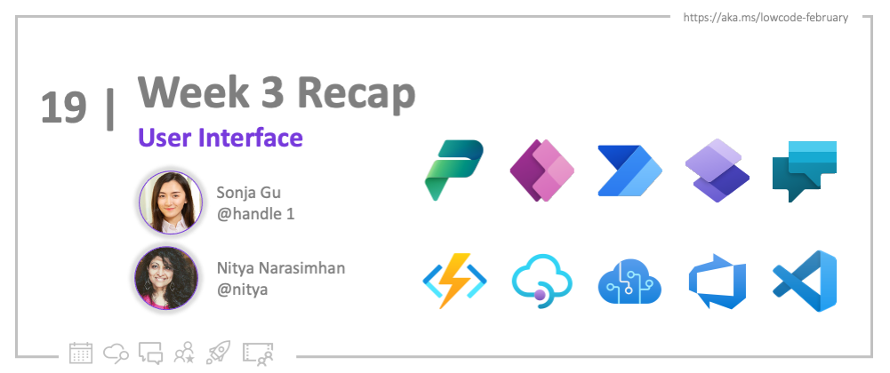
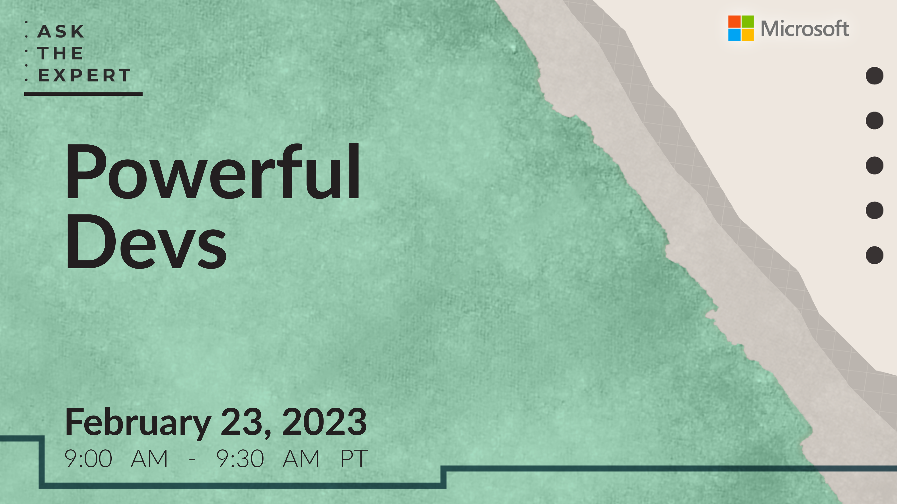

<head>
  <meta name="twitter:url" 
    content="https://microsoft.github.io/Low-Code/blog/2023-day19" />
  <meta name="twitter:title" 
    content="19. Recap - Interface Week ✨" />
  <meta name="twitter:description" 
    content="Let's recap Week 3 of #30DaysOfLowCode focused on builing user interface quickly with power platform - join us at #LowCodeFebruary https://aka.ms/lowcode-february" />
  <meta name="twitter:image" 
    content="https://microsoft.github.io/Low-Code/img/og/30-19.png" />
  <meta name="twitter:card" content="summary_large_image" />
  <meta name="twitter:creator" 
    content="@nitya" />
  <meta name="twitter:site" content="@AzureAdvocates" /> 
  <link rel="canonical" 
    href="https://microsoft.github.io/Low-Code/blog/2023-day19" />
</head>

Welcome to `Day 19` of #30DaysOfLowCode!

## What We'll Cover
 * **Look Back**: Recap User Interface Week
 * **Recap events**: Powerful Dev Conference, Learn Live and Webinar for Power Platform and GitHub
 * **Skill Up**: Self-Study Resources & Cloud-Skills Challenge
 * **Look Ahead**: Are you ready for the Developer Experience Week?!
 * **Resources**: Explore the [**Low Code February Collection**](https://aka.ms/lowcode-february/collection)

## **Look Back**: Week 3 Recap

Hey there! Week 3 is a wrap! We had a blast exploring the user interface of Power Apps together. First up, we took a deep dive into canvas apps 101 and got familiar with the low code programming language - Fx. We also got to play around with the PCF (Power Apps Component Framework) control and learned how to build stunning, eye-catching front-ends. To top it off, we even built a PCF control together! 

In our ZeroToHero blog post, we provided a detailed step-by-step guide on how to create a highly flexible and interactive app using the powerful combination of OpenAI, API Management, and Power Apps. Last but not the least, we also discussed how professional developers can take advantage of Power Pages to quickly build enterprise-ready internal and external websites. 

Here's what we've covered this week:

* [**Build a Canvas App**](https://microsoft.github.io/Low-Code/blog/2023-day13) - Introduction to Canvas Apps, a powerful tool that allows developers to create highly tailored and personalized experiences for their users.

* [**Intro to Power Fx**](https://microsoft.github.io/Low-Code/blog/2023-day14) - Intoduction to Power Fx, a low-code programming language that enable you to add logic to your Power Apps. By delving into this language, you'll gain a deeper understanding of how Power Apps really work and be able to add more complex functionality to your apps. 

* [**OpenAI & Microsoft Power Platform 🚀**](https://microsoft.github.io/Low-Code/blog/2023-day15) - Over the past few weeks, there has been a lot of buzz around the topic of ChatGPT and OpenAI. In this blog, we're going to dive deeper into one of the many exciting scenarios where OpenAI and the Power Platform can be combined to create something truly amazing. 

* [**Intro to PCF Control**](https://microsoft.github.io/Low-Code/blog/2023-day16) - Introduce to the Power Apps Component Framework (PCF), a powerful tool that allows developers to build custom components for their Power Apps, giving them complete control over the look and functionality of their apps. 

* [**Build a PCF Control**](https://microsoft.github.io/Low-Code/blog/2023-day17) - Build a simple code component step-by-step, giving you the opportunity to follow along and see exactly how the process works.

* [**Power Pages for ProDevs**](https://microsoft.github.io/Low-Code/blog/2023-day18) - Intoduction to Power Pages, a powerful tool that provides developers with a wide range of features and tools to help them create professional websites quickly and easily. 

## **Recap events**

* [**Ask The Experts!**](http://localhost:3000/Low-Code/lowcode-february/Video-Live#ask-the-experts) During these sessions, you'll have the chance to have a face-to-face discussion with our leaders and experts, who will be able to provide you with valuable insights, guidance, and best practices:
    1. 🎙 [**Feb 23, 9AM PST**](https://aka.ms/ATE0223/RSVP ) - Join this session for Q&A from the **Powerful Devs Conference** team. The Powerful Devs Conference is all about showing how code-first developers can integrate with the Power Platform to innovate faster. Our experts will be available to answer questions about full code and low code integration.
    

    2. 🎙 [**Mar 09, 9AM PST**](https://aka.ms/ATE0309/RSVP) - Join this session for Q&A from the **Low Code February** team, including authors of this #30DaysOfLowCode series. We will have experts in code-first integration with the Power Platform live to answer questions related to the content of the Low Code February events.
    

* [**Learn Live!**](https://aka.ms/lowcode-february/LearnLive) If you have any questions or concerns about the Microsoft Learn modules or the Cloud Skills Challenge, be sure to tune in to our "Learn Live" sessions. During these sessions, you'll have the opportunity to hear directly from experts in the field and get tips and insights that can help you succeed in your learning journey: 
  1. 🎙 [**Feb 27**](https://aka.ms/lowcode-february/LearnLive) - Manage Microsoft Power Platform deployments
  

* [**Powerful Devs Conference: On-Demand**](https://learn.microsoft.com/events/learn-events/powerful-devs-2023/?WT.mc_id=javascript-82212-ninarasi) The Powerful Devs Conference is a fantastic resource for developers who want to learn more about the Power Platform and how to build applications quickly and easily. The conference features a wide range of sessions and talks from industry experts, Microsoft Cloud Advocates, community leaders, and members of the Power Platform Team. 
  

* [**Webinar: Power Platform & Azure Deploys with GitHub: On-Demand**](https://mktoevents.com/Microsoft+Event/383091/157-GQE-382) Watch the on-demand webinar, where you'll get a chance to explore the powerful capabilities that the Power Platform opens up for GitHub. You'll learn about the inner and outer loop functions that are available with Power Platform and GitHub, and see firsthand how to author CI/CD pipelines that can help you streamline your development process.
  

## **Skill Up:** For Self-Study

Unable to keep up with the daily pace? No problem! Check out these our self-study materials designed to help you learn at your own convenience:
1. [**Resource Collection**](https://aka.ms/lowcode-february/collection): Bookmark the collection for a 1-stop resource containing all relevant links to documentation and training, as covered in the #30DaysOfLowCode blogs. 
2. [**Hands-on Workshops**](https://aka.ms/lowcode-february/workshop): learn by doing! These labs help you gain hands-on experience from intro to advanced, whereever you're in the learning path. 
3. [**Cloud skills Challenge**](https://aka.ms/lowcode-february/challenge): gives you a free curated set of learning modules to jumpstart your learning journey into Low Code and Fusion development. 

## **Look Forward**: Week 4

During week 4 of the learning journey, you'll get a deep-dive in developer experience. You will get a chance to learn about Power Platform app lifecycle management, app governance as well as managing your apps with GitHub Actions, Power Platform pipelines and Azure DevOps. 

Don't forget to bookmark the [**#30DaysOfLowCode**](https://aka.ms/lowcode-february/blog) page, then follow along to read the daily blog post, ask questions, and connect with other learners. _Get empowered_ with low code development!

