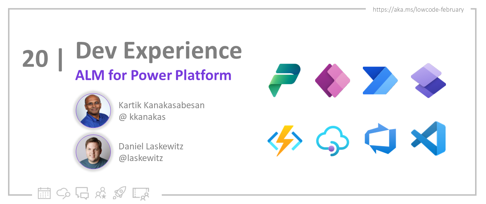

<head>
  <meta name="twitter:url"
    content="https://microsoft.github.io/Low-Code/blog/2023-day20" />
  <meta name="twitter:title"
    content="20. ALM For Power Platform" />
  <meta name="twitter:description"
    content="Take a look into the foundamentals of App Lifecycle Management (ALM) and walk you through how can you implement ALM with Power Platform. - join us at #LowCodeFebruary https://aka.ms/lowcode-february. #30DaysOfLowCode" />
  <meta name="twitter:image"
    content="https://microsoft.github.io/Low-Code/img/og/30-20.png" />
  <meta name="twitter:card" content="summary_large_image" />
  <meta name="twitter:creator"
    content="@nitya" />
  <meta name="twitter:site" content="@AzureAdvocates" />
  <link rel="canonical"
    href="https://microsoft.github.io/Low-Code/blog/2023-day20" />
</head>

Welcome to `Day 20` of #30DaysOfLowCode!

The theme for this week is Developer Experience. Today we will take a look into the foundamentals of App Lifecycle Management (ALM) and walk you through how can you implement ALM with Power Platform.

## What We'll Cover

* Intro to Application Lifecycle Management (ALM)
* Power Platform and Application Lifecycle Management
* Solutions for Application Lifecycle Management
* Deployment management
* Exercise: Sign up for your [**Developer Plan**](https://aka.ms/lowcode-february/devplan)
* Resources: Explore the [**Low Code February Collection**](https://aka.ms/lowcode-february/collection)

<!-- FIXME: banner image -->

<!-- ************************************* -->
<!--  AUTHORS: ONLY UPDATE BELOW THIS LINE -->
<!-- ************************************* -->

## What is Application Lifecycle Management (ALM) ?

Application Lifecycle Management is an very large encompassing term. Which is absolutely true, because you are managing the life of an Application from its birth to finally retiring it.
Now, there is a perception that ALM is only valid traditional software development projects, and those perceptions maybe right. The applications being built by Power Platform are also applications, and applications by nature need to be managed especially when low code applications are now being built for organization's turn key products. Application Lifecycle management is culmination of a problem solving effort by combining people, process, and tools to address a purpose/outcome.

## What falls within realm of ALM?

ALM can be seen via various terms, such as:
  -Digital transformation : where an organization adopts technology to help improve value, productivity,risk management, efficiency, and manage costs
  -DevOps (Development + Operations)               : It is the union of people, process, and tools to enable continuous delivery to your users of your service
  -DevSecOps (Development + Security + Operations) : It is an approach built on top of DevOps and incorporating a security mindset from the get go
  -Legacy Application development                  : Managing the Application lifecycle of a mature product line
  -New Application development                     : Managing the Application lifecycle of a nascent product line

Now there is SDLC which stands for Software Development Lifecycle, it is also part of ALM but focuses mostly on the software development side of things.

In short, all these terms are part of application lifecycle management, as a matter of fact, any time a new application is developed, it will have to be managed eventually!

## Power Platform and Application Lifecycle Management

Power Platform helps you develop applications quicker and faster, so it has the capabilities to be part of Application Management initiatives of an organization. When implementing Application Lifecycle Management with Power Platform, three things need to be considered

- Environment Management                : This entails the strategy you want to implement when embarking on ALM. Typically most common ALM pattern from an environments perspective is to have environments that map to Development, Test, and Production.  

- Organize the artifacts in Solutions   : PowerApps, PowerAutomate Flows, Power Virtual Agents, AI Builder, PowerBI, and Power Pages assets need to be within solutions

- Managing Deployments                  : When solutions are deployed from Development, to Test, to Production what are the mechanism that need to be employed and managed (i.e. Azure DevOps pipelines, GitHub actions, and Pipelines for Power Platform)  

## Solutions are important for Application Lifecycle Management

Beyond the components listed in the prior section, the additional components that are part of solution for enabling successful Application Lifecycle Management

In addition, there are two types of solution, which are managed and unmanaged solutions.
-    Managed solutions  : Are immutable, as in once a solution becomes managed, it cannot be changed. Think of components that you use as a library for your application
-    Unmanaged solutions: These solutions can be changed, solutions when in your development environment are generally in the unmanaged state.

When committing solutions from a Power Platform developer environment, you need to export them, the solution renders itself as a zip file that can be then committed to source code repository.

## Deployment management

As mentioned before, there are various ways and means to deploy power platform applications, there are integrations with Azure DevOps and GitHub Actions. In addition, Power Platform has an in-product deployment capability called [Pipelines for Power Platform](https://learn.microsoft.com/power-platform/alm/pipelines/?WT.mc_id=javascript-82212-ninarasi). This is designed for developers who may not have sophisticated ALM deployment needs.

## Resources
* [ALM with Power Platform](https://learn.microsoft.com/power-platform/alm/?WT.mc_id=javascript-82212-ninarasi)
* [Environment Strategy](https://learn.microsoft.com/power-platform/alm/environment-strategy-alm/?WT.mc_id=javascript-82212-ninarasi)
* [Solution Concepts](https://learn.microsoft.com/power-platform/alm/solution-concepts-alm/?WT.mc_id=javascript-82212-ninarasi)
* [ALM Automation: Power Platform Build Tools for Azure DevOps](https://learn.microsoft.com/power-platform/alm/devops-build-tools?WT.mc_id=javascript-82212-ninarasi)
* [ALM Automation: Power Platform actions with GitHub](https://learn.microsoft.com/power-platform/alm/devops-github-actions?WT.mc_id=javascript-82212-ninarasi)
* [ALM Automation:Pipelines in Power Platform](https://learn.microsoft.com/power-platform/alm/pipelines?WT.mc_id=javascript-82212-ninarasi)

