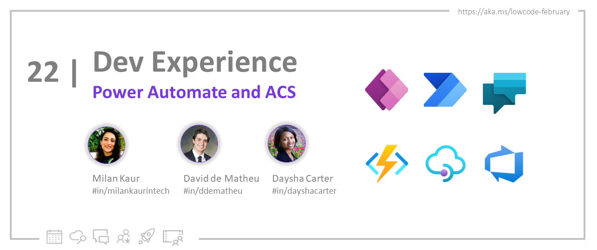
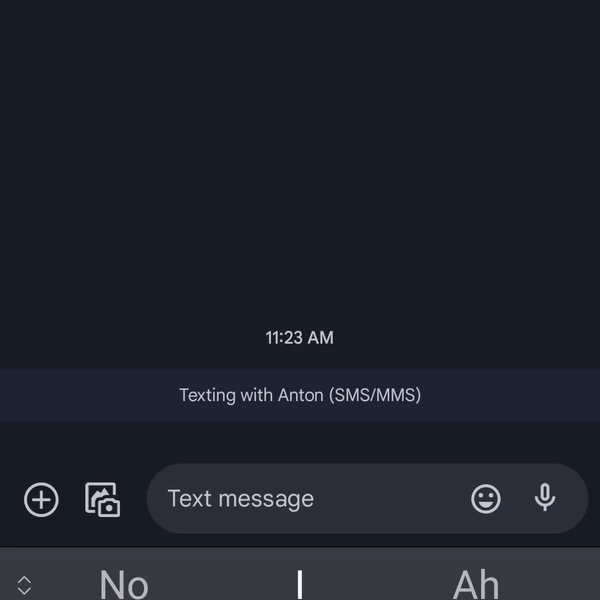
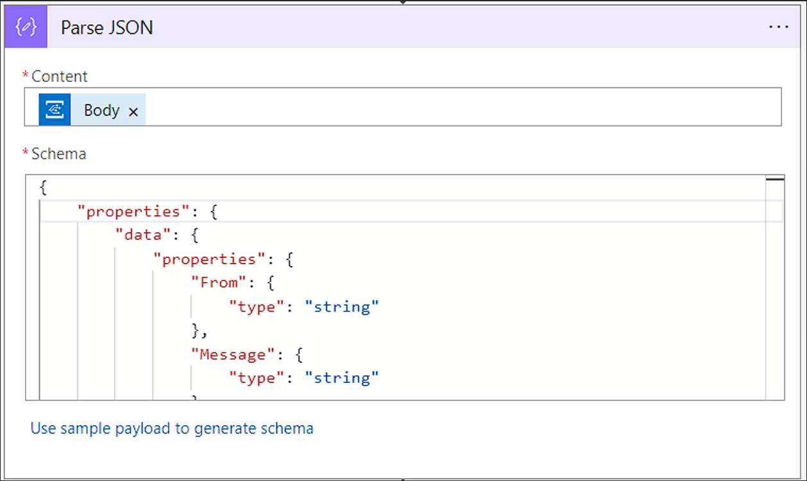

<head>
  <meta name="twitter:url"
    content="https://microsoft.github.io/Low-Code/img/og/30-22.png" />
  <meta name="twitter:title"
    content="22. Power Automate and ACS" />
  <meta name="twitter:description"
    content="Learn how to build a SMS conversational bot with Power Automate, OpenAI and Azure Communication Services! - join us at #LowCodeFebruary https://aka.ms/lowcode-february. #30DaysOfLowCode" />
  <meta name="twitter:image"
    content="https://microsoft.github.io/Low-Code/img/og/30-22.png" />
  <meta name="twitter:card" content="summary_large_image" />
  <meta name="twitter:creator"
    content="@nitya" />
  <meta name="twitter:site" content="@AzureAdvocates" />
  <link rel="canonical"
    href="https://microsoft.github.io/Low-Code/img/og/30-22.png" />
</head>

Welcome to `Day 22` of #28DaysOfLowCode!

## What We'll Cover

* Power Automate and Azure Communication Services
* Build a SMS conversational bot
* Configuring Event Grid Trigger
* Configure Azure OpenAI
* Configure Azure Communication Services SMS
* Exercise: Sign up for your [**Developer Plan**](https://aka.ms/lowcode-february/devplan)
* Resources: Explore the [**Low Code February Collection**](https://aka.ms/lowcode-february/collection)

<!-- FIXME: banner image -->


<!-- ************************************* -->
<!--  AUTHORS: ONLY UPDATE BELOW THIS LINE -->
<!-- ************************************* -->

## Background

In our [last blog](https://techcommunity.microsoft.com/t5/azure-communication-services/build-a-conversational-sms-bot-with-azure-communication-services/ba-p/3739568), we walked through the process of building a SMS conversational bot. Today we want to showcase a similar bot, but this time built completely on top of low code connectors for Power Automate. It is incredibly easy and exciting to leverage Azure Communication Services connectors in conjunction with Large Language Models (LLM) like ChatGPT to build a conversation bot. For this blog, we will be building Anton, a personal trainer bot for Contoso Gym. See the preview:



## Pre-requisites

To follow along you will need:
* An Azure account with an active subscription. [Create an account for free](https://aka.ms/acs-sms-open-ai-create-azure).
* Enable Event Grid resource provided on your subscription. See [instructions](https://aka.ms/acs-sms-open-ai-event-sub).
* An active Communication Services resource and connection string. [Create](https://aka.ms/acs-sms-open-ai-create-resource) a Communication Services resource.
* An SMS-enabled telephone number. [Get a phone number](https://aka.ms/acs-sms-open-ai-get-number).
* Azure OpenAI resource. See [instructions](https://aka.ms/acs-sms-open-ai-create-open).
* Azure OpenAI deployed model. See [instructions](https://aka.ms/acs-sms-open-ai-deploy-model).
* Power Automate account. Azure Communication Services connectors require a [plan](https://learn.microsoft.com/power-platform/admin/power-automate-licensing/types#standalone-plans) that supports premium connectors.

## Configuring Event Grid Trigger

This application will leverage [Azure Event Grid](https://learn.microsoft.com/azure/event-grid/) to listen for incoming text messages to Azure Communication Services number, and an [Azure Function](https://learn.microsoft.com/azure/azure-functions/) to process the event and respond with an Azure OpenAI generated response.

We will start by configuring an Event Grid trigger for your Power Automate flow. This trigger will automatically connect to your existing Azure subscription and to the Azure Communication Services resource to configure your event subscription.


To keep the data organized, you will add a Parse JSON connector to help us parse the event. The event schema follows this structure:

    <details>
    <summary><b>Schema (open to see)</b></summary>

    ```json

    {
        "properties": {
            "data": {
                "properties": {
                    "From": {
                        "type": "string"
                    },
                    "Message": {
                        "type": "string"
                    },
                    "MessageId": {
                        "type": "string"
                    },
                    "ReceivedTimestamp": {
                        "type": "string"
                    },
                    "To": {
                        "type": "string"
                    }
                },
                "type": "object"
            },
            "dataVersion": {
                "type": "string"
            },
            "eventTime": {
                "type": "string"
            },
            "eventType": {
                "type": "string"
            },
            "id": {
                "type": "string"
            },
            "metadataVersion": {
                "type": "string"
            },
            "subject": {
                "type": "string"
            },
            "topic": {
                "type": "string"
            }
        },
        "type": "object"
    }
 
    ```

    </details>

Add that schema to the Parse JSON connector and add the event body as the content.



## Configure Azure OpenAI

Next, we must add a call to Azure OpenAI to ask the model to generate a response. We will use REST APIs to POST a request with our prompt. For the prompt, we will use a combination of the message sent by the user and a pre-designed text. In this example, we want the GPT-3 model to act like Anton, a personal trainer at Contoso Gym. We added some sample quotes from which the model can draw inspiration. These quotes help guide the model’s response and provide a more intuitive and conversational flow for the users. See the completed prompt below:

    ```text
    
        You're Anton Stanescu and you are a personal trainer at Contoso Gym. You are having a conversation with one of your students. You are trying to motivate them to work out.
        Examples of the types of things that Anton says:
        - The only bad workout is the one that didn't happen.
        - Strive for progress, not perfection.
        - You won't get the muscle without the dedication and the drive
        - Train hard...so you can stop a train if you need to.
        - Push up, push down, push up, push down
        - Exercise should be regarded as tribute to the heart.
        Anton: Welcome to the Contoso Gym! Big things await for you.
        Student:
    
    ```

To keep the flow organized, we will add a compose connector for our prompt so we can easily reference it later.


To communicate with the Azure OpenAI service, we will use POST request inside of an HTTP connector. In return, we will receive a text generated by the Azure OpenAI model. To configure the HTTP connector, you will need the URI to your Azure OpenAI resource. You will also need the `api-key` for your Azure OpenAI resource.

    ```text

    <base_url> + /openai/deployments/ + <deployment_name> + /completions?api-version=2022-12-01

    ```


Using the compose output for our prompt, we will concatenate together the prompt, the message the user sent through SMS, and a stop trigger for the Open AI model to stop generating text:

    ```text

    concat(outputs('Compose'), body('Parse_JSON')?['data']?['Message'], '\nAnton:')

    ```
Once we have the HTTP connector configured, we will use a Parse JSON connector to process the response from Azure Open AI. The expected schema from Azure Open AI takes the following format:

    <details>
    <summary><b>Schema (open to see)</b></summary>

    ```json

    {
        "properties": {
            "choices": {
                "items": {
                    "properties": {
                        "finish_reason": {
                            "type": "string"
                        },
                        "index": {
                            "type": "integer"
                        },
                        "logprobs": {},
                        "text": {
                            "type": "string"
                        }
                    },
                    "required": [
                        "text",
                        "index",
                        "logprobs",
                        "finish_reason"
                    ],
                    "type": "object"
                },
                "type": "array"
            },
            "created": {
                "type": "integer"
            },
            "id": {
                "type": "string"
            },
            "model": {
                "type": "string"
            },
            "object": {
                "type": "string"
            }
        },
        "type": "object"
    }

 
    ```

    </details>

We will configure it to use the body of the http request as the content the schema above.


## Configure Azure Communication Services SMS

Finally, we will configure our SMS connector for Azure Communication Services to respond with the new response generated by Azure OpenAI. You will need a connection string for your Azure Communication Services resource to initialize the SMS connector.


Now that everything is connected, test the flow by sending an SMS from your phone to the phone number you acquired through the Azure Communication Services resource.

## Next Steps and Resources

Congratulations! You have created a conversational SMS bot using Power Automate. Azure Communication Services provides out of the box connectors for SMS, Email and Chat. Whether it is having Anton, the personal trainer bot talk to your customers or having a real person interact with them, Azure Communication Services can help. To learn more about other resources that Azure Communication Services offers see the links below:

* [Overview](https://aka.ms/acs-sms-open-ai-overview) of Azure Communication Services.
* [SMS Connector](https://aka.ms/acs-sms-connector)
* [Email Connector](https://aka.ms/acs-email-connector)
* [Chat Connector](https://aka.ms/acs-chat-connector)
* [Identity Connector](https://aka.ms/acs-identity-connector)
* Want to learn how to do this in code, checkout out [last blog post](https://techcommunity.microsoft.com/t5/azure-communication-services/build-a-conversational-sms-bot-with-azure-communication-services/ba-p/3739568).

Also consider -

* Signing up for the free [Power Apps Developer Plan](https://aka.ms/lowcode-february/devplan) so you have access to the Power Platform.
* Enrolling in the [Cloud Skills Challenge](https://aka.ms/lowcode-february/challenge) to skill up on key cloud technologies with free, self-guided learning courses, and start climbing the leaderboard!

