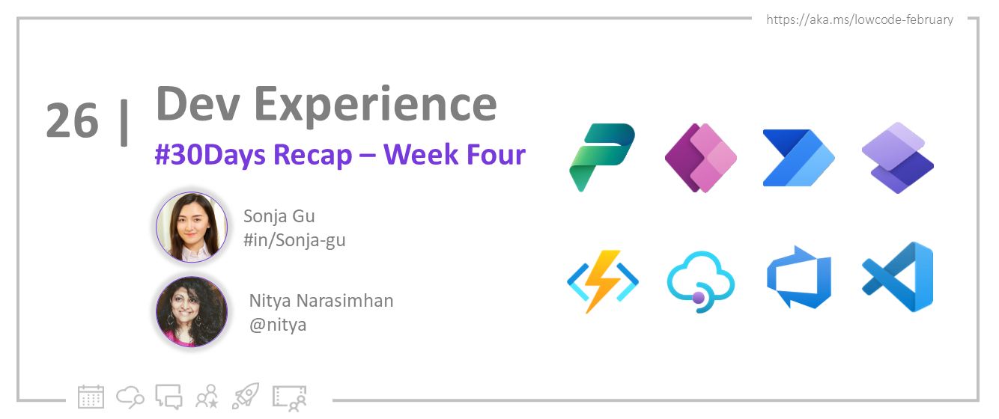
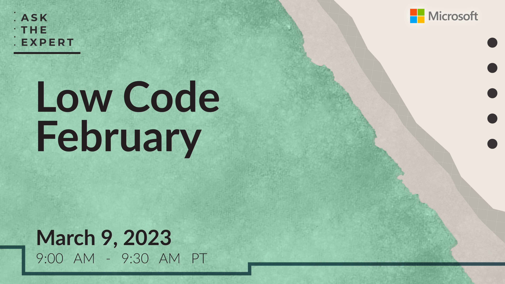

<head>
  <meta name="twitter:url" 
    content="https://microsoft.github.io/Low-Code/img/og/30-26.png" />
  <meta name="twitter:title" 
    content="26. Recap - Dev Experience Week" />
  <meta name="twitter:description" 
    content="Let's recap Week 4 of #30DaysOfLowCode focused on developer experience with power platform - join us at #LowCodeFebruary https://aka.ms/lowcode-february." />
  <meta name="twitter:image" 
    content="https://microsoft.github.io/Low-Code/img/og/30-26.png" />
  <meta name="twitter:card" content="summary_large_image" />
  <meta name="twitter:creator" 
    content="@nitya" />
  <meta name="twitter:site" content="@AzureAdvocates" /> 
  <link rel="canonical" 
    href="https://microsoft.github.io/Low-Code/img/og/30-26.png" />
</head>

Welcome to `Day 26` of #30DaysOfLowCode!

## What We'll Cover
 * **Look Back**: Recap Developer Experience Week
 * **Important events**: Powerful Dev Conference, Learn Live and Webinar for Power Platform and GitHub
 * **Skill Up**: Self-Study Resources & Cloud-Skills Challenge
 * **Look Ahead**: Continue The Journey!
 * **Resources**: Explore the [**Low Code February Collection**](https://aka.ms/lowcode-february/collection)
  * **Exercise**: Sign up for your [**Free Developer Plan**](https://aka.ms/lowcode-february/devplan)

<!-- FIXME: banner image -->

<!-- ************************************* -->
<!--  AUTHORS: ONLY UPDATE BELOW THIS LINE -->
<!-- ************************************* -->

## **Look Back**: Week 4 Recap

It's hard to believe that our #30daysoflowcode event is coming to an end. Time really flies, doesn't it? But what an amazing month it has been! Thanks to the incredible support from each and every one of you, we've welcomed **100,000+ visitors** to our event! We're thrilled to provide something useful and valuable to your learning journey and we hope that you've fallen in love with the power of low-code development tools. 

We would love to hear your thoughts, and please don't hesitate to reach out to us through [**GitHub Discussions**](https://github.com/microsoft/Low-Code/discussions). Your feedback is essential for us to improve and provide even better content and resources in the future. ❤️

Throughout the month, we've taken a comprehensive view of Power Platform and its capabilities, from creating custom integrations to building UI and more. And this week, we've focused on a critical topic for Power Platform: developer experience. As you know, it is essential for developers to build and deploy effective solutions, while managing app governance at the same time. 

Let's take a look at what we've covered this week!

* [**ALM For Power Platform**](https://microsoft.github.io/Low-Code/blog/2023-day20) - App lifecycle management can be a broad but critical topic for every developer, who is building, maintaining, or even retiring an application. By following best practices for app lifecycle management, developers can ensure that their applications are stable, reliable, and performant, while also meeting the needs of end-users and stakeholders.  In this blog, we introduce you to app lifecycel management, and explore how you can manage the entire app lifecycle with Power Platform. 

* [**GitHub Actions for Power Platform**](https://microsoft.github.io/Low-Code/blog/2023-day21) -  GitHub actions is a powerful tool that allows you to define workflows in code, and Power Platform provides a range of features and connectors that can be used to integrate with GitHub Actions. In this blog, we walk you through basic GitHub Actions concepts and show you how to connect to a Power Platform environment using GitHub Actions to streamline your development process and automate your workflows. 

* [**Power Platform and Governance**](https://microsoft.github.io/Low-Code/blog/2023-day23) - Governance is a key concern for many organizations when it comes to using low-code platforms like Power Platform. This blog provided guidance on how to manage your app governance at ease using Managed Environments for Power Platform.

* [**Power Apps & Automated Testing**](https://microsoft.github.io/Low-Code/blog/2023-day24) - When we talk about app lifecycle management, automated testing is an important part of it. This blog introduces automated testing, and provides you with an overview of tools available to test your Power Apps. 

* [**Power Automate, ACS and OpenAI**](https://microsoft.github.io/Low-Code/blog/2023-day22) - Integrating Power Automate with OpenAI and Azure Communication Services can enable you to build powerful and intelligent applications that can understand natural language and respond accordingly. In this blog, we'll show you a tutorial step-by-step how to build a SMS conversational bot yourself!

## **Important events**

* [**Ask The Experts!**](http://localhost:3000/Low-Code/lowcode-february/Video-Live#ask-the-experts) 
    1. 🎙 [**Mar 09, 9AM PST**](https://aka.ms/ATE0309/RSVP) - Join our upcoming hero Q&A session from the **Low Code February** leadership team, including authors of this #30DaysOfLowCode series. We will have experts live to answer questions related to the content of the Low Code February events. [**Sign Up**](https://aka.ms/ATE0309/RSVP) if you haven't already ✨

    2. 🎙 [**Powerful Dev Ask The Expert: On-Demand**](https://aka.ms/ATE0223/RSVP ) - Watch the last session for Q&A from the **Powerful Devs Conference** team. The Powerful Devs Conference is all about showing how code-first developers can integrate with the Power Platform to innovate faster. 
    

* [**Learn Live!**](https://aka.ms/lowcode-february/LearnLive) If you have any questions or concerns about the Microsoft Learn modules or the Cloud Skills Challenge, be sure to tune in to our "Learn Live" sessions. 
  1. 🎙 [**Feb 27**](https://aka.ms/lowcode-february/LearnLive) - Manage Microsoft Power Platform deployments. [**Sign Up**](https://aka.ms/ATE0309/RSVP) for our last session during #LowCodeFebruary! ✨

  

* [**Powerful Devs Conference: On-Demand**](https://learn.microsoft.com/events/learn-events/powerful-devs-2023/?WT.mc_id=javascript-82212-ninarasi) The Powerful Devs Conference is a fantastic resource for developers who want to learn more about the Power Platform and how to build applications quickly and easily. The conference features a wide range of sessions and talks from industry experts, Microsoft Cloud Advocates, community leaders, and members of the Power Platform Team. 
  

* [**Webinar: Power Platform & Azure Deploys with GitHub: On-Demand**](https://mktoevents.com/Microsoft+Event/383091/157-GQE-382) Watch the on-demand webinar, where you'll get a chance to explore the powerful capabilities that the Power Platform opens up for GitHub. You'll learn about the inner and outer loop functions that are available with Power Platform and GitHub, and see firsthand how to author CI/CD pipelines that can help you streamline your development process.
  

## **Skill Up:** For Self-Study

Check out these our self-study materials designed to help you learn at your own convenience:
1. [**Sign up**](https://aka.ms/lowcode-february/devplan) for the **Free** Power Apps Developer Plan to start your low-code advanture!
1. [**Resource Collection**](https://aka.ms/lowcode-february/collection): Bookmark the collection for a 1-stop resource containing all relevant links to documentation and training, as covered in the #30DaysOfLowCode blogs. 
2. [**Hands-on Workshops**](https://aka.ms/lowcode-february/workshop): learn by doing! These labs help you gain hands-on experience from intro to advanced, whereever you're in the learning path. 
3. [**Cloud skills Challenge**](https://aka.ms/lowcode-february/challenge): gives you a free curated set of learning modules to jumpstart your learning journey into Low Code and Fusion development. 

## **Look Forward**: Continue The Journey!

We're in the last week of #30daysoflowcode, but don't worry, we still have some exciting things for you! We've got two ZeroToHero blogs lined up, as well as our [**Feb 27th Learn Live**](https://aka.ms/lowcode-february/LearnLive) session and [**March 09th Ask the Experts**](https://aka.ms/ATE0309/RSVP) session! If you haven't already, make sure to sign up today so you don't miss out. And to top it off, we'll also have a recap of all the amazing content we've covered this month! 🎉

Don't forget to bookmark the [**#30DaysOfLowCode**](https://aka.ms/lowcode-february/blog) page, then follow along to read the daily blog post, ask questions, and connect with other learners. _Get empowered_ with low code development!

