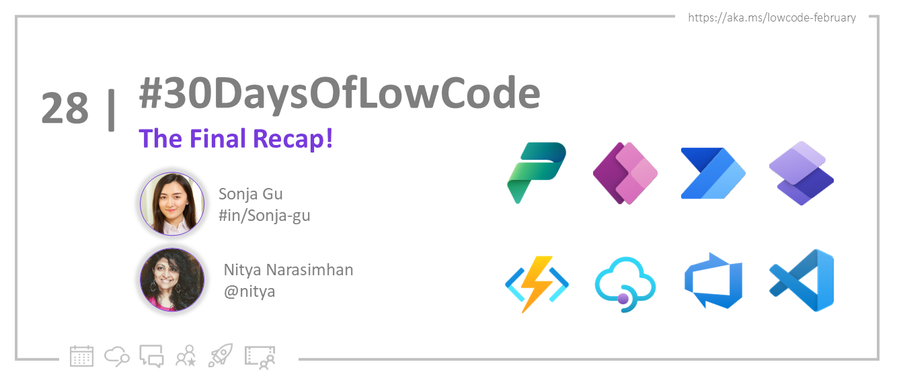

<head>
  <meta name="twitter:url" 
    content="https://microsoft.github.io/Low-Code/img/og/30-final.png" />
  <meta name="twitter:title" 
    content="Continue The Journey!" />
  <meta name="twitter:description" 
    content="Here's a recap of #30DaysOfLowCode! - join us at #LowCodeFebruary https://aka.ms/lowcode-february." />
  <meta name="https://microsoft.github.io/Low-Code/img/og/30-final.png" 
    content="FIXME: Post Image" />
  <meta name="twitter:card" content="summary_large_image" />
  <meta name="twitter:creator" 
    content="@nitya" />
  <meta name="twitter:site" content="@AzureAdvocates" /> 
  <link rel="canonical" 
    href="https://microsoft.github.io/Low-Code/img/og/30-final.png" />
</head>

## What We'll Cover
 * Thank you! ❤️
 * Recap of #30DaysOfLowCode
 * Continue the Journey
 * **Get Started**: Sign up for your [**Free Developer Plan**](https://aka.ms/lowcode-february/devplan)

<!-- FIXME: banner image -->

<!-- ************************************* -->
<!--  AUTHORS: ONLY UPDATE BELOW THIS LINE -->
<!-- ************************************* -->

## Thank you! ❤️
 
 It's hard to believe that #30DaysOfLowCode is coming to an end! It seems like just yesterday that we launched this initiative, and yet here we are, 30 days later, with an incredible amount of learning and growth behind us. So... it's time for a wrap!
 
 The numbers for the #LowCodeFebruary campaign are truly impressive, with over **130,000** visitors to the event page, 3000+ attendees to the Powerful Dev Conf, and 2500 participants taking part in the cloud skills challenges. What's more, we have welcomed countless attendees joining the various events and activities, from blogs series, to workshops, learn lives, webinars, and more. 

  From the bottom of our hearts, we want to thank each and every one of you for your participation, engagement, and enthusiasm. It's been truly inspiring to see the passion and dedication from this strong community, and we're honored to be a part of it. ✨

## Recap of #30DaysOfLowCode

  As we wrap up this exciting event, we wanted to take a moment to reflect on all that we've accomplished together. Over the last 30 days, we've covered a lot of ground, from the basics of Power Platform to more advanced concepts like custom code and app lifecycle management. 

  Now that the campaign is ending, we want to make sure that you have all the resources you need to continue honing your skills in the future. Whether you're looking to build your first app, collaborate with others, or simply keep learning, there are plenty of resources out there to help you achieve your goals. So, let's dive in and explore all the ways you can continue to skill up in Power Platform!  

 **Important skill-up resources:**

1. 📅 [**#30DaysOfLowCode**](https://microsoft.github.io/Low-Code/lowcode-february/30Days/?WT.mc_id=javascript-82212-ninarasi) By following the sequence of the blogs, you can build your knowledge step-by-step, gaining a deeper understanding of the various tools and capabilities of Power Platform along the way. This approach allows you to build a solid foundation of knowledge while also challenging yourself to grow and develop your skills. 

   [**#30DaysOfLowCode Roadmap**](https://microsoft.github.io/Low-Code/lowcode-february/30Days/?WT.mc_id=javascript-82212-ninarasi):

    * **Week 1️⃣: Fundamentals:** Power Platform core concepts, getting onboard and developer stories 
    * **Week 2️⃣: Backend Integrations:** Connectors, dataverse, custom connectors, API management, Azure integration and hand-on practices & turorials 
    * **Week 3️⃣: User Interface:** Building a Canvas app, introduction to PowerFx, Power Component Framework Controls, Power Pages as well as OpenAI and Power Platform.
    * **Week 4️⃣: Dev Experience:** Tutorials on ALM (App Lifecycle Management), GitHub Actions, App Governance, Automated testing, as well as ACS and OpenAI. 
    * **Week 5️⃣: Wrap-up:** API Management, Power Platform Pipelines and Monthly Recap 

2. 🚀 [**#ZeroToHero**](/lowcode-february/ZeroToHero/)  Get the latest updates on technologies and products for low code development directly from product teams.

3. 📺 [**Video + Livestream**](/lowcode-february/Video-Live/) 📻 Join online conversations with product teams and ask questions. 

  🎉 Sign Up for [**Low Code February Ask The Experts! on Mar 09, 9AM PST**](https://aka.ms/ATE0309/RSVP) for the hero Q&A session from the Low Code February leadership team. Our experts will be available to answer questions about full code and low code integration.

  Recap on past **hero sessions**🌟:
    1. [**Powerful Devs Conference: On-Demand**](https://learn.microsoft.com/events/learn-events/powerful-devs-2023/?WT.mc_id=javascript-82212-ninarasi) The Powerful Devs Conference is a fantastic resource for developers who want to learn more about the Power Platform and how to build applications quickly and easily.
    2. [**Webinar: Power Platform & Azure Deploys with GitHub: On-Demand**](https://mktoevents.com/Microsoft+Event/383091/157-GQE-382) Watch the on-demand webinar, where you'll get a chance to explore the powerful capabilities that the Power Platform opens up for GitHub.
    3. [**Powerful Dev Ask The Expert: On-Demand**](https://aka.ms/ATE0223/RSVP ) - Watch the last session for Q&A from the Powerful Devs Conference team. The Powerful Devs Conference is all about showing how code-first developers can integrate with the Power Platform to innovate faster. 
    4. [**Learn Live! - On-Demand**](https://aka.ms/lowcode-february/LearnLive) Check out our Learn Live recordings if you have any questions or concerns about the Microsoft Learn modules or the Cloud Skills Challenge.
   
4. 📖 **Self-Learning Resources**
   1. [**Low Code February Video Turorials collection**](https://www.youtube.com/playlist?list=PLi9EhCY4z99XUWIWXmw8Oc4N3qgwPA7Yl)
   2. [**Power Platform Learn Modules**](https://learn.microsoft.com/en-us/users/nityan/collections/xz6ehr2mx031y0?WT.mc_id=javascript-82212-ninarasi)
   3. [**Cloud skills Challenge**](https://aka.ms/lowcode-february/challenge): gives you a free curated set of learning modules to jumpstart your learning journey into Low Code and fusion development.

5. ⚒️ [**Dev Workshops**](/docs/intro/) Learn by doing! These labs help you gain hands-on experience from intro to advanced, whereever you're in the learning path. 

6. 😁 [**Community Buzz**](https://pnp.github.io/powerplatform-samples/?WT.mc_id=javascript-82212-ninarasi) Connect with the community and contribute your expertise by building interesting demos or writing articles.

## Continue the Journey 

  We believe that initiatives like #30daysoflowcode are critical in empowering developers to build up the technical skills they need to succeed in the digital transformance era. 

  Stay tuned and [**🔖 save the page**](https://aka.ms/lowcode-february), as we will be back soon with more exciting content and resources to help you continue your learning journey. We're committed to supporting you in your growth and development, and we'll be providing even more opportunities for you to learn and build with low code! 🎉

  