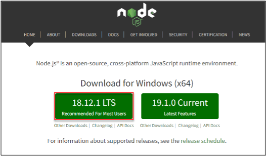
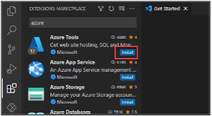

:::info LAB SCENARIO

You are  member of the PrioritZ Fusion Team. As part of your onboarding, you will be setting up your Power Platform development environment. You will also install Visual Studio Code, and the Power Platform CLI.

In **Exercise 2** you will install Visual Studio Code, Power Platform Tools, Azure tools. These tools are used in the labs for this course.
:::

## 2.1 Node Package Manager

Install the Node Package Manager

1. Navigate to [Npm and Node.js](https://nodejs.org/en/) website
2. Select a version. _We recommend that you use LTS (Long-Term Support) version
18.12.1 or higher._

3. Double click on the downloaded installation file.
4. Follow the installation wizard to install **NPM** (Node.js Package Manager).

## 2.2 Visual Studio Code 

1. Navigate to [Visual Studio Code](https://code.visualstudio.com/)
2. Download Visual Studio Code and install it if you don’t already have it installed.
3. Start **Visual Studio Code**.

## 2.3 Azure Tools Ext.

4. Select the **Extensions** tab.
5. Search for Azure and click **Install Azure Tools**.

6. Wait for the installation to complete.
7. You should now see the new Azure Tools extension you added.

## 2.3 Power Platform Tools Ext.

 8. Select the **Extensions** tab.
9. Search for 'Power platform' and click **Power Platform Tools**.

 10. You should now see the Power Platform Tools tab.

:::danger CHECK THIS: 
Screenshots should be for Power Tools
:::
11. Search for Azure and click Install **Azure Tools**.

12. Wait for the installation to complete.
13. You should now see the new Azure Tools extension you added.

