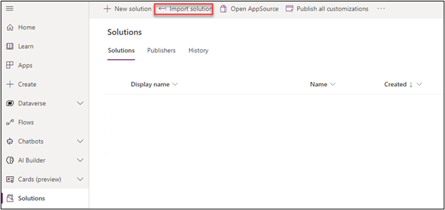
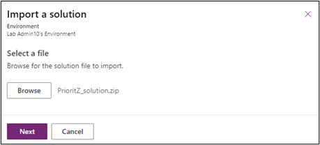
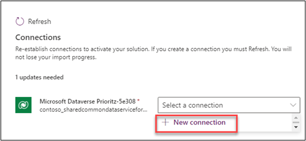
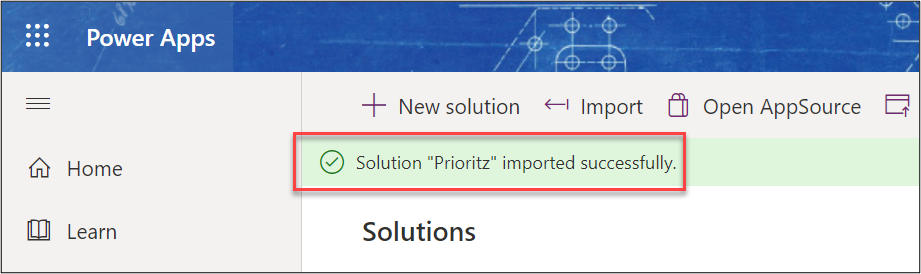

:::info LAB SCENARIO

You will import the current solution and use this to start your work. You will also add a column to a table and modifying the app to use it. You will also configure and test the Power Platform CLI.

In **Exercise 1** you will import a solution into your dev environment.  This solution contains the current version of the PrioritZ apps, flows and Dataverse tables.

:::

## 1.1 Import starting solution

1. Navigate to [**Maker Portal**](https://aka.ms/lowcode-february/makerportal) and make sure the development environment is selected.
2. Select **Solutions** and click **Import solution**.

3.	Click **Browse**.
4.	Go to the lab resources folder, select the [**PrioritZ_solution.zip**](https://github.com/microsoft/Low-Code/blob/main/resources/lowcode-feb/workshop/lab01/Prioritz_1_0_0_7.zip) file, and click **Open**.

5.	Click **Next**.

6.	Click **Next** again.
7.	Click on the **Select a connection** dropdown and the select + **New connection**.

8.	Click **Create**.
9.	Sign in if prompted.
10.	Close the connections browser window or tab.
11.	Click **Refresh**.
12.	Click **Import** and wait for the solution import to complete.

 

13.	You should now see the solution you imported in the list of solutions.

🚨 Note: Do not navigate away from this page.
