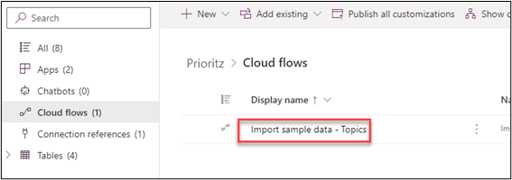
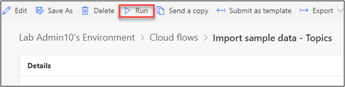
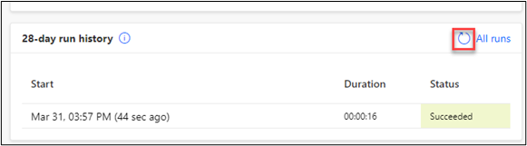

:::info LAB SCENARIO

You will import the current solution and use this to start your work. You will also add a column to a table and modifying the app to use it. You will also configure and test the Power Platform CLI.

In **Exercise 2** you will run a flow that will add sample data to your environment.

:::

## 2.1 Run a flow

1.  Open the **PrioritZ** solution you imported.

2.	Select **Cloud flow**.

3.	Open the **Import sample data – Topics** flow.

4.	Click **Run** to run the flow.

5.	Click **Run flow**.

6.	Click **Done** and wait for the flow run to complete.

7.	The flow should run successfully. If you want, you can click on the run itself and it will show you the details of what the flow did.

 

8.	Click on the browser back button.

🤖 Note: You should be back on the solution you imported.
