:::info LAB SCENARIO

You will import the current solution and use this to start your work. You will also add a column to a table and modifying the app to use it. You will also configure and test the Power Platform CLI.

In **Exercise 3** you will add a new column My Notes to the topic table and update the PriortZ Admin application. 

:::

## 3.1 Add a column for My Notes

1.	Expand **Tables** and select the **PrioritZ Topic** table.

2.	Click **+ New** and select **Column**.

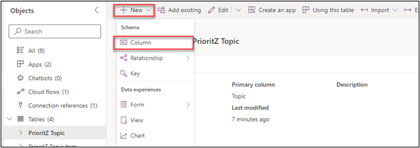

3.	Enter **My Notes** for Display name, select **Plain text** for Data type.

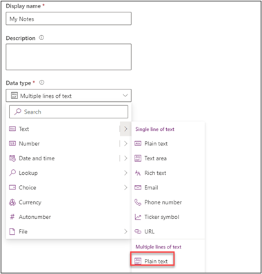

4.	Click **Save**.

5.	🚨 Note: Do not navigate away from this page.

## 3.2 Update the admin app

1.	Make sure you are still in the **PrioritZ** solution.

2.	Select **Apps** and click to open the **PrioritZ Admin** application.

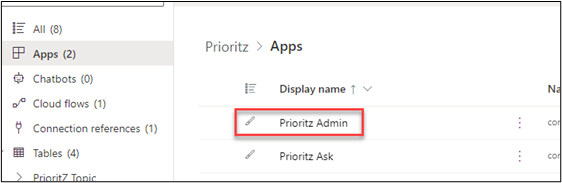

3.	Select the **Add Topic Screen**.

4.	Click **+ Insert** and select **Text input**.


5.	Rename the text input **Notes textbox**.

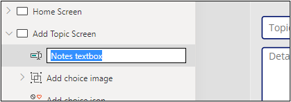

6.	Place the Notes textbox between the Details control and the Respond by label.

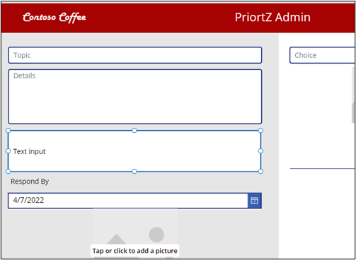


7.	Select **Notes textbox**.

8.	Change the **HintText** value of the Notes textbox to **My notes**.

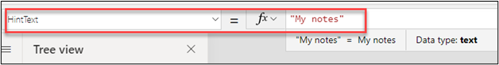

9.	Remove the **Default** text.

10.	Change the **Mode** to **TextMode.MultiLine**.

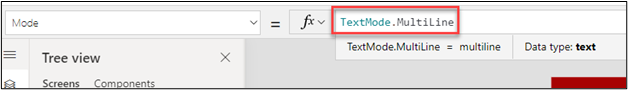

11.	Select **Save topic icon**.


12.	Replace the **OnSelect** formula of the **Save topic icon** with the formula below. 
🤖 Note: The patch creates the new row in the Dataverse table.

```js
Set(newTopic,Patch('Prioritz Topics',Defaults('Prioritz Topics'),{'My Notes': 'Notes textbox'.Text,Topic:'Topic name textbox'.Text,Details:'Topic details textbox'.Text,'Respond By':'respond by date picker'.SelectedDate,Photo:AddTopicImage.Image}));ForAll(colAddChoices,Patch('Prioritz Topic Items',Defaults('Prioritz Topic Items'),{Choice:ThisRecord.choice,'PrioritZ Topic':newTopic,Photo:ThisRecord.photo}));Back()

```


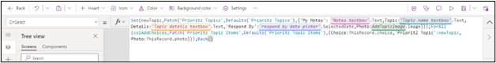

13.	Select the **View Topic Screen**.

14.	Click **+ Insert** tab and select **Text label**.

15.	Rename the label you just added **Notes label**.

16.	Change the **Text** value of the Notes label to **'Topics gallery'.Selected.'My Notes'**


17.	Rearrange the controls and move the **Notes label** between the details label and topic items gallery.


18.	Select the **Home Screen** and click **Preview the app**.

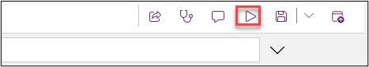

19.	Click **+**.

20.	Enter **Test notes** for Topic, **Testing the notes** for Details, **Some notes here** for My notes, select Response by date, and click **Tap or click to add a picture**.


21.	Select any photo from your machine.

22.	Type **Choice One** and click **Tap or click to add a picture**.

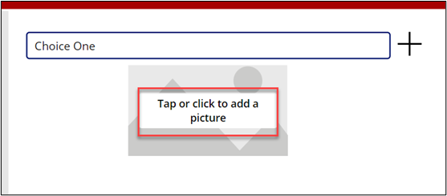

23.	Select any photo from your machine.

24.	Click **+** choice.

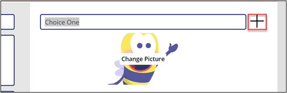

25.	Add couple more choices with images.

26.	Click **Save**.

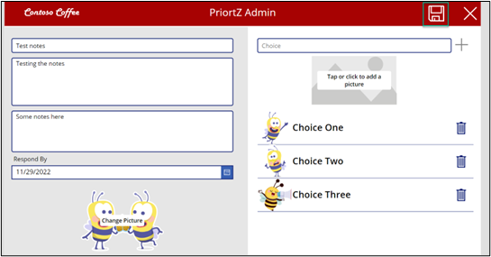

26.	🤖 Note: The new topic should be saved, and you should be navigated back to the list of topics.

28.	Click to open the topic you just created.

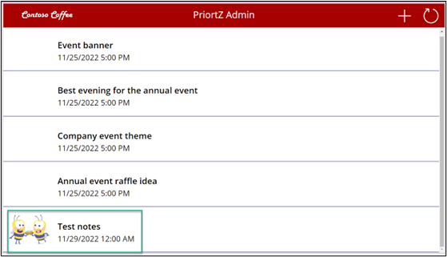

29.	The notes should now be shown.

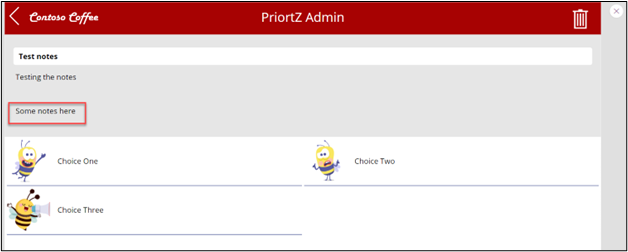

30.	Close the app preview.

31.	Click **Publish**.

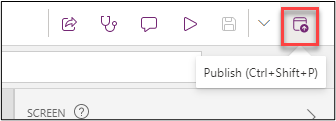


32.	Select Publish this version and wait for the publishing to be completed.

🤖 Note: You may close the app designer.
