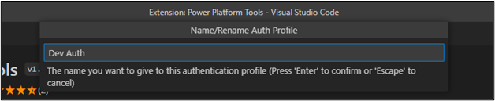
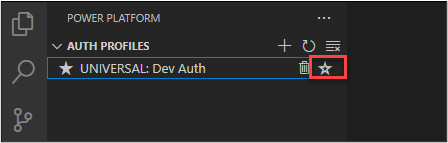
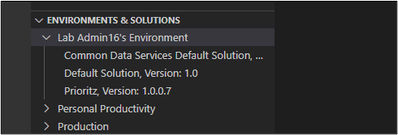
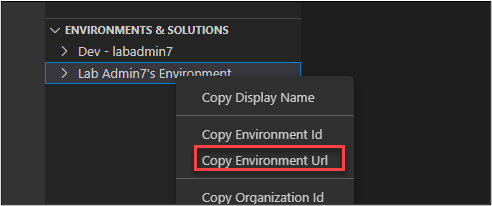
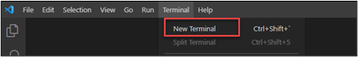
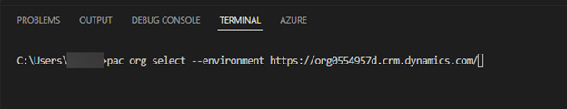
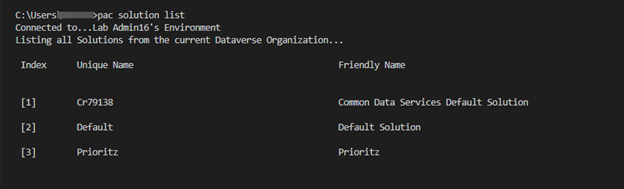

:::info LAB SCENARIO

You will import the current solution and use this to start your work. You will also add a column to a table and modifying the app to use it. You will also configure and test the Power Platform CLI.

In **Exercise 4** you will learn and test the Power Platform CLI.

:::

1.	Open Visual Studio Code.
2.	Select the **Power Platform** tab and click **Add Auth Profile**.


3.	The sign in popup should appear.

4.	Provide your credentials and sign in.

5.	Right click on the auth profile you created and select Name/Rename Auth profile.


6.	Type Dev Auth and **ENTER**.




7.	You should now have at least one auth profile. If you have more than profile, make sure the profile you created is selected.





8.	Go to the Environments & Solutions pane and expand the environment you are using for this lab.
9.	You should see all the solutions in the environment.




10.	Right click on the dev environment you created and select copy the *Environment Url*.




11.	Click **Terminal** and select **New Terminal**.




12.	Run the command below to select the dev environment. Replace **[YOUR ENVIRONEMNT URL]** with the environment URL you copied.
```
pac org select --environment [YOUR ENVIRONMENT URL]
```




13.	Run the command below to see list of solutions.
```
pac solution list
```

🤖 Note: You should see list of solutions installed on your environment.


