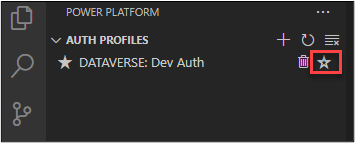
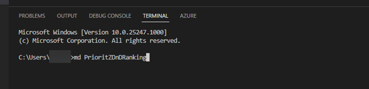
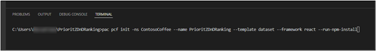
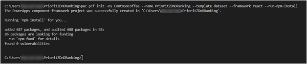
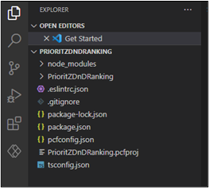
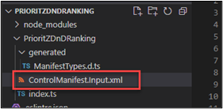
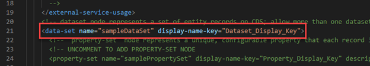
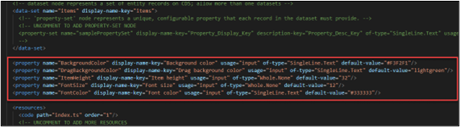
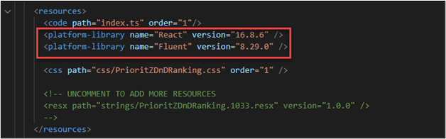
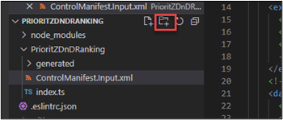

:::info LAB SCENARIO

Working as part of the PrioritZ fusion team you have been asked to create a Power Apps code component to allow drag and drop priority ranking of items in the PrioritZ Ask Power App. 
You will build a code component using the React JavaScript framework. 
The code component approach is used to address the requirement because there isn’t a similar control already built-in.

You have collaborated with the app makers to identify the following properties to allow them to configure the code component in the app:
 
•	BackgroundColor

•	DragBackgroundColor

•	ItemHeight

•	FontSize

•	FontColor

The PrioritZ Ask app will prepare a collection of the items to rank that will be bound as the dataset for the code component.  
When an item is dragged and dropped the code component will raise an OnSelect event that will be handled by the hosting app.  
The hosting app will update the collection items with their new rank.  The code component will be stateless.

In **Exercise 1** you will build the code component.

:::

## 1.1 Create the code component

1.	Start Visual Studio Code.
2.	Select the Power Platform tab and make sure your Dev Auth profile is selected. 

:::tip Note 
The Power Platform tab is only available if you installed the Power Platform extension as explained in lab 0 and configured it in lab 1.
:::





3.	Click **Terminal** and select **New Terminal**.


4.	In the Terminal window, make a new directory by running the command below.

```
md PrioritZDnDRanking
```




5.	Run the command below to switch to the `PrioritZDnRanking` directory you just created.

```
cd PrioritZDnDRanking
```


6.	You should now be in the directory you created. Create a new component project and install dependencies by running the commands below. This will create the initial files for your code component.

```
pac pcf init -ns ContosoCoffee --name PrioritZDnDRanking --template dataset --framework react --run-npm-install
```




:::tip Note 
7.	The component framework project should be created successfully.




:::


## 1.2 Review and run the code component

8.	In the terminal, run the command below to open the project in your current Visual Studio Code session.

```
code -a .
```

9.	Review the created code component files.




10.	Expand the `PrioritZDnDRanking` folder and then expand the component folder.

11.	Open the `ControlManifest.Input.xml` file. The manifest is the metadata file that defines the component including the properties exposed to the hosting app.





12.	In the `ControlManifest.Input.xml` file locate data-set XML element.





13.	Change the `name` to `items` and the `display-name-key` to `items`. This defines the property the app will bind to a collection of items.


14.	Add the following properties after the closing tag of the data-set element `</data-set>`.

```js
<property name="BackgroundColor" display-name-key="Background color" usage="input" of-type="SingleLine.Text" default-value="#F3F2F1"/>
<property name="DragBackgroundColor" display-name-key="Drag background color" usage="input" of-type="SingleLine.Text" default-value="lightgreen"/>
<property name="ItemHeight" display-name-key="Item height" usage="input" of-type="Whole.None" default-value="32"/>
<property name="FontSize" display-name-key="Font size" usage="input" of-type="Whole.None" default-value="12"/>
<property name="FontColor" display-name-key="Font color" usage="input" of-type="SingleLine.Text" default-value="#333333"/>
```




15.	Locate `<resources>` and uncomment `css` resource. This will ensure that our styles will be bundled with the code component when it is deployed.


16.	Notice the following two resources. This declares the component’s dependency on these two libraries. This is a result of specifying –framework React on initialization.

```html
<platform-library name="React" version="16.8.6" />
<platform-library name="Fluent" version="8.29.0" />
```





17.	Click **File** and select **Save All**.

18.	Make sure you still have the `ControlManifest.Input.xml` file selected and then click **New Folder**. 





19.	Name the new folder `css`.

20.	Select the new `css` folder you created and then click New File


21.	Name the new file `PrioritZDnDRanking.css`.
22.	Paste the following css into the `PrioritZDnDRanking.css` file.

```css
.prioritydnd-scroll-container {
	    box-sizing: border-box;
	    padding: 2px;
	    overflow-y: auto;
	    overflow-x: hidden;
	    position: relative;
	}
	
	.prioritydnd-item-container {
	    user-select: none;
	    display: flex;
	    align-items: center;
	}
	
	.prioritydnd-item-column {
	    margin: 8px;
}
```


23.	The file should now look like the following.


24.	Click **File** and save your changes.