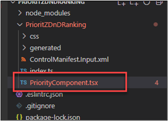
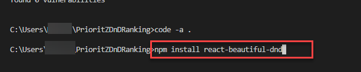
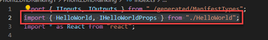
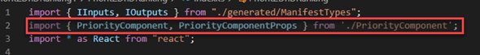

:::info LAB SCENARIO

Working as part of the PrioritZ fusion team you have been asked to create a Power Apps code component to allow drag and drop priority ranking of items in the PrioritZ Ask Power App. 
You will build a code component using the React JavaScript framework. 
The code component approach is used to address the requirement because there isn’t a similar control already built-in.

You have collaborated with the app makers to identify the following properties to allow them to configure the code component in the app:
 
•	BackgroundColor

•	DragBackgroundColor

•	ItemHeight

•	FontSize

•	FontColor

The PrioritZ Ask app will prepare a collection of the items to rank that will be bound as the dataset for the code component.  
When an item is dragged and dropped the code component will raise an OnSelect event that will be handled by the hosting app.  
The hosting app will update the collection items with their new rank.  The code component will be stateless.

In **Exercise 2** you will implement the component logic.

:::

## 2.1 Implement the component logic

1.	Delete the `HelloWorld.tsx` component file that is automatically created as we won’t be using it.

2.	Go to the lab resources folder.

3.	Drag the `PriorityComponent.tsx` file and drop it in the `PrioriZDnDRanking` folder.




4.  🤖 Note: The `PriorityComponent.tsx` file should now be in the `PrioriZDnDRanking` folder.


5.	Click **File** and save your changes.
6.	Open the `PriorityComponent.tsx` and review the contents.  This implements the React component that will be rendered to represent our draggable items.
7.	🤖 Note: Notice line 9 from `‘react-beautiful-dnd’` has a red underline.  This is a npm package the component uses that we haven’t referenced.





8.	Run the following command in a terminal window to add a reference to react-beautiful-dnd
```
npm install react-beautiful-dnd
```


9.	Add the following command for the type definitions.
```
npm install --save-dev @types/react-beautiful-dnd
```

10.	Notice the red underline in line 9 has been resolved.




11.	Open the `index.ts` file.

12.	Remove `line 2` as we are no longer using `HelloWorld`.
```
import { HelloWorld, IHelloWorldProps } from "./HelloWorld";
```




13.	Add the import below to the `index.ts` file. This will reference the `PriorityComponent`.
```
import { PriorityComponent, PriorityComponentProps } from './PriorityComponent';
```


14.	Locate the `Export` class line in `index.ts`.


15.	Add the following code below inside the export class. This defines some working variables you will be using in the workshop logic.
```
private context: ComponentFramework.Context<IInputs>;
private items: ComponentFramework.PropertyTypes.DataSet;
```

16.	Locate the `init` function.

17.	Paste the code below inside the `init` function. This logic initializes our class variables from the runtime values and enables resize notification.
```
this.context = context;
context.mode.trackContainerResize(true);
```

18.	Locate the `updateView` function.

19.	Replace the `updateView` function with the function below. This logic creates the `React Element` from the `PriorityComponent` and adds it to the virtual DOM.

```js
public updateView(context: ComponentFramework.Context<IInputs>): React.ReactElement {
        const dataset = context.parameters.items;
        return React.createElement(PriorityComponent, {
            width: context.mode.allocatedWidth,
            height: context.mode.allocatedHeight,
            itemHeight: context.parameters.ItemHeight.raw,
            fontSize: context.parameters.FontSize.raw,
            fontColor: context.parameters.FontColor.raw,
            dataset: dataset,
            onReorder: this.onReorder,
            backgroundColor: this.context.parameters.BackgroundColor.raw,
            dragBackgroundColor: this.context.parameters.DragBackgroundColor.raw,
        } as PriorityComponentProps);
    }
```

20.	Add the function below after the destroy function. This logic handles the `onReorder` event from the `PriorityComponent` and lidentifies the involved items to the hosting app as selected items.

```js
onReorder = (sourceIndex: number, destinationIndex: number): void => {
        const dataset = this.context.parameters.items;
        const sourceId = dataset.sortedRecordIds[sourceIndex];
        const destinationId = dataset.sortedRecordIds[destinationIndex];
        // raise the OnSelect event
        this.context.parameters.items.openDatasetItem(dataset.records[sourceId].getNamedReference());
        // set the SelectedItems property
        this.context.parameters.items.setSelectedRecordIds([sourceId, destinationId]);
    };
```

21.	Open the `package.json` file.
22.	Locate the `dependencies` JSON object.
23.	Replace `dependencies` with the JSON below.

```json
"dependencies": {
    "@fluentui/react": "8.29.0",
    "eslint-config-prettier": "^8.5.0",
    "eslint-plugin-prettier": "^4.0.0",
    "eslint-plugin-react": "^7.29.4",
    "eslint-plugin-react-hooks": "^4.4.0",
    "eslint-plugin-sonarjs": "^0.13.0",
    "prettier": "^2.6.1",
    "react": "16.8.6",
    "react-beautiful-dnd": "^13.1.0",
    "react-dom": "16.8.6"
  },
```

24.	Make the following modification to the file `.eslintrc.json` to work around a new lint rule that was too strict.
a)	Open the `.eslintrc.json` file.
b)	Locate rules and paste the rules below.


25.	Click **File** and save all your changes.

## 2.2 Run the command and test harness

26.	Go to the terminal and run the command below. This will build your component and identify any problems.
```
npm run-script build
```
27.	🤖 Note: The build should succeed. If any errors, resolve them before proceeding.

28.	Run the command below to start the test harness.
```
npm start
```

29.	The test harness should start. Try dragging the items and see if the behavior functions as expected. The data shown will be the default test harness data.

30.	Close the test harness.
31.	Stop the run by holding the `CONTROL` key + C. 
32.	Type Y and `ENTER`.

25.	Run the command below to see your currently selected environment.
```
pac org who
```

26.	🤖 Note: You should have the dev environment you created selected. If not, run the select command from the end of lab one again.

## 2.3 Push component to your environment 

27.	Run the command below to push the component to your environment.
```
pac pcf push --publisher-prefix contoso
```

28.	Wait for the solution to be imported and published to your environment.