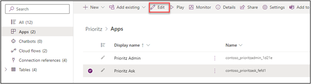
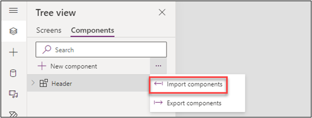
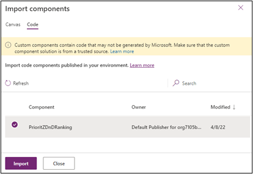
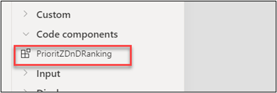
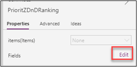
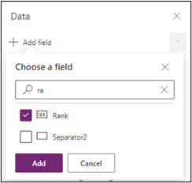
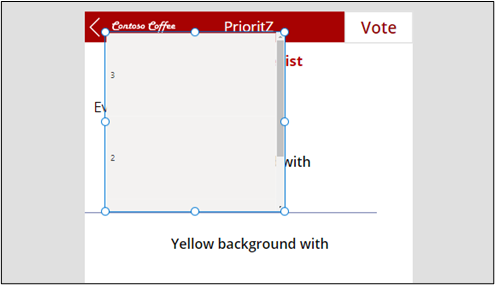
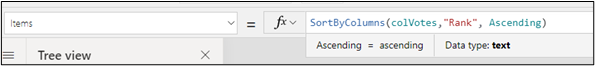
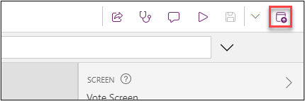
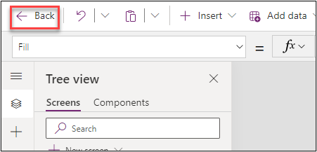

:::info LAB SCENARIO

Working as part of the PrioritZ fusion team you have been asked to create a Power Apps code component to allow drag and drop priority ranking of items in the PrioritZ Ask Power App. 
You will build a code component using the React JavaScript framework. 
The code component approach is used to address the requirement because there isn’t a similar control already built-in.

You have collaborated with the app makers to identify the following properties to allow them to configure the code component in the app:
 
•	BackgroundColor

•	DragBackgroundColor

•	ItemHeight

•	FontSize

•	FontColor

The PrioritZ Ask app will prepare a collection of the items to rank that will be bound as the dataset for the code component.  
When an item is dragged and dropped the code component will raise an OnSelect event that will be handled by the hosting app.  
The hosting app will update the collection items with their new rank.  The code component will be stateless.

In **Exercise 3** you will use the code component you created in the PrioritZ Ask canvas application.

:::

## 3.1 Allow Power Apps component framework
🤖 Note: In this task, you will allow publishing of canvas apps with code components for your environment.

1.	Navigate to [**Power Platform admin center**](https://aka.ms/lowcode-february/admincenter)  and select environments.
2.	Open the dev environment you are using for this lab.
3.	Click Settings.


4.	Expand Products and select Features.


5.	Turn on **Allow publishing of canvas apps with code components** and click Save.'


## 3.2 Edit canvas app
🤖 Note: In this task, you will edit the PrioritZ Ask canvas application to use the code component you created.

1.	Navigate to [**Power Apps maker portal**](https://aka.ms/lowcode-february/makerportal)  and make sure you are in the correct dev environment.
2.	Select Solutions and open the PrioritZ solution.
3.	Select Apps, select the PrioritZ Ask app and click Edit.



4.	Select the Components tab, click on the **… Components option button** and select **Import components**.




5.	Select the Code tab.
6.	Select the code component you created and click Import.




7.	Select the Screens tab.
8.	Expand the Vote Screen and select the Votes gallery.
9.	Set the Width value of the Votes gallery to 570.
10.	The screen should now look like the image below.


11.	Select the Votes Screen and click + Insert.


12.	Select `PrioritZDnDRanking`.





13.	Go to the Tree view tab and select the `PrioritZDnDRanking` you just added.
14.	Set the Items value of the `PrioritZDnDRanking` component to the formula below.
```
'Votes gallery'.AllItems
```

15.	Select the `PrioritZDnDRanking` go to the `Properties` pane and click **Edit Fields**.




16.	Click **+ Add field**.
17.	Select **Rank** and click **Add**.





18.	Set the `ItemHeight` of the `PrioritZDnDRanking` to the formula below.
```
'Votes gallery'.TemplateHeight + 2
```

19.	The rank should now show on the control, but it is sorted descending.





20.	Select the Votes gallery and change the sort order to Ascending.





21.	The rank should now get sorted ascending.


22.	Select the `PrioritZDnDRanking` component.

23.	Set the X value of the `PrioritZDnDRanking` component to the formula below.
```
'Votes gallery'.Width
```

24.	Set the Width value of the `PrioritZDnDRanking` component to 60.

25.	Set the Height value of the `PrioritZDnDRanking` component to the formula below.
```
'Votes gallery'.Height
```

26.	Set the BackgroundColor value of the `PrioritZDnDRanking` component to `#99CCFF`.


27.	Set the DragBackgroundColor value of the `PrioritZDnDRanking` component to `#A70202`.
28.	Set the Y value of the `PrioritZDnDRanking` component to the formula below.
```
'Votes gallery'.Y
```

29.	Set the OnSelect value of the `PrioritZDnDRanking` component to the formula below.

``` js
	With({
	    sourceRank:First(Self.SelectedItems).Rank,
	    destinationRank:Last(Self.SelectedItems).Rank
	    },
	    If(sourceRank<destinationRank,
	        // Moving Up
	        UpdateIf(colVotes,Rank>=sourceRank && Rank<=destinationRank,
	        {
	            Rank:If(Rank<>sourceRank,Rank-1,destinationRank)
	        }
	        );
	        
	    );
	
	    If(sourceRank>destinationRank,
	        // Moving Down
	        UpdateIf(colVotes,Rank>=destinationRank && Rank<=sourceRank,
	        {
	            Rank:If(Rank<>sourceRank,Rank+1,destinationRank)
	        }
	        );
	        
	    );
	);
```
30.	Select the Home Screen and click Play.
31.	Select one of the topics.
32.	Make your browser widow smaller until it is the size of a phone screen.


33.	Drag one of the topic items and drop it in a different location.


34.	The drag/drop should work as expected.
35.	Close the preview.
36.	Click **Publish**.




37.	Select **Publish this version** and wait for the publish to be completed.
38.	Click on the **Back** button.



39.	Select **Leave** if prompted.

:::tip Note

You should now be back on the solution. Do not navigate away from this page.
:::


