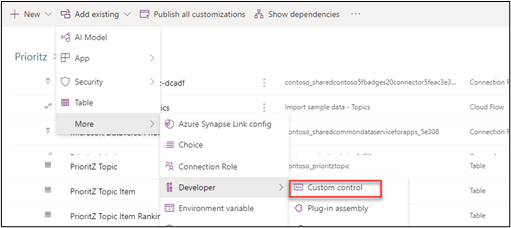
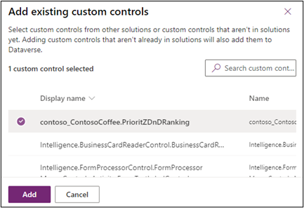
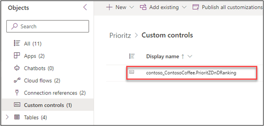

:::info LAB SCENARIO

Working as part of the PrioritZ fusion team you have been asked to create a Power Apps code component to allow drag and drop priority ranking of items in the PrioritZ Ask Power App. 
You will build a code component using the React JavaScript framework. 
The code component approach is used to address the requirement because there isn’t a similar control already built-in.

You have collaborated with the app makers to identify the following properties to allow them to configure the code component in the app:
 
•	BackgroundColor

•	DragBackgroundColor

•	ItemHeight

•	FontSize

•	FontColor

The PrioritZ Ask app will prepare a collection of the items to rank that will be bound as the dataset for the code component.  
When an item is dragged and dropped the code component will raise an OnSelect event that will be handled by the hosting app.  
The hosting app will update the collection items with their new rank.  The code component will be stateless.

In **Exercise 4** you will add the code component you created to the PrioritZ solution. This will ensure later when we move from dev to test our component is included.

:::

## 4.1 Add component to solution

1.	Make sure you are still in the **PrioritZ** solution.
2.	Click **Add existing** and select **More | Developer | Custom control**.

3.	Select `contoso_ContosoCoffee.PrioritZDnDRanking` and click **Add**.

:::tip Note
The custom control should now be in your solution.

:::