:::info LAB SCENARIO

Working as part of the PrioritZ fusion team you will be configuring a custom connector for an existing API.  The team would like to add badging to the PrioritZ application to give credit to users when they have completed ranking an item.  The team identified an existing API, but it doesn't have a Power Platform connector.  

When you review the API, you see that it has four operations and uses API key authentication.

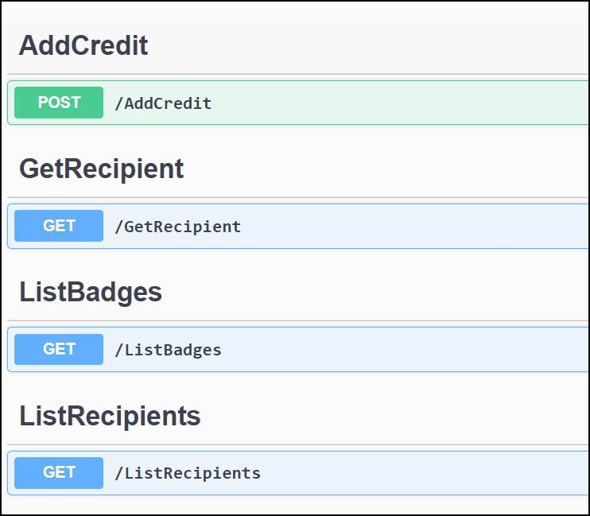

In **Exercise 1** you will download open API definition, create a solution for Contoso Badges custom connector. Currently, custom connectors must be in a separate solution from the apps and flows that use them, and then create the custom connector.

:::

## 1.1 Download open API definition and create solution

1.	Navigate to [**Contoso Coffee Badges**](https://aka.ms/lowcode-february/workshop/contoso)

2.	Click on open the **Open API definition** file link.

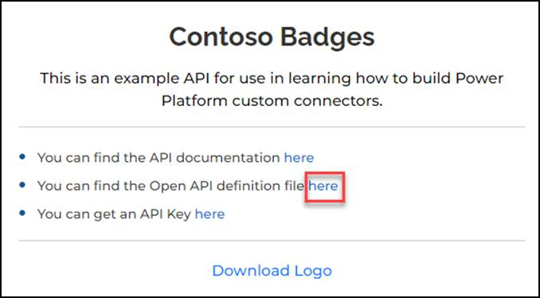

3.	Do a quick review of the Open API definition.
4.	Right click on the page and select **Save as**.

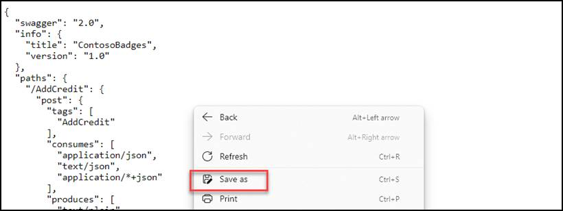

5.	Save the `swagger.json` file on your local computer.

## 1.2 Create custom connector

1.	Navigate to [**Power Apps maker portal**](https://aka.ms/lowcode-february/makerportal) and make sure you are in your dev environment.
2.	Select **Solutions** and click **+ New solution**.

3.	Enter **Contoso Badges connector** for Display name, select **Contoso Coffee** for Publisher, and click Create.

4.	Open the **Contoso Badges connector** solution you created.

5.	Click **+ New | Automation** and select **Custom connector**.

6.	Enter **Badges connector** for Connector name, `contosobadgestest.azurewebsites.net` for Host, and click Create connector.

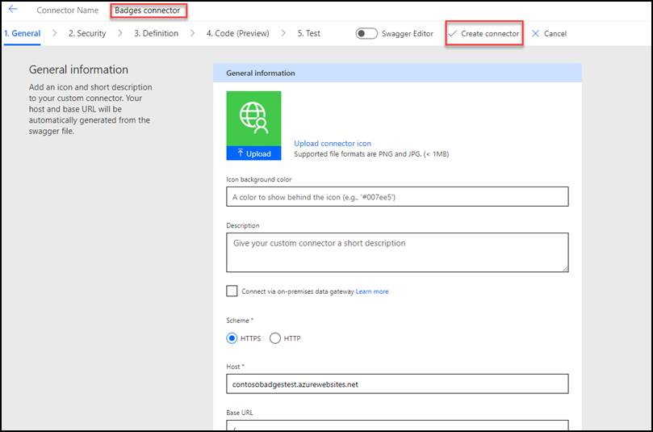

7.	Select Custom connectors from the sitemap.
8.	Click on the **… More actions** button of the custom connector you created and select **Update from Open API file**.

9.	Click **Import**.
10.	Select the `swagger.json` file you saved to your machine and click **Open**.

11.	Click Continue.

12.	Enter Connector for badges for Description, `contosobadgestest.azurewebsites.net` for Host, and advance to **Security**.

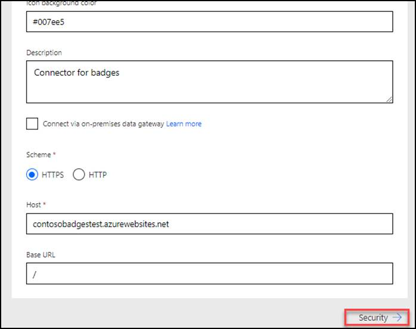

13.	Review the security configuration and advance to **Definition**.

:::tip Note
Do not navigate away from this page.
:::

## 1.3 Modify the definition
1.	Select the **AddCredit** action.
2.	Select **Important** for Visibility.

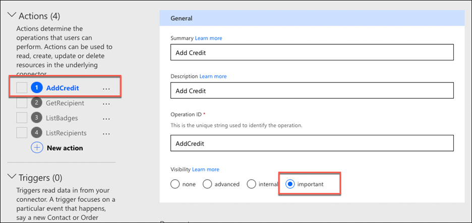

3.	Scroll down to the **Request** section, click on the chevron button of the **body** and select **Edit**.

4.	Click on the chevron button of **points** and select **Edit**.

5.	Select **Yes** for Is required and click on the **Back** button.

6.	Click on the chevron button of **recipientid** and select **Edit**.
7.	Select Yes for Is required and click on the **Back** button.
8.	Click on the chevron button of name and select **Edit**.
9.	Select Yes for Is required and click on the **Back** button.
10.	Click on the **Back** button again.

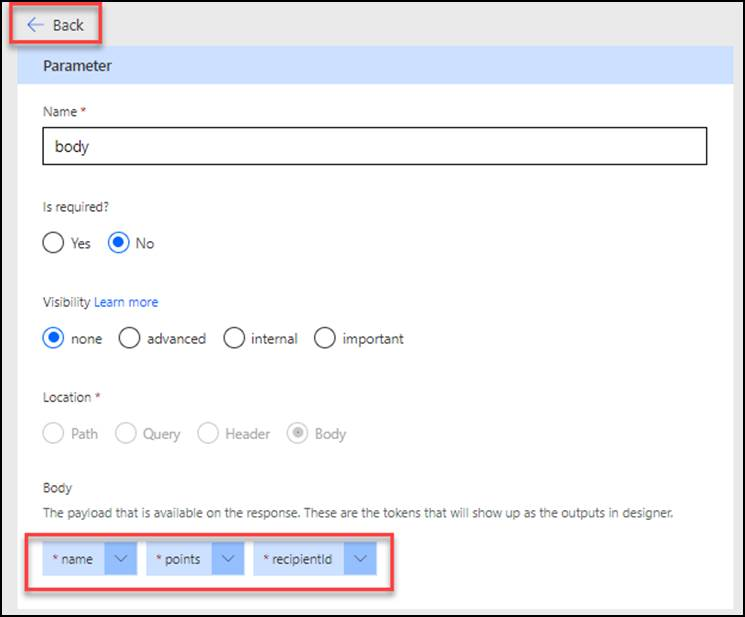

11.	Advance to **Code**.
12.	Review the code and advance to **Test**.
13.	Click **Update connector** and wait for the connector to be updated

:::tip Note
Do not navigate away from this page.
:::

## 1.4 Test connector

1.	Open a new browser tab or window and navigate to [**Contoso Coffee Badges**](https://aka.ms/lowcode-february/workshop/contoso)

2.	Click on open the **API Key** link

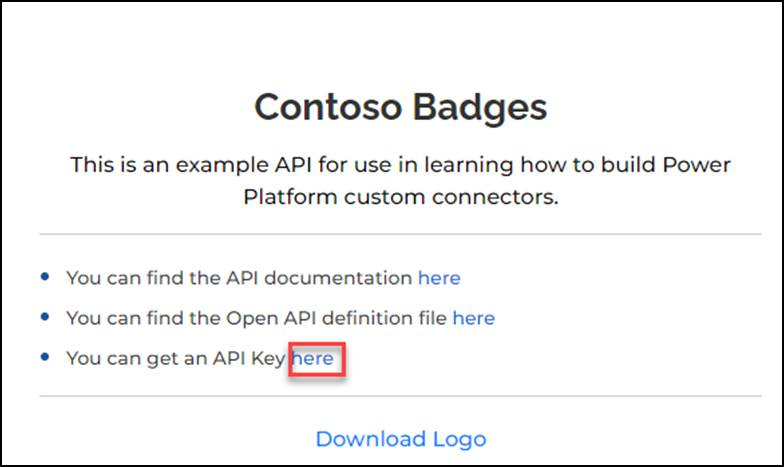

3.	Copy the **API Key**. Save this key you will use it multiple times.

4.	Go back to the connector test page and click **+ New Connection**.

5.	Paste the API Key you copied and click **Create connection**.

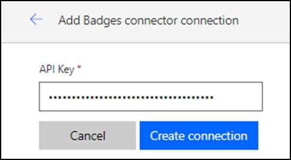

6.	Click on the **Refresh** connections button.

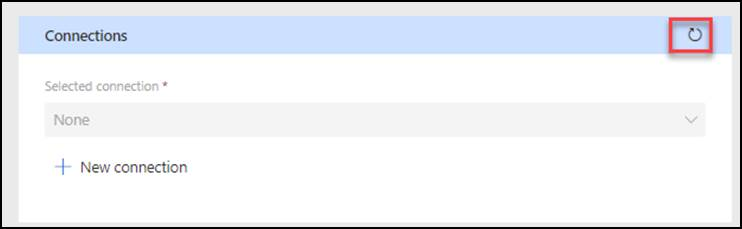

7.	The connection you created should get selected.
8.	Go to the **AddCredit** operation.

9.	Enter your email address for **recipientid**, enter your name for **name**, enter **1** for points, and click **Test operation**.

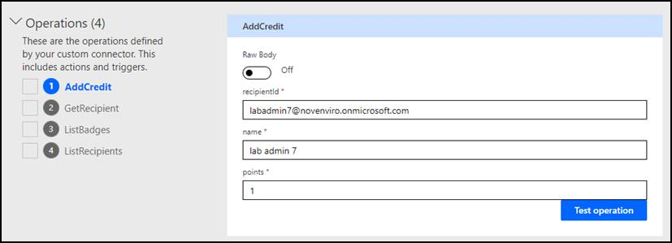

10.	The test should succeed, and the response should look like the image below.

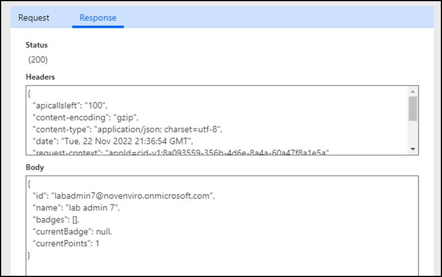