:::info LAB SCENARIO

Working as part of the PrioritZ fusion team you will be configuring a custom connector for an existing API.  The team would like to add badging to the PrioritZ application to give credit to users when they have completed ranking an item.  The team identified an existing API, but it doesn't have a Power Platform connector.  

When you review the API, you see that it has four operations and uses API key authentication.

In **Exercise 2** you will add a new operation to only return the current badge name and image URL.  You will do this by using the custom code feature to reshape the response from the API.
:::

:::tip Note
If you already have the custom connector open, skip to step 4
:::

## 2.1 Add code from resource folder

1.	Navigate to [**Power Automate**](https://aka.ms/lowcode-february/workshop/powerautomate) 
2.	Expand **Data** and select **Custom connectors**.

3.	Click the **Edit** button of the custom connector you created.

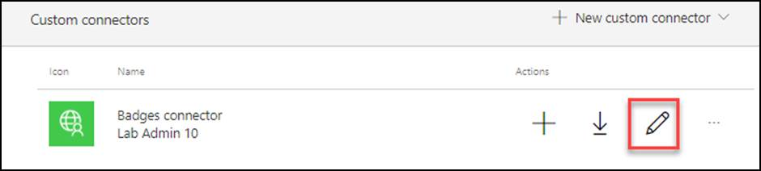

4.	Select the Definition tab and click **New action**.

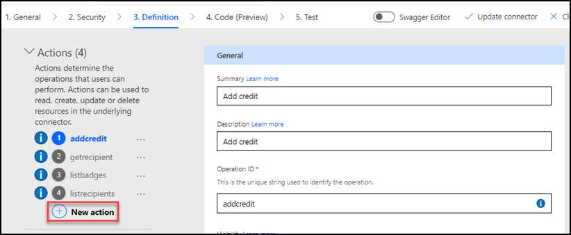

5.	Enter **Get current badge** for Summary, **Get current badge** for Description, and **getcurrentbadge** for Operation ID.

6.	Scroll down to the **Request** section and click **+ Import from sample**.

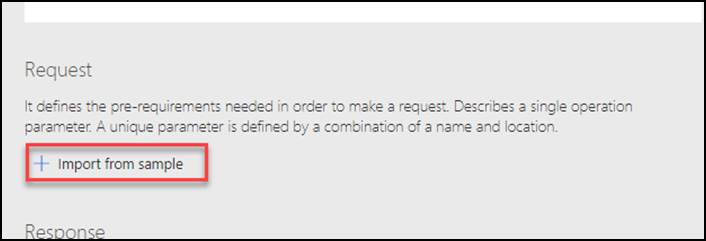

7.	Select **Get** for Verb, enter `https://contosobadgestest.azurewebsites.net/getcurrentbadge?id={id}` for URL, and click Import.

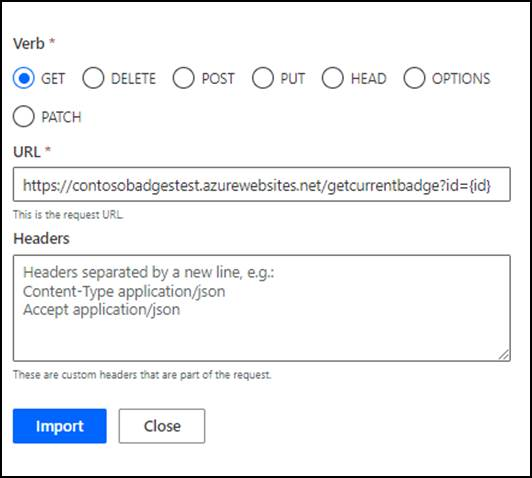

8.	Click **Update connector** and wait for the connector to be updated.

9.	Select the **Code** tab.

10.	Enable **Code** and click **Upload**.

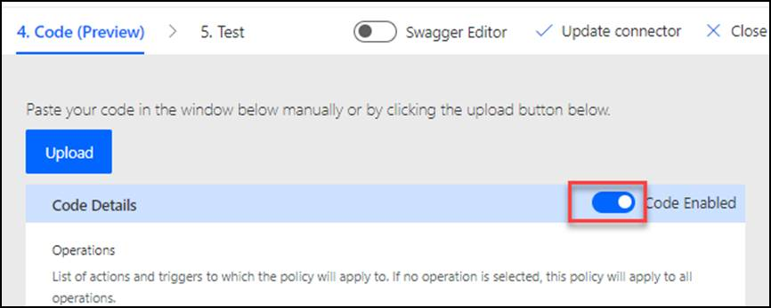

11.	Select the [**CustomConnectorCode.csx**](https://github.com/microsoft/Low-Code/blob/main/resources/workshops/Dev%20in%20a%20day/lab03/CustomConnectorCode.csx) file located in the lab resources folder and click Open.

12.	Select the **getcurrentbadge** action.

:::tip Note
Review the code you just added.
:::

13.	Click **Update connector** and wait for the connector to be updated.

14.	Advance to **Test**.
15.	Select the **getcurrentbadge** action.
16.	Provide your email address as id and click **Test operation**.

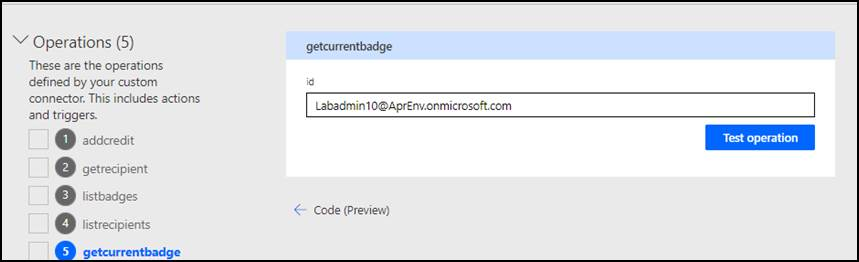

:::tip Note 
The test should succeed, and you should get current badge for the user you created.

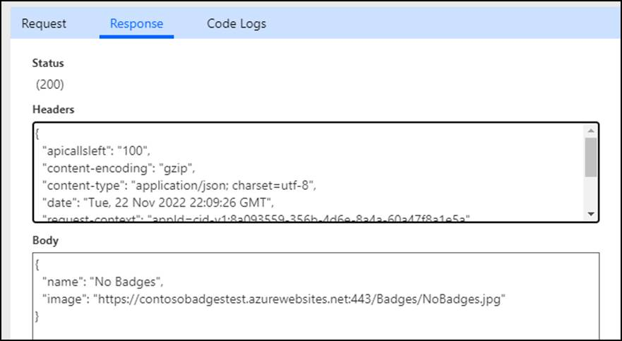
:::

## 2.2 Update Connector

1.	Copy the Response **Body** JSON.

2.	Select the **Definition** tab.
3.	Select the **getcurrentbadge** action.

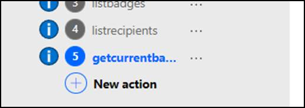

4.	Scroll down to the **Response** section and click **+ Add default response**.

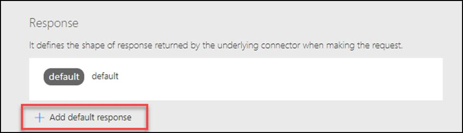

5.	Paste the JSON you copied in the **Body** and click **Import**.

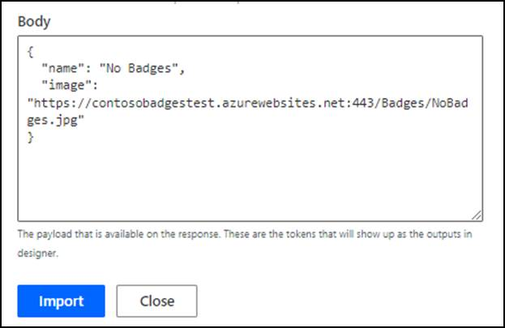

6.	Click **Update connector** and wait for the connector to be updated.

:::tip Note
Do not navigate away from this page.
:::

## 2.3 Test custom code

1.	Select the **Test** tab.
2.	Select the connection you created earlier.
3.	Go to the **Operations** section and select the **getcurrentbadge** operation.
4.	Provide your email as **id** and click **Test operation**.

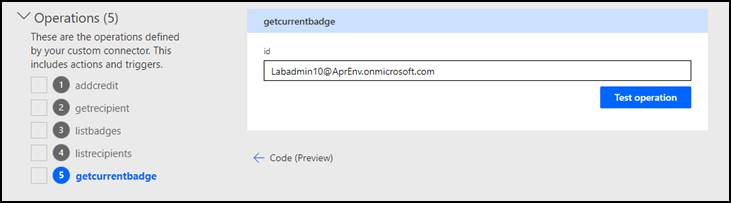

:::tip Note
The operation should succeed, and the response **Body** should look like the image below.

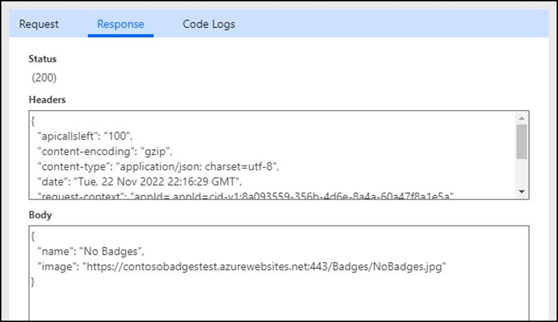