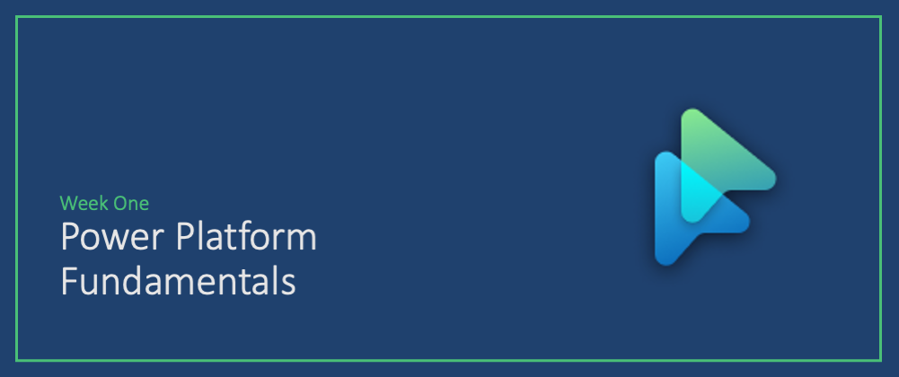

# Roadmap for #30Days

---

## Welcome! 

:::tip PLANNED ROADMAP
This is the planned roadmap for #30DaysOfLowCode, a series of daily content posts all through #LowCodeFebruary. Hear from our experts in the product teams and cloud advocacy and follow along at your own pace!
:::

We've organized the content into 4 themed weeks. Based on your level of experience with the topic, you can choose to pick specific weeks or posts to check out. If you are new to low code development, we recommend you read the posts in order.

 * **Fundamentals** of Power Platforms
 * **Backend Integrations** with Connectors, Azure
 * **UI Design** with Power Apps, PowerFX, PCF 
 * **Dev Experience** with ALM, Azure DevOps, GitHub Actions

---

## Kicking Off Low Code Feb

_Welcome to our LowCode February kickoff!!_ The official kickoff is Feb 1 but we wanted to share a few posts ahead of time to set the context and describe the various resources available to you!

:::info Kick Off 
* Jan 25 - [It's a Low Code February!](/blog/2023-kickoff)
:::

---

## Week 1: FUNDAMENTALS

_Welcome to the Week 1 of your learning journey into Low Code Development._

:::info WEEK 1 - TOPIC
_Posts will be linked here once published._
 * Feb 01 - [Hello, #30DaysOfLowCode](/blog/)
 * Feb 02 - [You say Low, I say Code!](/blog/)
 * Feb 03 - [Developer Tools & Onboarding](/blog/)
 * Feb 04 - [🚀 Zero-To-Hero Post: Developer Stories](https://aka.ms/lowcode-february/0ToHero)
 * Feb 05 - [Week 1: Recap](/blog/)
:::

---

## Week 2: INTEGRATIONS

_Welcome to the Week 2 of your learning journey into Low Code Development._

:::info WEEK 2 - TOPIC
_Posts will be linked here once published._
 * Feb 06 - [Built-in Connectors](/blog/)
 * Feb 07 - [Low Code + Dataverse](/blog/)
 * Feb 08 - [Low Code + Serverless](/blog/)
 * Feb 09 - [Custom Connector (Tutorial)](/blog/)
 * Feb 10 - [Custom Connectors (APIM)](/blog/)
 * Feb 11 - [Integration Use Cases](/blog/)
 * Feb 12 - [Week 2: Recap](/blog/)
:::

---

## Week 3: USER INTERFACE

_Welcome to the Week 3 of your learning journey into Low Code Development._

:::info WEEK 3 - TOPIC
_Posts will be linked here once published._
 * Feb 13 - [Build a Canvas App!](/blog/)
 * Feb 14 - [Intro to PowerFX](/blog/)
 * Feb 15 - [🚀 Zero-To-Hero Post](/blog/)
 * Feb 16 - [Power Component Framework Controls](/blog/)
 * Feb 17 - [Build a PCF Control](/blog/)
 * Feb 18 - [Advanced Use Cases](/blog/)
 * Feb 19 - [Week 3: Recap](/blog/)
:::

## Week 4: DEV EXPERIENCE

_Welcome to the Week 4 of your learning journey into Low Code Development._

:::info WEEK 4 - TOPIC
_Posts will be linked here once published._
 * Feb 20 - [ALM For Power Apps](/blog/)
 * Feb 21 - [GitHub Actions for Power Apps](/blog/)
 * Feb 22 - [🚀 Zero-To-Hero Post](/blog/)
 * Feb 23 - [App Governance](/blog/)
 * Feb 24 - [Power Platform Pipelines](/blog/)
 * Feb 25 - [Azure DevOps & Automated Testing](/blog/)
 * Feb 26 - [Week 4: Recap](/blog/)
:::

## Week 5: WRAP-UP

:::info WEEK 5 - WRAP-UP
_Posts will be linked here once published._
 * Feb 27 - [🚀 Zero-To-Hero Post](/blog/)
 * Feb 28 - [Month: Recap](/blog/)
:::

Thank you for staying the course with us. In the final two posts of this series we'll do two things:
 * **Look Back** - with a quick retrospective of what was covered.
 * **Look Ahead** - with resources and suggestions for how you can skill up further!

We appreciate your time and attention and we hope you found this curated tour valuable. Feedback always welcome. 

From our entire team, here's wishing you **good luck your learning & career journey!** 🎉
