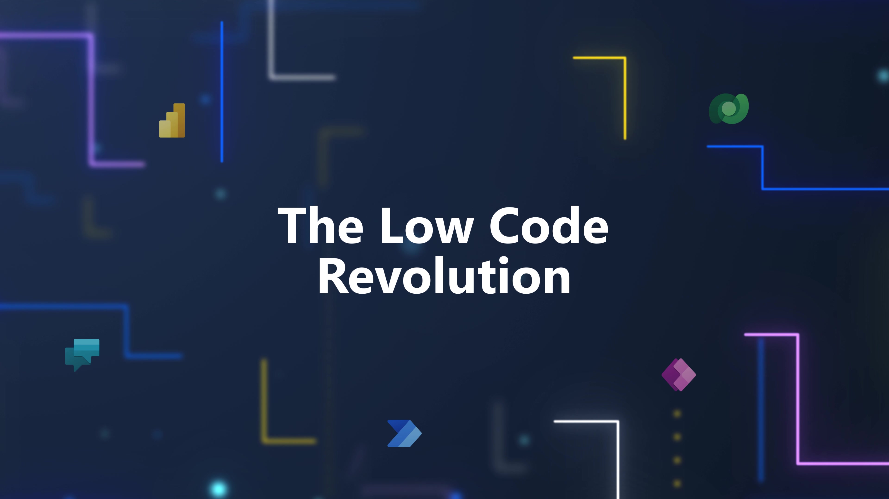
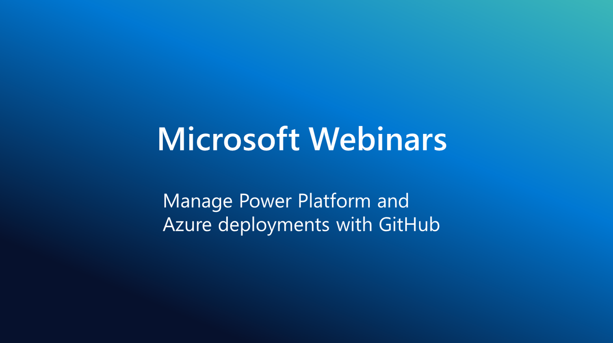
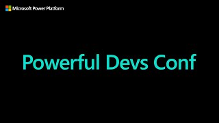

# Video & Livestreams

:::tip CHECK THE EVENTS CALENDAR

Want to know what online events or livestreams are scheduled in the upcoming weeks? Check our [Calendar](/calendar) for dates and registration links for meetups, webinars and livestreams on related topics.
:::

---

## Ask The Experts

These thirty-minute live broadcasts are where you can connect with experts to get your questions answered. Join us for new episodes LIVE at 9AM PT, catch the replay at 12PM SGT, or watch on-demand whenever you'd like!
[Learn More](https://learn.microsoft.com/events/learn-events/Ask-the-expert/).

### PowerfulDevs
|  | 
|:---|
|This Ask the Expert will be focused on answering questions from the Powerful Devs Conference on Feb 15th. The Powerful Devs Conference focuses on showcasing how code first developers can integrate with the Power Platform to innovate faster. We will have experts on hand to answer questions about full code and low code integration. |
| 🚨 Register for **[Live Session](https://aka.ms/ATE0223/RSVP)** (Feb 23, 9AM PT) or [**Replay**](https://aka.ms/ATE0223/APAC-RSVP) (Feb 12, 12PM SGT)|

### LowCode Feb
|  | 
|:---|
|This Ask the Expert will answer your questions from Low Code February. Low Code February is a month-long, hands-on learning experience focused on showcasing how code-first developers can take advantage of the Power Platform and use their skills and tooling to extend low code solutions. We will have experts in code-first integration with the Power Platform live to answer questions related to the content and cloud skills challenge of the Low Code February event. |
| 🚨 Register for **[Live Session](https://aka.ms/ATE0309/RSVP)** (Mar 09, 9AM PT) or [**Replay**](https://aka.ms/ATE0309/APAC-RSVP) (Mar 10, 12PM SGT)|

---

## Video Series

### Low Code Revolution
|  | 
|:---|
|The Low Code Revolution showcases stories and insights from industry experts on how you can revolutionize your applications and business processes with the Power Platform. Whether you are citizen developer, IT Pro, or code first developer, each episode will help you discover innovative ways that you can build applications faster and with far less effort by embracing the low code revolution.|
| **Jan 20, 2023** - [Power Platform CLI Exposed: Power Pages](https://learn.microsoft.com/shows/the-low-code-revolution/power-platform-cli-exposed-power-pages/) |
| **Jan 11, 2023** - [Power Platform CLI Exposed: Solutions](https://learn.microsoft.com/shows/the-low-code-revolution/power-platform-cli-exposed-solutions/) |
| **Jan 04, 2023** - [Power Plaforms CLI Exposed: PAC CLI Overview](https://learn.microsoft.com/shows/the-low-code-revolution/power-platform-cli-exposed-pac-cli-overview/) |
| 🎬 [**Visit The Series Page**](https://learn.microsoft.com/shows/the-low-code-revolution/) for more episodes.|

---

## Learn Live Sessions

|  | 
|:---|
| It's right there in the name: We present Microsoft Learn content Live. Every episode we'll choose a Learn module and work through it. We'll pull in guests to give you extra commentary from experts and sometimes even the engineers who built it. Join us and ask questions, live!|
| **Feb 06** - Week 1: Power Fundamentals (Link TBA) | 
| **Feb 13** - Week 2: Backend Integration (Link TBA) | 
| **Feb 20** - Week 3: User Interface (Link TBA) | 
| **Feb 27** - Week 4: App Lifecycle Management (Link TBA) | 
| 🎬 [**Visit The Series Page**](https://learn.microsoft.com/shows/learn-live/) for more episodes.|

---

## Microsoft Webinars

|  | 
|:---|
| Discover how to develop and integrate re-usable applications in real-time with the Continuous Integration and Continuous Development (CI/CD) pipeline. The fusion development of low code apps with Power Platform and Azure enables you to reclaim time, improve efficiency, and reduce development costs.|
| 🎬 [**Register**](https://mktoevents.com/Microsoft+Event/383091/157-GQE-382) for Feb 14 Session.|

---

## #PowerfulDevs 

|  | 
|:---|
| The Powerful Devs Conference will highlight how developers can leverage the Power Platform to build applications faster and with far less effort. Connect with industry recognized ProDev influencers, Microsoft Cloud Advocates, trusted and diverse community leaders, and members of the Power Platform Team. Stay tuned for more details - including speakers and session information - in the new year!|
| 🎬 [**Register**](https://learn.microsoft.com/events/learn-events/powerful-devs-2023/?WT.mc_id=javascript-82212-ninarasi) for the Feb 15 Event.|
| 🎬 [**Revisit Prior Events**](https://learn.microsoft.com/shows/powerful-devs/) for more episodes.|

